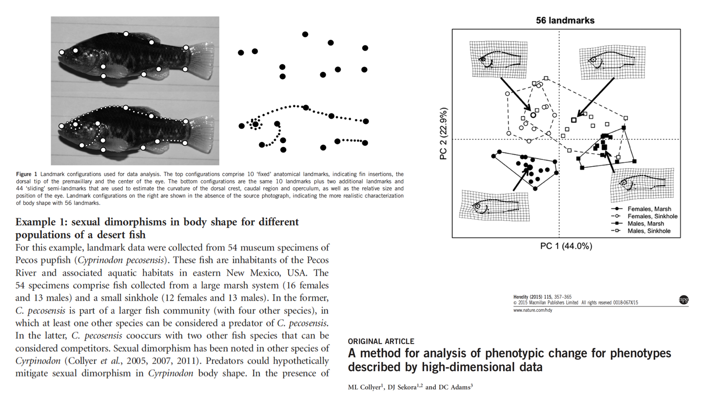

### **Motivation**
Today we explore multivariate implementations of linear models (anova, regression, etc.). First however, let's read in some data and examine a few of its properties:

```{r eval=TRUE}
library(knitr)
library(RRPP) 
library(mvabund)
library(vegan)

bumpus <- read.csv("Data/bumpus.csv",header=T)
bumpus.data <- log(as.matrix(bumpus[,(5:13)])) # matrix of linear measurements
sex <- as.factor(bumpus[,2])
surv <- as.factor(bumpus[,4])
SexBySurv <- paste(sex,surv)
TotalLength <- bumpus.data[,1]
Y <- bumpus.data[,-1]
mydat <- rrpp.data.frame(Y=Y,sex=sex,surv=surv,TotalLength=TotalLength,SexBySurv = SexBySurv)
```

Let's do some simple exploratory descriptions of the data.

```{r eval=TRUE}
#Describe the data
(100*apply(bumpus.data,2,sd)) /apply(bumpus.data,2,mean)  # CV: Coefficient of Variation

cor.bumpus<-cor(bumpus.data)
cor.bumpus
pairs(bumpus.data)
vcv.bumpus<-var(bumpus.data)
vcv.bumpus
var(scale(bumpus.data))
```

#### **1: Single-Factor MANOVA**
Multivariate anova may be accompished in the base package of R using 'lm'. However, one must specify that it is a manova; otherwise it is assumed that a series of independent anovas is desired.  Alternatively, MANOVA via RRPP may be performed in the RRPP package.

```{r eval=TRUE}
model1 <- lm(bumpus.data~sex)
summary(model1)	#yields a set of univariate analyses

summary(manova(model1))	#does multivariate test (using Pillai's)
summary(manova(model1),test="Wilks")	#does multivariate test (using Wilks)

##### MANOVA via RRPP
model.rrpp <- lm.rrpp(Y~sex,data = mydat, print.progress = FALSE)
anova(model.rrpp)
plot(model.rrpp, type = "PC", pch=21, bg = sex)  #PC PLOT!
legend("topright", levels(sex), pch = 21, pt.bg = 1:4)

```

One may ask why permutation-based approaches are necessary. The following is a simple example for high-dimensional data, showing that when standard, parametric-based methods break down, RRPP can still evaluate statistical models.

```{r eval=TRUE, error=TRUE}
##When parametric methods break down
Ynew <- matrix(rnorm(10000), nrow=100) #100 x 100 matrix: N=p
gp <- gl(2,50)
summary(manova(lm(Ynew~gp)))  #parametric algebra cannot be completed
anova(lm.rrpp(Ynew~gp,print.progress = FALSE))  #NO problem with RRPP!
```

#### **2: Factorial MANOVA**
Factorial manova may be accomplished in a similar manner. Alternatively, one may evaluate MANOVA via RRPP. Here one has the option of permuting the raw data or residuals from the reduced models. Simulations have shown that RRPP (reduced residual permutation procedure) displays higher statistical power for factorial designs and is thus preferred. It also permutes the correct exchangeable units under each null hypothesis (see discussion in lecture).  

Finally, we have an example of performing pairwise comparisons. These are based on Euclidean distances between group means. Recall that univariate pairwise comparisons are based on the numerator of the T-test in some manner (typically |Y1-Y2|).  This is a univariate representation of Euclidean distance, so the approach here is the multivariate equivalent.

```{r eval=TRUE}
#Factorial MANOVA
model2<-lm(bumpus.data~sex*surv)
summary(manova(model2))

#Factorial MANOVA via RRPP
model2.rrpp <- lm.rrpp(Y~sex*surv,data = mydat, print.progress = FALSE)
anova(model2.rrpp)
groups <- interaction(mydat$sex, mydat$surv)
plot(model2.rrpp, type = "PC", pch=21, bg = groups)
legend("topright", levels(groups), pch = 21, pt.bg = 1:4)

#Also in vegan (FRPP only)
adonis(formula = Y~sex*surv, method = "euclidean" )

#Pairwise comparisons 
PW <- pairwise(model2.rrpp,groups = SexBySurv, print.progress = FALSE)
summary(PW, test.type = "dist")  #No pairwise groups significant AFTER accounting for main effects!

model.null <- lm.rrpp(Y~1,data=mydat, print.progress = FALSE)
summary(pairwise(model2.rrpp, model.null, groups = SexBySurv, print.progress = FALSE),test.type = "dist")
   #Male vs. female seem to be biggest differences
```

#### **3: Multivariate Regression**

Multivariate regression is accomplished in a similar manner, with the exception that the independent variable (X) is continuous. 

It is a challenge to visualize the multivariate regression, as the Y-axis of this plot is multivariate and can be highly dimensional. Several visualization representations can be used to summarize trends in a multivariate-Y versus X.  One approach from the RRPP package are illustrated here. 

```{r eval=TRUE}
summary(manova(Y~TotalLength))

model.reg <- lm.rrpp(Y~TotalLength, data = mydat, print.progress = FALSE)
anova(model.reg)

### Visualizing multivariate regression 
plot(model.reg, type = "regression", reg.type = "RegScore", 
     predictor = mydat$TotalLength, pch=19)
```

#### **4: MANCOVA**

Multivariate analysis of covariance contains both continuous and categorical X-variables. Here one must first test for homogeneity in Y~X slopes across groups. If these are not statistically distinguishable, a  common slope model may be used to compare group means while accounting for a common slope.

On the other hand, if the slopes are different, one must perform a pairwise comparison of slopes test to determine how the slopes differ (rather than the group mean test). 

As with multivariate regression, visualizing these trends is challenging. RRPP has several options (derived from the literature): two of which are shown here.

```{r eval=TRUE}
#MANCOVA	
summary(manova(lm(Y~TotalLength*sex*surv)))
summary(manova(lm(Y~TotalLength+sex*surv))) # FIT COMMON SLOPE

#MANCOVA via RRPP
model.mancova <- lm.rrpp(Y~TotalLength*sex*surv, data =mydat, print.progress = FALSE)
anova(model.mancova)

#Pairwise comparisons of slopes: NOTE: Used here for illustrative purposes only! 
   # Interaction should show evidence justifying this analysis
PW.mancova <- pairwise(model.mancova, groups = SexBySurv, covariate = TotalLength, print.progress = FALSE)
summary(PW.mancova, test.type = "VC", angle.type = "deg")

### Visualizing MANCOVA
plot(model.mancova, type = "regression", reg.type = "RegScore", 
     predictor = mydat$TotalLength, pch=19, col = as.numeric(groups))

plot(model.mancova, type = "regression", reg.type = "PredLine", 
     predictor = mydat$TotalLength, pch=19,
     col = as.numeric(groups))

```

#### **4a: RRPP: A more complex example**

Here we perform a series of analyses on a high-dimensional dataset, containing 54 specimens and 112 variables describing the body shapes of fish. Several RRPP  analyses are shown, which remind us of the strength of these permutation-based methods. 

```{r, echo = FALSE, out.width="100%"}

```

First, a MANOVA via RRPP, including pairwise comparisons and graphical visualization of results. 

```{r, echo = FALSE, out.width="100%"}
data(Pupfish)
Pupfish$Group <- interaction(Pupfish$Sex, Pupfish$Pop)
fit.m <- lm.rrpp(coords ~ Pop * Sex, data = Pupfish, print.progress = FALSE) 
anova(fit.m)$table
summary(pairwise(fit.m,groups = Pupfish$Group), test.type = "dist")

plot(fit.m, type = "PC", pch=21, bg = Pupfish$Group, cex=2)
legend("topright", levels(Pupfish$Group), pch = 21, pt.bg = 1:4)

```

Next we perform MANCOVA to include body size as a covariate. Here, pairwise comparisons are of multivariate slopes. Visualization of these high-dimensional allometry trends are found via approaches by Drake & Klingenberg (2008) and Adams & Nistri (2010).

```{r echo=FALSE, out.width="80%" }
Pupfish$logSize <- log(Pupfish$CS)
fit.slopes <- lm.rrpp(coords ~ logSize * Pop * Sex, data = Pupfish, print.progress = FALSE)
anova(fit.slopes)$table
PWS <- pairwise(fit.slopes, groups = Pupfish$Group, covariate = Pupfish$logSize)
summary(PWS, test.type = "VC", angle.type = "deg")

plot(fit.slopes, type = "regression", reg.type = "RegScore", pch=21, bg = Pupfish$Group, predictor = Pupfish$logSize, cex=2)
legend("topleft", levels(Pupfish$Group), pch = 21, pt.bg = 1:4)

plot(fit.slopes, type = "regression", reg.type = "PredLine", pch=21, bg = Pupfish$Group, predictor = Pupfish$logSize, cex=2)
legend("topright", levels(Pupfish$Group), pch = 21, pt.bg = 1:4)
```

#### **5: Multivariate LM with non-continuous data**

If one does not have multivariate normal data (ie, *not* multivariate continuous), MANOVA via RRPP may still be utilized to evaluate such hypotheses. Here a distance matrix is used as the input Y-data. NOTE: one must use an appropriate distance measure for the data type under investigation (see lecture). 

```{r eval=TRUE}
mydat$Ydist <- dist(Y)
mancova.dist <- lm.rrpp (Ydist~TotalLength*sex*surv, data =mydat, print.progress = FALSE)
anova(mancova.dist)
```

#### **5a: Species Abundance Data**

A common scenario in community ecology is to have a data matrix comprised of species abundances across sites. Typically, each species is a column (variable), and the rows are sites. One goal is to determine whether community richness patterns differ across sites in a particular manner (e.g., islands vs. continents, or across some ecological gradient).  Effectively, these are ANOVA and regression-type hypotheses, but the response data are in the form of counts, not continuous variables. There is a large literature on what to do in such cases, and several implementations for analysis are possible.  

One school uses matrices of log(abundance+1) or Bray-Curtis distances analyzed using linear models (LM) via permutational MANOVA (e.g., Anderson). 

Another approach is to use generalized linear models (GLM with poisson or other link-function) on each species separately, followed by  evaluating $\small\sum{F}$-ratio found across species (e.g., Wharton). 

There are strengths and weaknesses to both approaches, and both have advantages. GLM can be accommodating to specific data types but LM is more robust to departures from assumptions. **Importantly, it is suggested that residual resampling (i.e., RRPP!) cures a lot of LM/GLM ills.** Future theoretical work on RRPP will investigate this more thoroughly.

##### **for discussion see: Wharton et al. 2016. *Methods Ecol. Evol.* **

Here we show a simple example using each of these 3 options:

```{r eval=TRUE}
data("spider")  #species abundance data across localities
dim(spider$abund)

# transformation of raw data (log+1)
spid <- data.frame(spider$x)
spid$abund <- as.matrix(spider$abund)
spid$logY <- as.matrix(log(spider$abund + 1)) # log-transform

### 1: MANOVA via RRPP on log(Y) 
fitLM <- lm.rrpp(logY ~ soil.dry + bare.sand + fallen.leaves + moss
                 + herb.layer + reflection, 
                 data = spid, iter = 999, SS.type = "II",
                 print.progress = FALSE)
anova(fitLM)
pca <- plot(fitLM, type = "PC")
text(pca$PC.points, rownames(pca$PC.points), pos = 1, cex = 0.5)

### 2: MANOVA via RRPP on Bray-Curtis distance (ala Anderson)
Db <- vegdist(spid$abund, method="bray")

fitD <- lm.rrpp(Db ~ soil.dry + bare.sand + fallen.leaves + moss
                + herb.layer + reflection, 
                data = spid, iter = 999, SS.type = "II",
                print.progress = FALSE)
anova(fitD)  #pretty similar

### 3: Generalized linear models: mvAbund (ala Wharton)
spiddat <- mvabund(spider$abund)
X <- spider$x

#To fit a log-linear model assuming counts are poisson:
  #NOTE: mvabund fits generlized LM to each Y-variable separately, then sums F-values
glm.spid <- manyglm(spiddat~X, family="poisson")
summary(glm.spid)   #not the same as above
```