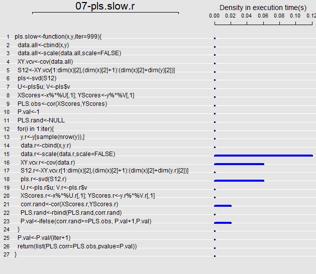

### **Motivation**
In R there are often multiple ways of doing the same thing. Typically, we don't consider which implementation is preferable; instead we ask: 'Does it work?'  This is usually sufficient for our needs, as for simple one-off analyses of reasonably-sized datasets all we are concerned with is obtaining a consistent numerical answer. 

However, while multiple implementations may yield the same numerical answer, they may not be identical in terms of the time they require to obtain it. This difference can matter a great deal, especially in this era of big data, of which 21^st^ century biology is clearly playing a part. 

Additionally, biologists do not only use simple analyses. Increasingly, they are using  computationally-intensive approaches such as permutation, bootstrapping, or Monte Carlo simulations to evaluate patterns in their data.  Here also, computational efficiency matters a great deal. 

So the question is: how do different implementations of some set of operations compare in terms of computational speed?

#### **Example**: Find the mean of a sample
Finding the mean can be obtained in various ways: `mean()`, `apply()`, or `sum(x)/length(x)`, etc. How do they compare?  We can use the library *microbenchmark* to evaluate.

```{r eval=TRUE}
mymean<-function(x){  #Create my own function for the mean
  n<-length(x)
  tmp<-0
  for (i in 1:n){
    tmp<-tmp+x[i]
  }
  mn<-tmp/n
  return(mn)
}
## simulate some data
x<-matrix(rnorm(1000))
n<-length(x)

#Compare implementations
library(microbenchmark)
library(ggplot2)
microbenchmark(mean(x),apply(x,2,mean), sum(x)/length(x),mymean(x),colSums(x)/length(x))
```

Note that the base function `mean()` is *NOT* the fastest,`apply()` was rather slow for this particular task, and my function was the worst! 

#### **Why R can be Slow**
So why are some implementations slow and others fast? There are many reasons, but two big ones are: 

1. **_Inefficient Code_**. The code works but is computationally inefficient.  

2. **_Computational Overhead_**. The code uses functions that do (or evaluate) many things. 
For example, base functions are usually quite robust and very general, and are thus incredibly useful. However, they also have considerable data checks to ensure the proper data type is provided,  often calculate, obtain, or pass  many additional components beyond the main values being calculated, and they have many options (print, labels, names, etc.) that must be evaluated at run-time.  The result is that these functions are often slower than more streamlined algorithms designed to do the same thing. 

#### **The Challenge**
As an end-user, this generates a trade-off between coding efficiency (how long does it take me to write this?) and computational efficiency (how long does it take to run?).  Improving the latter comes at the expense of the former. The trick: improving the speed of one's code where it matters most (ie, find the slowest parts of code and speeding them up).

#### **Speeding up R: Finding the Slow Bits**
There are several ways to find the slow portions of your code. Both `microbenchmark` and `system.time` can be used creatively to identify choke points. See H. Wickham's *Advanced R* book; especially *Optimizing code*: http://adv-r.had.co.nz/Profiling.html.
One approach I'll illustrate here is using the *aprof* library. 

First, let's look at a function. 

NOTE: This function is easy to read, but it turns out is rather poorly written: as we will see there are numerous ways of improving its performance.
```{r eval=FALSE}
#Peform multivariate correlation assessed via permutation
pls.slow<-function(x,y,iter=999){
  data.all<-cbind(x,y)
  data.all<-scale(data.all,scale=FALSE)
  XY.vcv<-cov(data.all)
  S12<-XY.vcv[1:dim(x)[2],(dim(x)[2]+1):(dim(x)[2]+dim(y)[2])]
  pls<-svd(S12)
  U<-pls$u; V<-pls$v
  XScores<-x%*%U[,1]; YScores<-y%*%V[,1]
  PLS.obs<-cor(XScores,YScores)
  P.val<-1
  PLS.rand<-NULL
  for(i in 1:iter){
    y.r<-y[sample(nrow(y)),]	
    data.r<-cbind(x,y.r)
    data.r<-scale(data.r,scale=FALSE)
    XY.vcv.r<-cov(data.r)
    S12.r<-XY.vcv.r[1:dim(x)[2],(dim(x)[2]+1):(dim(x)[2]+dim(y.r)[2])]
    pls.r<-svd(S12.r)
    U.r<-pls.r$u; V.r<-pls.r$v
    XScores.r<-x%*%U.r[,1]; YScores.r<-y.r%*%V.r[,1]
    corr.rand<-cor(XScores.r,YScores.r)
    PLS.rand<-rbind(PLS.rand,corr.rand)
    P.val<-ifelse(corr.rand>=PLS.obs, P.val+1,P.val) 
  }  
  P.val<-P.val/(iter+1)
  return(list(PLS.corr=PLS.obs,pvalue=P.val))
}
```

Using the *aprof* package, we can give this function some data, and profile its performance to find choke-points in the code:

```{r eval=FALSE}
library(aprof)
source("07-pls.slow.r")
tmp<-tempfile() #create tmp file for saving profiler output
Rprof(tmp,line.profiling=TRUE)  #profile the function
x<-matrix(rnorm(1000),ncol=10)
y<-matrix(rnorm(1000),ncol=10)
pls.slow(x,y)
Rprof(append=FALSE)
fooaprof<-aprof("07-pls.slow.r",tmp) #Create aprof object
plot(fooaprof)

# new code to create plot
png("Aprof.out.png")
plot(fooaprof)
dev.off()
```

The output looks something like this: 




Here we can see which lines of the function consume the most time.  With this, we can determine which parts would provide the best speed-up if they are altered. In this case, all are within the permutation loop: 

1. Obtaining the covariance matrix `cov`

2. Performing the singular-value decomposition `svd`

3. Scaling the data `scale`

4. Obtaining the correlation `cor`.     

5. Obtaining the cross-covariance component of the covariance matrix

Now we will discuss some general principles for speeding up R code.

#### **1: Pre-allocate Memory**
Don't grow objects within loops or functions. Instead, pre-allocate them and fill the values in as they are calculated.

```{r eval=TRUE}
iter<-99
SS<-array(NA,iter) #pre-allocate
newSS<-function(iter){ #grow object on the fly
  SS<-NULL
  for (i in 1:iter){SS<-rbind(SS,NA)}
  return(SS)
}

microbenchmark(SS<-array(NA,99), x<-newSS(99))
microbenchmark(SS<-array(NA,9999), x<-newSS(9999),times=10)
```
As we can see, pre-allocating memory can be a huge time savings, particularly for large objects or many iterations.

#### **2: Pre-Calculate Components**
Components used repeatedly in a function can be calculated first, then re-used.

```{r eval=TRUE}
#Linear regression using matrix algebra
x<-cbind(1,matrix(rnorm(1000),ncol=10))
y<-matrix(rnorm(100))

all.calc<-function(x,y){
  coef.r<-array(NA,dim=c(999,ncol(x)))
  for (i in 1:999){
    y.r<-y[sample(nrow(y)),]	
    coef.r[i,]<-solve(t(x)%*%x)%*%t(x)%*%y.r
  }
}

#notice that the hat matrix is a constant. Pull out of loop
hat.calc<-function(x,y){
  hat<-solve(t(x)%*%x)%*%t(x)
  coef.r<-array(NA,dim=c(999,ncol(x)))
  for (i in 1:999){
    y.r<-y[sample(nrow(y)),]	
    coef.r[i,]<-hat%*%y.r
  }  
}

microbenchmark(all.calc(x,y),hat.calc(x,y),times=10)
```
Pre-calculating components can be a huge time savings; particularly if parts of calculations are repeated in numerous places within some function.

#### **3: Use Lower-Level R Functions and Algebra**
Base R-functions are robust, but can be slow. Instead, use lower-level functions, or other algebraic formulations for accomplishing the same task.

```{r eval=FALSE}
#Some ways of performing linear models
lm(y~x)  #Common method
solve(t(xf)%*%xf)%*%t(xf)%*%y
crossprod(solve(crossprod(xf)),crossprod(xf,y))
lm.fit(xf,y)$coefficients
.lm.fit(xf,y)$coefficients  # NOTE: a very low-level function (cannot use in packages submitted to CRAN)
qr.coef(qr(xf),y)

```

Now compare them:

```{r eval=TRUE}
x<-matrix(rnorm(10000),ncol=2)
xf<-cbind(1,x)
y<-matrix(rnorm(nrow(x)))

microbenchmark(
  lm(y~x),
  solve(t(xf)%*%xf)%*%t(xf)%*%y,
  crossprod(solve(crossprod(xf)),crossprod(xf,y)),
  lm.fit(xf,y),.lm.fit(xf,y),
  qr.coef(qr(xf),y)
)

```

Note that the base function `lm` is not the most computationally efficient.

Be aware that the size of the data matrices, and which dimensions (or objects) are larger or smaller can make a difference. 

```{r eval=TRUE}
#Large X univ. Y
x<-matrix(rnorm(10000),ncol=50)
xf<-cbind(1,x)
y<-matrix(rnorm(nrow(x)))
microbenchmark(
  lm(y~x),
  solve(t(xf)%*%xf)%*%t(xf)%*%y,
  crossprod(solve(crossprod(xf)),crossprod(xf,y)),
  lm.fit(xf,y),.lm.fit(xf,y),
  qr.coef(qr(xf),y)
)
```

```{r eval=TRUE}
##Large Y univ. X
y<-matrix(rnorm(10000),ncol=100)
x<-matrix(rnorm(nrow(y)))
xf<-cbind(1,x)
microbenchmark(
  lm(y~x),
  solve(t(xf)%*%xf)%*%t(xf)%*%y,
  crossprod(solve(crossprod(xf)),crossprod(xf,y)),
  lm.fit(xf,y),.lm.fit(xf,y),
  qr.coef(qr(xf),y)
)
```

```{r eval=TRUE}
#large Y and X
y<-matrix(rnorm(20000),ncol=100)
x<-matrix(rnorm(10000),ncol=50)
xf<-cbind(1,x)
microbenchmark(
  lm(y~x),
  solve(t(xf)%*%xf)%*%t(xf)%*%y,
  crossprod(solve(crossprod(xf)),crossprod(xf,y)),
  lm.fit(xf,y),.lm.fit(xf,y),
  qr.coef(qr(xf),y)
)

```
This exercise demonstrates that care must be taken when writing functions. Knowing the size of the input objects can make a difference in which implementation is preferable. Also, when writing general functions for yourself and others (e.g., to go in an R-package), one can consider first performing a check of the RxC of input matrices, then shunting the analysis to the appropriate pipeline for speed efficiency. 

#### **4: Vectorize When Possible**
###### Or: **'Don't speak R with a C accent'.**
When writing a function, one often thinks in terms of an algorithm: "Do this, then do that, etc." For iterative tasks these algorithms take the form of loops. Loops are very useful in programming and are straightforward to understand. However, one must remember that in R, the primary data type is a vector, and many R functions are 'vectorized'. This means that they perform a given  operation over the set of elements in the vector automatically. Basically, these functions already contain a loop which has been programmed in a lower-level compiled computer languages (e.g., C).  This means that vectorized R functions are often faster than performing the same task using a for-loop.  **NOTE: the `apply` family: `apply`, `sapply`, `lapply`, `tapply`, `mapply`, `Map`, etc. are designed precisily to speed up these sorts of 'looping' tasks. USE THEM!!**  

Looping in R is especially inefficient when indexing rows and columns in an array or matrix. Let's see an example:  

```{r eval=TRUE}
fn1<-function(x){
  means<-array(0,ncol(x))
  for(i in 1:ncol(x)){
    for(j in 1:nrow(x)){
      means[i]<-means[i]+x[j,i]
    }
  }
  means<-means/nrow(x)
  return(means)
}

x<-matrix(rnorm(1000*1000),ncol=1000)
microbenchmark(fn1(x),apply(x,2,mean),colMeans(x),times=10)
```

Notice that the loop is ~100 times slower than `apply`. Additionally, note that `colMeans` is even more efficient: about ~20X faster than `apply` and ~2000X times faster than the loop. Both `apply` and `colMeans` use internal vectorized coding, but for this particular task, `colMeans` is far superior. 
NOTE: Be aware that not all loops in R are slow. If the loop does not call indexed elements or uses vectorization within the loop, it may be as fast as a vectorized function for that same task.  But as the example above illustrates, calling indexed elements within loops is certainly very slow!

#### **5: When More Speed is Needed**
If the above tips still do not result in sufficient speed gains, there are additional options. 

1. Parallelization. One can use parallel processing within R to distribute the job to multiple processors. This is particularly useful for permutation, bootstrap and Monte Carlo procedures where the iterations can be divided and then recombined. The package *parallel* provides some tools.

2. Bit-compiled R code. One can also compile portions of the R code at run-time to improve performance. The package *Rcpp* provides useful tools.

3. Incorporate C or Fortran code. One can also write code in lower-level languages such as C and Fortran and call these from within one's R script. In fact, the lowest levels of R are written in these languages. Using `.C` and `.Call`  allow one to interface directly with code written in C. So long as the code is written efficiently, this will provide the best improvement in computational performance. Note however, that considerably greater programming skill is required to wite C and Fortran code (and to interface with it properly), so this option is generally not recommended for the novice user. 

#### **Using What We've Learned**
Let's revisit our original PLS function: 
```{r eval=FALSE}
#Peform multivariate correlation assessed via permutation
pls.slow<-function(x,y,iter=999){
  data.all<-cbind(x,y)
  data.all<-scale(data.all,scale=FALSE)
  XY.vcv<-cov(data.all)
  S12<-XY.vcv[1:dim(x)[2],(dim(x)[2]+1):(dim(x)[2]+dim(y)[2])]
  pls<-svd(S12)
  U<-pls$u; V<-pls$v
  XScores<-x%*%U[,1]; YScores<-y%*%V[,1]
  PLS.obs<-cor(XScores,YScores)
  P.val<-1
  PLS.rand<-NULL
  for(i in 1:iter){
    y.r<-y[sample(nrow(y)),]	
    data.r<-cbind(x,y.r)
    data.r<-scale(data.r,scale=FALSE)
    XY.vcv.r<-cov(data.r)
    S12.r<-XY.vcv.r[1:dim(x)[2],(dim(x)[2]+1):(dim(x)[2]+dim(y.r)[2])]
    pls.r<-svd(S12.r)
    U.r<-pls.r$u; V.r<-pls.r$v
    XScores.r<-x%*%U.r[,1]; YScores.r<-y.r%*%V.r[,1]
    corr.rand<-cor(XScores.r,YScores.r)
    PLS.rand<-rbind(PLS.rand,corr.rand)
    P.val<-ifelse(corr.rand>=PLS.obs, P.val+1,P.val) 
  }  
  P.val<-P.val/(iter+1)
  return(list(PLS.corr=PLS.obs,pvalue=P.val))
}
```

Using the tips we've learned, here is a modified version:
```{r eval=FALSE}
#Peform multivariate correlation assessed via permutation
pls.fast<-function(x,y,iter=999){
  n<-nrow(x)
  x<-scale(x,scale=FALSE); y<-scale(y,scale=FALSE) 
  ind <- c(list(1:n), (Map(function(x) sample.int(n, n), 1:iter)))  
  y.rand <- lapply(1:(iter+1), function(i) y[ind[[i]], ])
  S12.r<-lapply(1:(iter+1), function(i) crossprod(x, y.rand[[i]])/(n - 1)) 
  pls.r<-lapply(1:(iter+1), function(i) La.svd(S12.r[[i]], 1, 1))
  r.rand<-sapply(1:(iter+1), function(i) cor(x %*% pls.r[[i]]$u, y.rand[[i]] %*% t(pls.r[[i]]$vt)))
  p.val<- 1-(rank(r.rand)[1])/(iter+1)
  return(list(PLS.corr=r.rand[[1]],pvalue=p.val))
}
```
In this modified version, we've pre-calculated components once (`scale`), used lower-level functions (`crossprod` and `La.svd`), are not growing the result inside the loop, and have eliminated the loop by vectorizing the function with `lapply`, `sapply`, and `Map`.

Now let's compare them:
```{r eval=TRUE}
pls.slow<-function(x,y,iter=999){
  data.all<-cbind(x,y)
  data.all<-scale(data.all,scale=FALSE)
  XY.vcv<-cov(data.all)
  S12<-XY.vcv[1:dim(x)[2],(dim(x)[2]+1):(dim(x)[2]+dim(y)[2])]
  pls<-svd(S12)
  U<-pls$u; V<-pls$v
  XScores<-x%*%U[,1]; YScores<-y%*%V[,1]
  PLS.obs<-cor(XScores,YScores)
  P.val<-1
  PLS.rand<-NULL
  for(i in 1:iter){
    y.r<-y[sample(nrow(y)),]	
    data.r<-cbind(x,y.r)
    data.r<-scale(data.r,scale=FALSE)
    XY.vcv.r<-cov(data.r)
    S12.r<-XY.vcv.r[1:dim(x)[2],(dim(x)[2]+1):(dim(x)[2]+dim(y.r)[2])]
    pls.r<-svd(S12.r)
    U.r<-pls.r$u; V.r<-pls.r$v
    XScores.r<-x%*%U.r[,1]; YScores.r<-y.r%*%V.r[,1]
    corr.rand<-cor(XScores.r,YScores.r)
    PLS.rand<-rbind(PLS.rand,corr.rand)
    P.val<-ifelse(corr.rand>=PLS.obs, P.val+1,P.val) 
  }  
  P.val<-P.val/(iter+1)
  return(list(PLS.corr=PLS.obs,pvalue=P.val))
}

pls.fast<-function(x,y,iter=999){
  n<-nrow(x)
  x<-scale(x,scale=FALSE); y<-scale(y,scale=FALSE)  
  ind <- c(list(1:n), (Map(function(x) sample.int(n, n), 1:iter)))  
  y.rand <- lapply(1:(iter+1), function(i) y[ind[[i]], ])
  S12.r<-lapply(1:(iter+1), function(i) crossprod(x, y.rand[[i]])/(n - 1)) 
  pls.r<-lapply(1:(iter+1), function(i) La.svd(S12.r[[i]], 1, 1))
  r.rand<-sapply(1:(iter+1), function(i) cor(x %*% pls.r[[i]]$u, y.rand[[i]] %*% t(pls.r[[i]]$vt)))
  p.val<- 1-(rank(r.rand)[1])/(iter+1)
  return(list(PLS.corr=r.rand[[1]],pvalue=p.val))
}

x<-matrix(rnorm(10000),ncol=10)
y<-matrix(rnorm(20000),ncol=20)
microbenchmark(pls.slow(x,y),pls.fast(x,y),times=10)
```

For this example, we've sped up the function by a factor of 2-3. 
