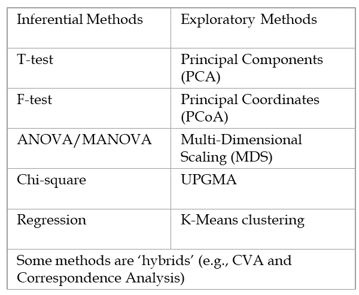

```{r setup, include=FALSE, echo = TRUE, tidy = TRUE}
library(knitr)
library(RRPP)
library(geomorph)
library(RRPP)
library(scatterplot3d)
knitr::opts_chunk$set(echo = TRUE)
```

#  The Particulars:

<style type="text/css">
td {  /* Table  */
  font-size: 20px;
}
code.r{ /* Code block */
    font-size: 12px;
}
pre { /* Code block - determines code spacing between lines */
    font-size: 12px;
}
</style>

- Lectures: Tuesday 11:00 – 12:30
- Lab:	Thursday 11:00 – 12:00
- Readings: no assigned readings, but 3 references are useful
  - Legendre, P., and L. Legendre.  2012.  Numerical Ecology. 3rd edition. Elsevier Science, Amsterdam. 
  - Manly, B. F. J., and J.A. Navarro Alberto 2017.  Multivariate Statistical Methods:  A Primer.  4th edition.  Chapman & Hall, London.
  - Sokal, R. R. and F. J. Rohlf.  2012.  Biometry. 4th Edition.  Freeman 	Associates, San Francisco.

# Perspectives on Statistics

- All data are dots in data spaces: data spaces may be simple, or may be complex

```{r echo=FALSE, fig.height = 3}
bumpus<-read.csv("lectureData/02.Resampling/bumpus.csv",header=T)
par(mfrow=c(1,2),mar = c(4, 4, 0, 4)) 
plot(bumpus$TL,bumpus$AE, pch=21, bg="red", xlab="Total Length", ylab="Alar Extent")
plot(as.numeric(as.factor(bumpus$sex)),bumpus$AE, pch=21, bg="red", xlab = "Sex", ylab="Alar Extent")
par(mfrow=c(1,1)) 
```

- Statistical methods provide models that describe patterns of variation in data, and help determine whether those patterns are important biologically (i.e., is the pattern 'significant'?)

>- The 'secret' of statistics:  knowing which method to use for which data type (choice is combination of hypotheses and data types)

# Inferential vs. Exploratory Statistics
- **Independent Variable**:  specifies the hypothesis; a predictor for other variables (e.g., sex, age). (X-matrix)

- **Dependent Variable**:  the response variable; its variation depends other variables.  This is the ‘data’ (Y-matrix)

- MANY ways of classifying statistical methods, I prefer…

- **Inferential Statistics**:  test for specific patterns in data using independent variables to generate hypotheses (Y vs. X)

- **Exploratory Statistics**:  describe patterns in data without independent variables or specific hypotheses (patterns in Y)

# Inferential vs. Exploratory Statistics

Some examples

```{r, echo = FALSE,out.width="50%", fig.align='center'}
  
```

# Statistical Hypothesis Testing

- Parametric Methods: Parameters estimated from the data are evaluated relative to theoretical distributions of those parameters. Implementations include:

    >- Least Squares (LS): Find parameters that minimize the sum-of-squared deviations of the residual error of the data when fitting the model. Parameters are estimated using algebraic solutions derived from theory under a set of assumptions. Observed parameters are compared to theoretical distributions to test hypotheses. 
    
    >- Maximum Likelihood (ML): Obtain likelihood of the data and model parameters given the model assumptions, and compare the fit of various models using likelihood or some derivative of it (e.g., AIC) (NOTE: LS and ML estimates are related, and converge when the data satisfy model assumptions and have large sample sizes).

    >- Bayesian Methods: Use data, model, and prior knowledge to assess hypotheses and obtain posterior probabilities of parameters (mathematically related to ML)
  
>- Nonparametric Resampling Methods: Use the data to generate empirical sampling distributions against which estimated parameters are compared. Make fewer assumptions than parametric methods.

# Parametric Statistics: Basic Concepts

- Evaluate patterns in data relative to independent variables (e.g., $\small\mathbf{Y}=\mathbf{X}\mathbf{\beta } +\mathbf{E}$)
    - Estimate parameters, model coefficients, and statistical summary measures (e.g., $\small{F}_{obs}$ ) from the data under the hypothesis ($\small{H_{1}}$) 
    - Compare observed test value (or likelihood) under $\small{H_{1}}$ to expected values under the null hypothesis $\small{H_{0}}$ 
    - Interpret parameters to understand model
    - Determine whether observed value is something interesting:  i.e., is outcome unexpected relative to $\small{H_{0}}$? Is the probability of observing that outcome  small (e.g., *P* < 0.05) relative to expectation under $\small{H_{0}}$? 

    ```{r, echo = FALSE, fig.height=2, fig.align='center'}
include_graphics("LectureData/01.Intro/ParamDistConceptModel.png")  
```

- This is all fine and dandy, but where do the expected values come from?

# Parametric Distributions
Parametric statistical theory has generated numerous expected distributions for various parameters, which were derived from theory by considering:

1. The type of data examined
2. A model of the process that generates variation

# Parametric Distributions: Example

- How likely is it that one gets 5 heads in a row?
  - Type of data:  Binary: head/tail (1/0)
  - Model:  a ‘fair’ coin (i.e., chance of heads = 0.5). Also, each event independent (flipping a head the 1^st^ toss does not alter chance of heads on 2^nd^ toss)
  - This is the binomial distribution: $\small{Pr=}\left(\begin{array}{ccc}n \\x\end{array}\right)p^{x}q^{n-x}$

```{r, echo = FALSE, out.width="40%", fig.align='center'}
include_graphics("LectureData/01.Intro/binomial.png")  
```

- Likelihood of 5 tails in a row is: $\small{Pr=}0.5^5 = 0.03125$
- Probability is small, so result of 5 heads in a row is not likely

# A Panoply of Parametric Distributions

Over decades, many parametric distributions have been derived from theory

```{r, echo = FALSE, out.width="80%", fig.align='center'}
include_graphics("LectureData/01.Intro/TheoryDist.png")  
```

Each is used to evaluate statistical summary parameters from particular hypothesis tests

# Empirical Sampling Distributions

Sampling distributions may be obtained in other ways (e.g., permutation) 

- Example: Do male and female birds differ in size?

  >- Calculate test value ($D_{obs}=\mu_M-\mu_F$) 

  >- Generate empirical sampling distribution by shuffling specimens many times relative to groups (i.e., under $H_0$ of no group difference) and calculating $D_{rand}$ each time

# Empirical Sampling Distributions

Sampling distributions may be obtained in other ways (e.g., permutation) 

- Example: Do male and female birds differ in size?

  - Calculate test value ($D_{obs}=\mu_M-\mu_F$) 

  - Generate empirical sampling distribution by shuffling specimens many times relative to groups (i.e., under $H_0$ of no group difference) and calculating $D_{rand}$ each time

```{r, echo = FALSE,  fig.height=3, fig.align='center'}
y <- bumpus$TL
sex <- as.factor(bumpus$sex)
sexdata<-split(y,sex)
c1 <- rgb(173,216,230,max = 255, alpha = 80, names = "lt.blue")
c2 <- rgb(255,192,203, max = 255, alpha = 80, names = "lt.pink")
par(mfrow=c(1,2),mar = c(4, 4, 0, 4))
hist(sexdata$m,col=c1,xlim = c((min(y)-5),(max(y)+5)),
     main=NULL,xlab="Body Size")
hist(sexdata$f,col=c2,add=TRUE)

perm <- geomorph:::perm.index(length(y),iter=999)
D.rand <- unlist(lapply(1:1000, 
          function(j) diff(tapply(y[perm[[j]]],sex,mean))))
hist(D.rand,main=NULL,xlab = "Empirical Sampling Distribution (M-F)")
arrows(D.rand[1], 100, D.rand[1], 5, length = 0.1, lwd = 2)
text(x = (D.rand[1]-.06),y=145,labels = "Obs")
par(mfrow=c(1,1))
```

##### NOTE: the null hypothesis and expected values derived from it are extremely important for designing proper permutation tests


# Parameter Estimation and Model Evaluation

Parametric statistical hypothesis testing is comprised of two distinct steps:

1. Parameter Estimation: Here we fit the data to the model, and estimate parameters that summarize that fit. These are commonly in the form of *model coefficients*, which for linear models are regression parameters.  

2. Model Evaluation: Here we use statistical summary measures that summarize the fit of the data to the model. 

>- It is common to think of these steps as being the same: **THEY ARE NOT!**  

# Parameter Estimation and Model Evaluation

Parametric statistical hypothesis testing is comprised of two distinct steps:

1. Parameter Estimation: Here we fit the data to the model, and estimate parameters that summarize that fit. These are commonly in the form of *model coefficients*, which for linear models are regression parameters.  

2. Model Evaluation: Here we use statistical summary measures that summarize the fit of the data to the model. 

- It is common to think of these steps as being the same: **THEY ARE NOT!**  
Take as an example bivariate regression ($\small\mathbf{Y}=\mathbf{X}\mathbf{\beta } +\mathbf{E}$)  

>- 1: Estimate the regression coefficients for the model given our data. 

>- 2: Use parameters and data to calculate summary statistics  (e.g., $\small\mathbf{SS}_{Model}$ & $\small\mathbf{SS}_{Error}$) and statistical test measures (e.g., $\small{F}_{obs}$). $\small{F}_{obs}$ is then compared to a theoretical $F$-distribution for the appropriate degrees of freedom to evaluate model significance.

>- ##### As will become clear, distinguishing between parameter estimation and model evaluation is *crucial* for permitting a fresh look at statistical hypothesis testing via permutation, and proposing a new paradigm not bound by the Achilles heels of the parametric statistical approach.


# Type I and Type II Error

Don't forget there is error in model evaluation & hypothesis testing!!

```{r, echo = FALSE, out.width="80%"}
include_graphics("LectureData/01.Intro/TypeI-II-Error.png")  
```

# Statistical Power

- Power $\left(1-\beta\right)$ : Ability to detect significant effect when it is present (function of effect size, N, $\sigma^2$)

- Power of test can be empirically determined in many instances

```{r, echo = FALSE, out.width="100%"}
include_graphics("LectureData/01.Intro/PowerCurve.png")  
```

# Univariate Versus Multivariate Analyses

- Univariate statistics: Assess variation in single Y (obtain scalar result)

```{r, echo = FALSE, out.width="30%", fig.align='center'}
par(mar = c(4, 4, 0, 4)) 
hist(rnorm(1000,mean=10),main=NULL,xlab = "Y")
#include_graphics("LectureData/01.Intro/UnivData.png")  
```

- Multivariate statistics: Assess variation in multiple Y simultaneously

```{r, echo = FALSE, out.width="40%", fig.align='center'}
include_graphics("LectureData/01.Intro/MultivData.png")  
```

- Multivariate methods are mathematical generalizations of univariate **(ACTUALLY, univariate methods are special cases of multivariate!)**

# Distributional Tests

- Parametric statistics: estimate statistical parameters from data, and compare to a theoretical distribution of these parameters

- Significance based upon how ‘extreme’ the observed value is relative to the distribution of values (under the null hypothesis of no pattern)

- Different distributions used for different statistical parameters and tests

```{r, echo = FALSE, fig.height=3, fig.align='center'}
include_graphics("LectureData/01.Intro/ParamDistConceptModel.png")  
```

- NOTE:  theoretical aspects and general properties of these distributions is a HUGE and interesting area of statistical research (consult Stats. Dept. for details)

# Distributions: Binomial

- Distribution for binary events, calculate probabilities directly

- Determine probability of obtaining x outcomes in n total tries

$$\small{Pr=}\left(\begin{array}{ccc}n \\x\end{array}\right)p^{x}q^{n-x}$$
    - $n$ is the total # events, x is the # successes, and p & q are the probability of success and failure

```{r, echo = FALSE, out.width="40%", fig.align='center'}
include_graphics("LectureData/01.Intro/binomial.png")  
```

>- Example: prob. of obtaining 7 heads in 10 tries

>- $$\small{Pr=}\left(\begin{array}{ccc}10! \\7!3!\end{array}\right)0.5^{7}0.5^{3}=0.117$$

# Distributions: Poisson

- Models probability of rare, and independent events

- For Poisson: $\mu_x = \sigma^2_x$

- Multiple Poisson distributions exist (for different means)

```{r, echo = FALSE, out.width="40%", fig.align='center'}
include_graphics("LectureData/01.Intro/Poisson.png")  
```

- Molecular mutations are typically modeled as Poisson 


# Distributions: Chi-Square 

- Ranges from 0 to + $\infty$: Multiple $\chi^2$ distributions exist (for different df) 

- Many statistics (particularly for categorical data) are compared to $\chi^2$ distributions ($\chi^2$, G-test, Fisher’s exact test, etc.)

```{r, echo = FALSE, out.width="40%", fig.align='center'}
include_graphics("LectureData/01.Intro/ChiDist.png")  
```


# Distributions: Normal

- The ‘bell curve’: data are symmetrical about the mean

- Range: $-\infty$ to $+\infty$: $\pm1\sigma$ = 68% of data, $\pm2\sigma$ = 95% of data, $\pm3\sigma$ = 99% of the data

- T-distribution is a set of approximate normal distributions for finite sample sizes (used to compare to groups)

```{r, echo = FALSE, out.width="40%", fig.align='center'}
include_graphics("LectureData/01.Intro/Normal.png")  
```


# Distributions: F

- Models the ratio of variances:  range: 0 to $+\infty$

- One of the most commonly used distributions (used for Linear Models [LM])

- Is the combination of 2 $\small{t}$-distributions (and has 2 $\small{df}$)

- Multiple $\small{F}$-distributions for various $\small{df}$

```{r, echo = FALSE, out.width="40%", fig.align='center'}
include_graphics("LectureData/01.Intro/FDist.png")  
```


# Data Transformations

- Sometimes, our data and hypotheses match a type of analysis (e.g., ANOVA), but violate the assumptions (e.g., normality)

- One solution: transform the data so that they more closely match the assumptions of the test (meeting the test assumptions is important, so that results can be attributed to true differences in the data vs. violations of the properties of the test)

- Some common transformations for biological data are:
    - Log transformation:  when mean is positively correlated with variance (e.g., linear morphological measurements)
    - Square-root transformation: used for frequency counts (note: need to add 0.5 to ALL counts if zeros exist in data)
    - Arcsine transformation: used for percentage or proportion data: $\theta =\arcsin\sqrt{p}$

- There are MANY other possible transformations 

# Measures of Central Tendency

A statistic summarizing the 'typical' location for a sample on the number line

>- **Arithmetic Mean**: average of the values: $\small{\bar{Y}}=\frac{1}{n}\sum_{i=1}^{n}{Y_i}$

>- **Weighted Mean**: average of weighted values: $\small{\bar{Y}}=\frac{\sum_{i=1}^{n}{w_iY_i}}{\sum_{i=1}^{n}{w_i}}$

>- **Geometric Mean**: used for logged data: $\small{\bar{Y}_{GM}}=\sqrt[n]{Y_{1}Y_{2}\ldots{Y_{n}} }=e^{\frac{1}{n}\sum_{i=1}^{n}{Y_i}}$

>- **Harmonic Mean**: used for rates or speed: $\small{\bar{Y}_{H}^{-1}}=\frac{1}{n}\sum_{i=1}^{n}{\frac{1}{Y_i}}$

>- **Median**: value having an equal number of lower and higher-valued items (the ‘middle’ or $50^{th}$ percentile value)

>- **Mode**: value found in highest frequency in the data

# Moment Statistics

Moment Statistics: deviations around the mean, raised to powers

>- $1^{st}$ moment: sum of deviates (equals zero): $\small{M_1=\frac{1}{n}\sum{\left(Y_i-\bar{Y}\right)^1}=0}$

>- $2^{nd}$ moment (variance): sum of squared deviates, measures dispersion around mean: $\small{\sigma^2=\frac{1}{n}\sum{\left(Y_i-\bar{Y}\right)^2}}$ (NOTE: $\small{\sigma^2}$ for a sample is calculated using $n-1$)

# Moment Statistics

Moment Statistics: deviations around the mean, raised to powers

- $1^{st}$ moment: sum of deviates (equals zero): $\small{M_1=\frac{1}{n}\sum{\left(Y_i-\bar{Y}\right)^1}=0}$

- $2^{nd}$ moment (variance): sum of squared deviates, measures dispersion around mean: $\small{\sigma^2=\frac{1}{n}\sum{\left(Y_i-\bar{Y}\right)^2}}$ (NOTE: $\small{\sigma^2}$ for a sample is calculated using $n-1$)

- $3^{rd}$ moment (skewness): describes the direction (skew) of the distribution

```{r, echo = FALSE, fig.height=2, fig.align='center'}
include_graphics("LectureData/01.Intro/Skewness.png")  
```

- $4^{th}$ moment (kurtosis):  describes overabundance of deviates at tails (platykurtic) or at center (leptokurtic) of distribution

```{r, echo = FALSE, fig.height=2, fig.align='center'}
include_graphics("LectureData/01.Intro/Kurtosis.png")  
```

# Standard Deviation

- Standard deviation:  another measure of dispersion around the mean: square-root of variance (note that $\small{n-1}$ used for the sample)

$$\sigma=\sqrt{\frac{1}{n-1}\sum{\left(Y_i-\bar{Y}\right)^2}}$$

- Degrees of Freedom ($\small{df}$): describes the number of parameters in data that are free to vary after we’ve calculated some parameter  (e.g., if you know the mean and all but 1 value from the data, you can figure out the remaining variate) 

- Becomes important when determining whether your sample size is sufficient for a particular test (each test has associated df based on how many parameters are estimated)


# Roadmap of Inferential Statistics

- Basic roadmap depends on type of $\small{X}$ & $\small{Y}$ variables

```{r, echo = FALSE, out.width="80%", fig.align='center'}
include_graphics("LectureData/01.Intro/RoadmapBasic.png")  
```

- The vast majority of biological analyses lie somewhere in this simple roadmap


# Inferential Statistics: Calculations

- Main categories of inferential models:  Linear Models (LM) and Log-linear models

- Maximum likelihood (ML) used to calculate all parameters

- LM (ANOVA, regression): Used when $\small{Y}$ is continuous.  Fitting procedure is Least Squares (minimize the sum of squares deviations).  This is equivalent to ML when error is normally distributed

- Log-Linear Models (logistic regression, contingency tables): Used when $\small{Y}$ is categorical.  Called log-linear because ML estimate of logs of variables is linear


# Analysis of Variance (ANOVA)

If $\small\mathbf{X}$ contains one or more categorical factors, the LM exemplifies a comparison of groups 

$$\mathbf{Y}=\mathbf{X}\mathbf{\beta } +\mathbf{E}$$

- $\small{H_{0}}$: No difference among groups. More formally, variation in $\small\mathbf{Y}$ is not explained by $\small\mathbf{X}$: i.e., $\small{H_{0}}$: $\small{SS}_{X}\sim{0}$

- $\small{H_{1}}$: Difference exist among groups (i.e., group means differ from one another). More formally, some variation in $\small\mathbf{Y}$ *is*  explained by $\small\mathbf{X}$: i.e., $\small{H_{1}}$: $\small{SS}_{X}>0$

- Parameters: model coefficients $\small\hat\beta$ represent components of the group means relative to the overall mean 


# Analysis of Variance (ANOVA): Example

Do male and female sparrows differ in total length?

```{r echo=FALSE, fig.height=3, fig.align='center'}
par(mar=c(4,4,0,4))
plot(as.numeric(as.factor(bumpus$sex)),bumpus$TL , pch=21, bg="red", xlab = "Sex", ylab="Total Length")
res<-lm.rrpp(bumpus$TL~bumpus$sex, print.progress = FALSE)
anova(res)$table
res$LM$coefficients
```


# Linear Regression

If $\small\mathbf{X}$ contains one or more continuous variables, the LM exemplifies a regression analysis

$$\mathbf{Y}=\mathbf{X}\mathbf{\beta } +\mathbf{E}$$

- $\small{H_{0}}$: No covariation between $\small\mathbf{Y}$ & $\small\mathbf{X}$. More formally, variation in $\small\mathbf{Y}$ is not explained by $\small\mathbf{X}$: i.e., $\small{H_{0}}$: $\small{SS}_{X}\sim{0}$

- $\small{H_{1}}$: Difference covariation is present between $\small\mathbf{Y}$ & $\small\mathbf{X}$. More formally, some variation in $\small\mathbf{Y}$ *is*  explained by $\small\mathbf{X}$: i.e., $\small{H_{1}}$: $\small{SS}_{X}>0$

- Parameters: model coefficients $\small\hat\beta$ represent slopes describing the relationship between covariation between $\small\mathbf{Y}$ & $\small\mathbf{X}$. 

# Linear Regression: Example

Does sparrow wingspan (alar extent) covary with total length?

```{r echo=FALSE, fig.height=4, fig.align='center' }
par(mar=c(4,4,0,4))
plot(bumpus$TL,bumpus$AE , pch=21, bg="red", xlab = "Total Length", ylab="Alar Extent")
res<-lm.rrpp(bumpus$AE~bumpus$TL, print.progress = FALSE)
anova(res)$table
res$LM$coefficients

#res<-lm(AE~TL, data = bumpus)
#anova(res)
#res$coefficients
```


# Logistic Regression

- If $\small\mathbf{X}$ contains one or more continuous variables and the response variable is binary, then the log-LM exemplifies a logistic regression analysis

- $\small{H_{0}}$: No covariation between $\small\mathbf{Y}$ & $\small\mathbf{X}$

- $\small\mathbf{Y}$ is derived from the categorical response variable (e.g., %males)

$$\ln{\left[\frac{p}{1-p}\right]}=\mathbf{X}\mathbf{\beta } +\mathbf{E}$$

- Best regression line is fit using ML

-Note: above formulation is a linear regression of the logits of the proportions


# Contingency Tables

- If both the predictor $\small\mathbf{X}$ variable and response $\small\mathbf{Y}$ variable are categorical, then our log-LM is a contingency table analysis (R x C test)

- $\small{H_{0}}$: No association between $\small\mathbf{Y}$ & $\small\mathbf{X}$ (rows and columns are independent)

- $\chi^2$ tests and G-tests fit this type of model

- *VERY* common in medical studies (e.g., Is smoking associate with cancer rates?)

```{r, echo = FALSE, out.width="80%", fig.align='center'}
include_graphics("LectureData/01.Intro/RxC.png")  
```

# Expanded Roadmap of Inferential Statistics

- Includes more $\small{X}$ & $\small{Y}$ possibilities

```{r, echo = FALSE, out.width="80%", fig.align='center'}
include_graphics("LectureData/01.Intro/RoadmapExpanded.png")  
```

- **ALL Linear Models (LM)** are derived from SAME equation, so conceptual leap to multivariate statistics is minimal
    - Note: ‘multivariate’ log-linear models exist, but are infrequently used in biology

# Basic Univariate Statistics: Student's T-Test

- Compare single sample to a known value, or compare 2 samples 

- Determine whether means are significantly different 
    - $\small{H_{0}}$: No difference in means
    
- For a single sample calculate: $t=\frac{\bar{Y}-\mu}{s_{\bar{Y}}}$

- For two samples calculate: $t=\frac{\bar{Y}_{1}-\bar{Y}_{2}}{s_{p}\sqrt{\frac{1}{n_1}+\frac{1}{n_2}}}$

- where: $s_p=\sqrt{\frac{(n_1-1)s_1^2+(n_2-1)s_2^2}{n_1+n_2-2}}$

- Compare value to a $\small{t}$-distribution (or perform resampling)

- Other variations exist (e.g., for paired data)

###### Note:  2-sample $\small{t}$-test ($\small{n_{1}=n_{2}}$) yields equivalent results to 2-sample ANOVA


# T-Test: Example

Does sparrow wingspan (alar extent) covary with total length?

```{r echo=FALSE, fig.height=3, fig.align='center'}
bumpus<-read.csv("lectureData/02.Resampling/bumpus.csv",header=T)
par(mar=c(4,4,0,4)) 
plot(as.numeric(as.factor(bumpus$sex)),bumpus$TL , pch=21, bg="red", xlab = "Sex", ylab="Total Length")
t.test(bumpus$TL~bumpus$sex)
```

# Basic Univariate Statistics: Correlation

- Determine amount of association (covariation) between two variables ($\small{H_{0}}$: no association)

- Range: -1 to +1 (more extreme values = higher correlation)

$$\small{r}_{ij}=\frac{cov_{ij}}{s_is_j}=\frac{\frac{1}{n-1}\sum(Y_i-\bar{Y}_i)(Y_j-\bar{Y}_j)}{\sqrt{\frac{1}{n-1}\sum(Y_i-\bar{Y}_i)^2\frac{1}{n-1}\sum(Y_j-\bar{Y}_j)^2}}=\frac{\sum(Y_i-\bar{Y}_i)(Y_j-\bar{Y}_j)}{\sqrt{\sum(Y_i-\bar{Y}_i)^2\sum(Y_j-\bar{Y}_j)^2}}$$

- Measures ‘tightness’ of scatter of one variable relative to the other

- Assess significance by converting $\small{r}$ to $\small{t}$ (or resampling)

# Correlation: Example

- Example: Does sparrow wingspan correlate with total length?

```{r echo=FALSE, fig.height=3, fig.align='center'}
par(mar=c(4,4,0,4))
plot(bumpus$AE,bumpus$TL, pch=21, bg="red", xlab = "AE", ylab="Total Length")
cor.test(bumpus$AE,bumpus$TL)
```

# Correlation Coefficient: Comments

- Numerator of $\small{r_{ij}}$ is covariance: describes deviations in 1 variable as they change with deviations in another variable (similar to variance, but for 2 variables)

- Note the similarity between:

$$\small{var}_i=\frac{\sum(Y_i-\bar{Y}_i)^2}{n-1}=\frac{\sum(Y_i-\bar{Y}_i)(Y_i-\bar{Y}_i)}{n-1}$$

$$\small{cov}_{ij}=\frac{\sum(Y_i-\bar{Y}_i)(Y_j-\bar{Y}_j)}{n-1}$$

- Variance is just a covariance between a variable and itself (*very* important to see connection here!)

- Can also think of correlation as **angle** between vectors i and j in variable space: the tighter the angle, the higher the correlation (parallel vectors have $r=1.0$ while orthogonal [perpendicular] vectors have $r=0.0$)

- Thus, correlations are cosines of angles between vectors:  $r= cos{\theta}$ (1 of MANY ways to visualize correlations)

# Basic Univariate Statistics: Chi-Square

- Often used to summarize categorical data from contingency tables

- Tests for independence of values in cells (i.e. between rows and columns)

- For 2 x 2 table calculate: $\chi^2=\frac{\sum{(O-E)}^2}{E}$
    - Where O and E are the observed and expected data in each cell 

- Compare $\chi^2_{obs}$ to  $\chi^2$ distribution with (n-1) df  [frequently = (r-1)(c-1)]

- Other derivations exist for particular data types, but this is general concept
