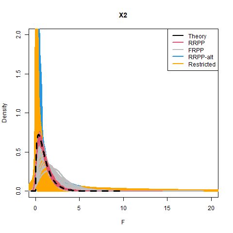

```{r setup, include=FALSE, echo = TRUE, tidy = TRUE}
library(knitr)
library(RRPP)
opts_chunk$set(echo = TRUE)
```

# Conceptual Motivation

<style type="text/css">
td {  /* Table  */
  font-size: 20px;
}
code.r{ /* Code block */
    font-size: 12px;
}
pre { /* Code block - determines code spacing between lines */
    font-size: 12px;
}
</style>

Statistical methods are often used to test hypotheses and make inferences

- One can also determine whether (parametric) confidence intervals of some parameter bracket a particular value
  - Do the 95% CI for $\small\sigma^{2}$ for foot traits differ from those of body traits? 
    
```{r, echo = FALSE, fig.height=3, fig.align='center'}
  
```

Requires parametric theory to estimate parameters & CI


# Parametric Expected Distributions

Numerous distributions of expected values have been generated from theory for different types of data and hypotheses

```{r, echo = FALSE, fig.height=3, fig.align='center'}
include_graphics("lectureData/02.Resampling/TheoryDistributions.png")  
```

Each have assumptions about the behavior of the underlying data


# Challenges to Parametric Theory

- Biological data display numerous challenges for parametric theory
  1. Data may not meet assumptions
  2. Hypothesis may not correspond to an existing theoretical distribution
  3. Data can be highly-dimensional, causing $\small{N:P}$ issues

```{r, echo = FALSE, out.width="40%", fig.align='center'}
par(mar=c(4,4,0,4))
include_graphics("lectureData/12.pcm/11-PCM-PGLS-RaoParadox.png")
```

Power $\small\downarrow$ as dimensionality $\small\uparrow$, and eventually computations cannot be completed (the 'curse' of dimensionality)

**Alternative mechanisms for evaluating hypotheses are required**


# Resampling Methods

- Generate empirical sampling distributions by sampling from the original data in some manner
- Are nonparametric (no theoretical distribution)
- Flexible (can assess patterns in high-dimensional data, as well as complex or non-standard designs)

```{r, echo = FALSE, out.width= "30%", fig.align='center'}
  
```

# Outline

- Randomization/Permutation: Basic concepts
- The Bootstrap
- The Jackknife
- 'Advanced' Randomization Concepts
  - Comments on exchangeable units
  - Randomization Procedures
  - RRPP (Randomizing Residuals in a Permutation Procedure)
  - Multivariate considerations (data matrix and distance matrix permutation)

# 1: Randomization/Permutation

- Permute order of objects (without replacement) many times to generate empirical sampling distribution for some statistic
- **Procedure**
  - 1: Obtain summary measure from the observed data ($E_{obs}$)

  >- 2: Permute data, obtain random measure ($E_{rand}$)

  >- 3: Repeat many times to obtain distribution of possible outcomes ($E_{rand}$)

  >- 4: Significance: $\small\Pr(E_{obs}) = \frac{N_{E_{rand} \geq E_{obs}}}{N_{perm}+1}$ 

  >- NOTE: $\small{N}_{E_{rand} \geq E_{obs}}$ includes $E_{obs}$ in count, as observed data is one possible permutation

# 1: Randomization/Permutation

Schematic of randomization procedure for $t$-test

```{r, echo = FALSE,out.width="80%", fig.align='center'}
  
```

# Randomization: Fisher's Exact Test

Complete enumeration of all possible permutations

Provides exact probability of $E_{obs}$

```{r, echo = FALSE,out.width="80%", fig.align='center'}
  
```

```{r, echo = FALSE, out.width="60%", fig.align='center'}
  
```


# Randomization: Example

- For large datasets, all possible permutations are not feasible, so we use a specific number of permutations (*iterations*)

>- Are male sparrows larger than female sparrows?

>- Use difference value as test value: $E_{obs}=\left(\mu_{M}-\mu_{F}\right)$

# Randomization: Example

- For large datasets, all possible permutations are not feasible, so we use a specific number of permutations (*iterations*)
- Are male sparrows larger than female sparrows?
- Use difference value as test value: $E_{obs}=\left(\mu_{M}-\mu_{F}\right)$

```{r echo = FALSE, eval=TRUE, fig.height = 3, fig.align='center'}
bumpus<-read.csv("lectureData/02.Resampling/bumpus.csv",header=T)
y <- bumpus$TL
sex <- as.factor(bumpus$sex)
sexdata<-split(y,sex)
c1 <- rgb(173,216,230,max = 255, alpha = 80, names = "lt.blue")
c2 <- rgb(255,192,203, max = 255, alpha = 80, names = "lt.pink")
par(mfrow=c(1,2),mar = c(4, 4, 0, 4))
hist(sexdata$m,col=c1,xlim = c((min(y)-5),(max(y)+5)),
     main=NULL,xlab="Body Size")
hist(sexdata$f,col=c2,add=TRUE)

perm <- geomorph:::perm.index(length(y),iter=999)
D.rand <- unlist(lapply(1:1000, 
          function(j) diff(tapply(y[perm[[j]]],sex,mean))))
hist(D.rand,main=NULL,xlab = "Empirical Sampling Distribution (M-F)")
arrows(D.rand[1], 100, D.rand[1], 5, length = 0.1, lwd = 2)
text(x = (D.rand[1]-.06),y=145,labels = "Obs")
par(mfrow=c(1,1))
p.val<-RRPP:::pval(D.rand)
out <- c(D.rand[[1]], p.val); names(out) <- c("D.obs","P-value")
out
```

# Randomization: Some Comments

Note the null distribution from our previous example:

```{r echo = FALSE, eval=TRUE, out.width="30%"}
par(mar = c(4, 4, 0, 4))
hist(D.rand,main=NULL)
```

- Here the empirical sampling distribution was centered on zero.  
- Recall the test measure: $E_{rand}=\left(\mu_{M}-\mu_{F}\right)$
- Under $\small{H}_{0}$ there should be no difference between male-female means
- Thus, the mean expected value under $\small{H}_{0}$ should be close to zero
- Our permutation-based empirical sampling distribution matches this!

>- This is *one* way of knowing that what we permuted was reasonable (more below on exchangeable units under the $\small{H}_{0}$)

# How Many Permutations to Use?

$\small\uparrow$ # of iterations improves precision of estimates of significance

```{r, echo = FALSE,out.width="40%", fig.align='center'}
  
```

With higher computing power, large numbers of iterations are feasible

# 2: The Bootstrap

Resample dataset many times *with replacement*

Each bootstrap iteration contains ${N}$ objects, but some are represented multiple times, and others not at all 

```{r, echo = FALSE,out.width="50%", fig.align='center'}
  
```

The bootstrap is very useful for estimating confidence intervals, because summary measures derived from bootstrap samples approximate those of the original population distribution


# Percentile Bookstrap Confidence Intervals

Generate boostrap datasets

Estimate summary statistic from each $E_{boot}$

Bootstrap CI are: upper and lower $\small\alpha/2$ values of $E_{boot}$ sample (usually 0.025 and 0.975)

```{r, echo = FALSE,out.width="40%", fig.align='center'}
mean.TL<-mean(sexdata$f)	
# mean.TL
int<-1.96*sqrt(var(sexdata$f)/length(sexdata$f))
CIlow<-mean.TL-int
CIhi<-mean.TL+int
# CIlow
# CIhi

boot.mean<-numeric(1000)
for (i in 1:1000){
  boot.mean[i]<-mean(sample(sexdata$f,replace=T))
}

hist(sexdata$f,main="Total Length")
segments(mean.TL, 0, mean.TL, 50, lwd=3,col="red") 
segments(quantile(boot.mean,c(0.025,0.975))[1], 0,
         quantile(boot.mean,c(0.025,0.975))[1], 50, lwd=3,col="blue") 
segments(quantile(boot.mean,c(0.025,0.975))[2], 0,
         quantile(boot.mean,c(0.025,0.975))[2], 50, lwd=3,col="blue") 
```

# Bias-Corrected Percentile Bookstrap Confidence Intervals

Sometimes the the bootstrap distribution is skewed, such that $\small\mu_{E_{boot}}\neq{E_{obs}}$

```{r, echo = FALSE,out.width="40%", fig.align='center'}
hist(boot.mean,main="Bootstrap Mean values")
segments(mean(boot.mean), 0, mean(boot.mean), 100, lwd=3,col="blue") 
segments(mean.TL, 0, mean.TL, 100, lwd=3,col="red") 
```

Bias is alleviated by finding fraction (Fr) of bootstrap values above $\small{E}_{obs}$ 

Adjust as $\small{CI}=\Phi[2\Phi^{-1}(Fr)\pm{Z}_{\alpha/2}]$ where $\small\Phi$ is the cumulative normal distribution 

>- Note: other bootstrap procedures exist

# 3: The Jackknife

'Leave one out' resampling: each iteration contains $\small{N-1}$ objects

```{r, echo = FALSE,out.width="60%", fig.align='center'}
  
```

Investigate the precision of $\small{E}_{obs}$ and how sensitive it is to specific values in a dataset 

Useful to measure bias, standard error or CI of test statistic

$\small{Bias}(E_{obs})=E_{obs}-\mu_{E_{jack}}$

# Revisiting Permutation: Designing The Test

Devising a proper permutation test requires several components:

1: Identifying the null hypothesis $\small{H}_{0}$

2: Determining whether there is a known expected value under $\small{H}_{0}$

3: Identifying which values may be permuted and how to estimate expected distribution under $\small{H}_{0}$

###### see: Commanges. (2003). Good. (2004).; Sekora, Adams & Collyer. Heredity (2015). Adams & Collyer. Evol. (2018)

# Revisiting Permutation: Designing The Test

Devising a proper permutation test requires several components:

1: Identifying the null hypothesis $\small{H}_{0}$

2: Determining whether there is a known expected value under $\small{H}_{0}$

3: Identifying which values may be permuted and how to estimate expected distribution under $\small{H}_{0}$

###### see: Commanges. (2003). Good. (2004).; Sekora, Adams & Collyer. Heredity (2015). Adams & Collyer. Evol. (2018)

Essentially, one must determine:

1: What to permute? 

2: How to permute it? 


# The Logic of Permutation Tests

Permutation tests generate empirical sampling distributions under $\small{H}_{0}$

How do we accomplish this? 

A simple logic flow:

1. Define $\small{H}_{0}$ and $\small{H}_{1}$

2. Identify what *differs* between $\small{H}_{0}$ and $\small{H}_{1}$ (i.e., what does $\small{H}_{1}$ quantify relative to $\small{H}_{0}$?)

3. Permute the data which 'breaks up' the signal in $\small{H}_{1}$ relative to $\small{H}_{0}$

# The Logic of Permutation Tests: Example

- Are males and females different in size? 
- Conceptually this is a $t$-test
  - $\small{H}_{0}$: no difference: $\small{T}_{obs}=0$ or more directly  $\small\left(\mu_{M}-\mu_{F}\right)=0$
  - $\small{H}_{1}$: differences between males and females: $\small{T}_{obs}\neq0$ or more directly $\small\left(\mu_{M}-\mu_{F}\right)\neq0$

>- Approach: Calculate $\small{E}_{obs}=\small\left(\mu_{M}-\mu_{F}\right)$
>- Permute size values (leave M/F column unchanged)
>- Estimate $\small{E}_{rand}=\small\left(\mu_{M}-\mu_{F}\right)$ from permuted data

# The Logic of Permutation Tests: Example

- Are males and females different in size? 
- Conceptually this is a $t$-test
  - $\small{H}_{0}$: no difference: $\small{T}_{obs}=0$ or more directly  $\small\left(\mu_{M}-\mu_{F}\right)=0$
  - $\small{H}_{1}$: differences between males and females: $\small{T}_{obs}\neq0$ or more directly $\small\left(\mu_{M}-\mu_{F}\right)\neq0$

- Approach: Calculate $\small{E}_{obs}=\small\left(\mu_{M}-\mu_{F}\right)$
- Permute size values (leave M/F column unchanged)
- Estimate $\small{E}_{rand}=\small\left(\mu_{M}-\mu_{F}\right)$ from permuted data


```{r echo = FALSE, eval=TRUE,out.width="30%", fig.align='center'}
hist(D.rand,main="Empirical distribution of (M-F) from permutation")
```

# Permutation Example: Comments

- For previous example, each iteration 'broke up' the association of size with sex
- Each permutation was a realization of possible outcomes of random assignment of size to sex
- Thus, the permutation was an embodiment of $\small{H}_{0}$ (i.e., of no size~sex association)
- Further, under $\small{H}_{0}$, we expect that: $\small{E}(\mu_{M}-\mu_{F}) = 0$
- The mean of our empirical distribution matches this expected value: $\small\bar{E}_{rand} \approx 0$ 

```{r echo = FALSE, eval=TRUE,out.width="30%", fig.align='center'}
hist(D.rand,main="Empirical distribution of (M-F) from permutation")
```

###### Here, permuting the response data (Y) appears reasonable as a set of exchangeable units (This is 'full' randomization)

# Exchangeable Units

- More formally, we seek to identify the correct *exchangeable units* under $\small{H}_{0}$

>- Exchangeable units are those values such that the permuted distribution is the same as that of the original (Commanges. *J. Nonparam. Stat.* 2003)

>- For linear models, we seek to retain two properties: 

>- 1^st^ moment exchangeability: the expected value remains constant

>- 2^nd^ moment exchangeability: the variance remains constant

# Exchangeable Units

- More formally, we seek to identify the correct *exchangeable units* under $\small{H}_{0}$

- Exchangeable units are those values such that the permuted distribution is the same as that of the original (Commanges. *J. Nonparam. Stat.* 2003)

- For linear models, we seek to retain two properties: 

- 1^st^ moment exchangeability: the expected value remains constant

- 2^nd^ moment exchangeability: the variance remains constant


###### Example: Say one is interested in the difference between two means. Permuting individuals among groups produces outcomes where the overall mean and overall variance are the same in every permutation. Thus, when compared to this empirical sampling distribution, evaluation of the observed difference is made with respect to constant global mean and variance.  

>- As seen later, permuting residuals retains both of these properties for OLS models (for GLS, permuting residuals retains the second property)

# Effect Sizes from Empirical Null Sampling  Distributions

- It is often useful to obtain an effect size from empirical sampling distributions 

1. Perform RRPP many times.  
2. Calculate $F$-value in every random permutation (observed case counts as one permutation)
3. For $N$ permutations, $P = \small\frac{N(F_{random} \geq F_{obs})}{N}$
4. Calculate *effect size* as a standard deviate of the observed value in a normalized distribution of random values (helps for comparing effects within and between models); i.e.,
$$\small{z = \frac{
\log\left( F\right) - \mu_{\log\left(F\right)}
} {
 \sigma_{\log\left(F\right)}
}}$$
where $\small\mu_{\log\left(F\right)}$ and $\sigma_{\log\left(F\right)}$ are the expected value and standard deviation from the sampling distribution, respectively.

###### Collyer et al. (2015); Adams & Collyer. (2016; 2018; 2019)

# Consequences of Incorrect Permutation

Incorrectly assigning exchangeable units can result in elevated type I error rates and incorrect inferences

```{r, echo = FALSE, out.width="75%", fig.align='center'}
include_graphics("lectureData/02.Resampling/ExchangeableUnits-PICBad.png")
```

Here, permuting phylogenetically independent contrasts is incorrect, because these values contain information from both the response ($\small\mathbf{Y}$) data as well as the phylogeny among taxa (see PCM lecture)

# Full Randomization

For simple linear models: $\small\mathbf{Y}=\mathbf{X}\mathbf{\beta } + \mathbf{E}$, permuting $\small\mathbf{Y}$ relative to $\small\mathbf{X}$ is often proposed

```{r, echo = FALSE,out.width="50%", fig.align='center'}
  
```

This is sufficient for $t$-test & correlation tests; and for simple linear models (e.g., single-factor models)

# Permutation Procedures: Factorial Models

For more complex models with **Multiple** explanatory factors:

Factorial model: $\small\mathbf{Y}=\mathbf{X_{A}}\mathbf{\beta_{A}} +\mathbf{X_{B}}\mathbf{\beta_{B}} +\mathbf{X_{AB}}\mathbf{\beta_{AB}}+\mathbf{E}$

Permuting $\small\mathbf{Y}$ is possible, but seems inadequate

```{r, echo = FALSE,out.width="30%", fig.align='center'}
include_graphics("lectureData/02.Resampling/FactorialDesign.png")  
```

>- 1: Does $\small\mathbf{Y}_{Full}$ retain 1^st^ and 2^nd^ moment exchangeability? **(Yes)**

>- 2: Does $\small\mathbf{Y}_{Full}$ properly separate $\small{SS_{A}}$ with $\small{SS_{B}}$ with $\small{SS_{AB}}$? **(No)**


# Restricted Randomization

An alternative is to restrict the resampling to sub-strata of data (strata based on levels within factors)

```{r, echo = FALSE,out.width="60%", fig.align='center'}
  
```

Permute $\small\mathbf{Y}$ within levels of **A** then within levels of **B**

Permits evaluation of $\small{SS_{A}}$ and $\small{SS_{B}}$ but *NOT* $\small{SS_{AB}}$

>- May not be general

# Factorial Models: Understanding the Null

The *key* to identifying exchangeable units lies with the $\small{H}_{0}$:

Factorial models $\small\mathbf{Y}=\mathbf{X_{A}}\mathbf{\beta_{A}} +\mathbf{X_{B}}\mathbf{\beta_{B}} +\mathbf{X_{AB}}\mathbf{\beta_{AB}}+\mathbf{E}$ are a set of sequential hypotheses comparing full ($\small\mathbf{X}_{F}$) and reduced ($\small\mathbf{X}_{R}$) models 

```{r, echo = FALSE,out.width="60%", fig.align='center'}
 
```

Testing each $\small\mathbf{X}_{F}$ requires appropriate permutation procedure for each $\small\mathbf{X}_{R}$

**Residual randomization** provides proper exchangeable units under each $\small\mathbf{X}_{R}$ 

###### Anderson. (2001); Anderson and terBraak. (2003); Collyer & Adams. (2007); Collyer, Sekora & Adams. (2015); Adams & Collyer. (2018; 2019)


# Residual Randomization

Permute *residuals* $\mathbf{E}_{R}$ from reduced model $\small\mathbf{X}_{R}$, rather than original values

Evaluates  $\small{SS}_{\mathbf{X}_{F}}$ while holding effects of $\small\mathbf{X}_{R}$ constant

Must specify full and reduced models (Type I SS used in example)

```{r, echo = FALSE,out.width="70%", fig.align='center'}
 
```

Mathematical justification:  

1: For any $\small\mathbf{X}_{R}$: $\small{SS}_{\mathbf{X}_{F}}=0$ 

2: Under $\small\mathbf{X}_{R}$, $\mathbf{E}_{R}$ represent those components of SS *NOT* explained by $\small\mathbf{X}_{R}$ (includes $\small{RSS}$ of $\small\mathbf{X}_{F}$ plus SS from term(s) not in $\small\mathbf{X}_{R}$)

3: Thus, permuting $E_{R}$ precisely embodies $\small{H}_{R}$ of: $\small{SS}_{\mathbf{X}_{F}}=0$ 

# Residual Randomization Permutation Procedure (RRPP)

1: Fit $\small\mathbf{X}_{F}$ for each term in model; obtain coefficients and summary statistics (e.g., $\small{SS}_{X}$) 

2: Fit $\small\mathbf{X}_{R}$ for each $\small\mathbf{X}_{F}$; Estimate $\small\hat{\mathbf{Y}}_{R}$ and $\mathbf{E}_{R}$

3: Permute, $E_{R}$: obtain pseudo values as: $\small\mathbf{\mathcal{Y}} = \mathbf{\hat{Y}}_{R} + \mathbf{E}_{R}$

4: Fit $\small\mathbf{X}_{F}$ using $\small\mathbf{\mathcal{Y}}$: obtain coefficients and summary statistics

5: Repeat

# Residual Randomization (RRPP): Single Factor Models

NOTE: for single-factor models, permuting $\small\mathbf{Y}$ is equivalent to RRPP

```{r, echo = FALSE,out.width="80%", fig.align='center'}
  
```

Reason: $\small{H}_{0}$ for single-factor model is $\mathbf{Y}$~1 (intercept model)

Residuals of $\small{H}_{0}$ are simply deviations from the $\small\mu_{Y}$

And since $\small\mu_{Y}$ is a constant, permutation distribution will be identical


# Which to Use?

OLS Factorial Model (Adams & Collyer, unpubl.)

```{r, echo = FALSE, out.width = "150px", out.height= "150px"}
par(mar=c(4,4,0,4))


```

```{r, echo = FALSE, out.width = "150px", out.height= "150px"}
par(mar=c(4,4,0,4))
include_graphics("lectureData/02.Resampling/Simulations/Figs/OLS.Fact-p1.png")


```

```{r, echo = FALSE, out.width = "150px", out.height= "150px"}
par(mar=c(4,4,0,4))


```

**Full Randomization, Restricted Randomization, and RRPP are all fine (but not full-model residuals)**

# Which to Use?

GLS Factorial Model (Adams & Collyer, unpubl.)

```{r, echo = FALSE, out.width = "150px", out.height= "150px"}
par(mar=c(4,4,0,4))


```

```{r, echo = FALSE, out.width = "150px", out.height= "150px"}
par(mar=c(4,4,0,4))


```

```{r, echo = FALSE, out.width = "150px", out.height= "150px"}
par(mar=c(4,4,0,4))



```

**Only RRPP is appropriate**


# RRPP & Multivariate Data

RRPP is unaltered for multivariate data

Shuffle *ROWS* of $\mathbf{E}_{R}$

```{r, echo = FALSE,out.width="80%", fig.align='center'}
  
```

The rest of the procedure is **unchanged**


# RRPP & Distance Data

Mantel tests (see Matrix Covariation) shuffle rows *AND* columns of distance matrices

Prefered approach: RRPP 

1: PCoA of distance matrix to obtain coordinates for $\small{Y}$

2: Fit model: $\small \mathbf{Y}=\mathbf{X}\mathbf{\beta } +E$

3: RRPP of rows of $\mathbf{E}_{R}$

```{r, echo = FALSE,out.width="50%", fig.align='center'}
include_graphics("lectureData/02.Resampling/RRPP-MultivDistFig.png")  
```

# Residual Randomization (RRPP): Example

Does pupfish body shape differ between populations (marsh vs. sinkhole) or between the sexes?

This is a factorial MANOVA: Y~ Pop + Sex + Pop:Sex

```{r, echo = FALSE,out.width="50%", fig.align='center'}
 
```

```{r, echo = FALSE,out.width="50%"}
data(Pupfish)
GP<-factor(paste(Pupfish$Sex,Pupfish$Pop))
fit <- lm.rrpp(coords ~ Sex*Pop, SS.type = "I", data = Pupfish, print.progress = FALSE) 
anova(fit)$table
```


# Residual Randomization  (RRPP): Example

PCA of data and predicted values (see GLM lecture)

```{r, echo = FALSE,out.width="50%"}
shapeDF <- expand.grid(Sex = levels(Pupfish$Sex), Pop = levels(Pupfish$Pop))
rownames(shapeDF) <- paste(shapeDF$Sex, shapeDF$Pop, sep = ".")
shapePreds <- predict(fit, shapeDF)

plot(fit,type="PC",pch=21, cex=2,bg=GP)
plot(shapePreds, PC = TRUE, pch=21, cex=1, bg=GP)
```

# More Complex Designs

* RRPP appropriate for 'standard' OLS (ordinary least squares) models

    + ANOVA designs

    + Regression designs

    + Factorial models

    + ANCOVA models

More generally RRPP is also appropriate for GLS (generalized least squares) models

These are models where covariance between objects is not zero (e.g., phylogenetic non-independence, spatial non-independence, temporal non-independence, etc.). 

OLS is a special case of GLS (see LM lecture)


# CONCLUSIONS

Resampling methods are of primary importance in multivariate analysis

Methods are flexible, and may be used with univariate or high-dimensional data

**RRPP** is *the* most general approach (and the only approach that is appropriate for GLS models)