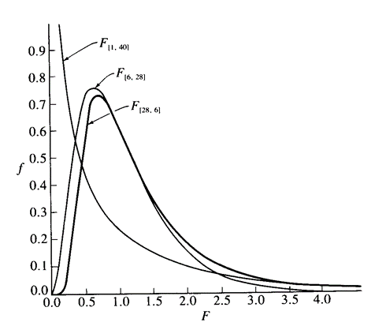
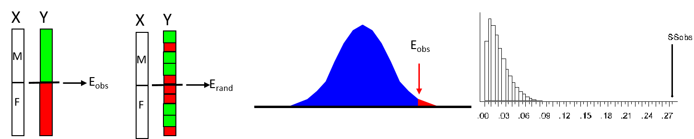

```{r setup, include=FALSE, echo = TRUE, tidy = TRUE}
library(knitr)
library(RRPP)
library(lme4)
library(lattice)
opts_chunk$set(echo = TRUE)
```

# Analysis of Variance (ANOVA)

<style type="text/css">
td {  /* Table  */
  font-size: 20px;
}
code.r{ /* Code block */
    font-size: 12px;
}
pre { /* Code block - determines code spacing between lines */
    font-size: 12px;
}
</style>

A linear model where the response variable $\small\mathbf{Y}$ is continuous, and $\small\mathbf{X}$ contains one or more categorical factors (predictor variables). This is a comparison of groups 

$$\mathbf{Y}=\mathbf{X}\mathbf{\beta } +\mathbf{E}$$

- $\small{H}_{0}$: No difference among groups. i.e., variation in $\small\mathbf{Y}$ is not explained by $\small\mathbf{X}$: i.e., $\small{H}_{0}$: $\small{SS}_{X}\sim{0}$

- $\small{H}_{1}$: Difference exist among groups (i.e., group means differ from one another). i.e., some variation in $\small\mathbf{Y}$ *is*  explained by $\small\mathbf{X}$: i.e., $\small{H}_{1}$: $\small{SS}_{X}>0$

- Parameters: model coefficients $\small\hat\beta$ represent components of the group means relative to the overall mean 

- Note: Model also written as: $\small{Y}_{ij}=\mu+\alpha_{i}+\epsilon_{ij}$ ($\small{\mu}$ is the grand mean, $\small{\alpha}_{i}$ is a component of the mean for the $\small{i}^{th}$ group, and $\small\epsilon_{ij}$ is the residual error)

###### This formulation appears different, but really $\mathbf{\beta}$ is a vector containing $\small{\mu}$ and $\small{\alpha}_{i}$, so the model is the same

# Assumptions of ANOVA

- 1: Independence: $\small\epsilon_{ij}$ of objects must be independent 

  - Spatial, temporal, or phylogenetic autocorrelation of objects violate this assumption

- 2: Normality: requires normally distributed $\small\epsilon_{ij}$ 

  - If not normal, transform as appropriate

- 3: Homoscedasticity: equal variance 

  - If heteroscedastic, transform or use nonparametric (NOTE: ANOVA models fairly robust to homoscedasticity violations)

# General Computations

- ANOVA is based on partitioning the total $\small{SS}$ in a dataset 

$$\small{SST}=\sum_{i=1}^{a}\sum_{j=1}^{n_a}\left({Y}_{ij}-\overline{\overline{Y}}\right)^{2}$$

- This is decomposed into model and error $\small{SS}$: $\small{SST} = SSM + SSE$
- Variance components obtained for each (termed *mean squares*)

$$\small{MS}={\sigma}^{2}=\frac{1}{n-1}SS$$

- Test statistic is $\small{F}$: a ratio of variances: $\small{F}=\frac{MSM}{MSE}$
- If $\small{F}$-ratio ~ 1.0, no differences in variance ($\small{\sigma}^{2}_{M}\approx{\sigma}^{2}_{E}$) thus, grouping factor does not explain an important component of variation (ie., groups not different: $\small{H}_{0}$ not rejected)

# Single-Factor ANOVA

- Model contains single grouping variable (e.g., `species` or `sex`)

- Procedure
	- Obtain overall and group means
  - Estimate $\small{MSM}$ from group means vs. overall mean: $\small{\sigma}^{2}_{M}=MSM$ 
	- Estimate $\small{MSE}$ from individuals vs. their group mean: $\small{\sigma}^{2}_{E}=MSE$ 
	- Calculate $\small{F}$ and assess significance ($\small{df}_{1},df_{2}$)

```{r, echo = FALSE,out.width="50%", fig.align='center'}
  
```

- Note: in future weeks we will use matrix algebra to obtain SS for model effects ($\small{SSM}$, $\small{SSE}$, etc.)

# Assessing Significance

- Standard approach: 
	- Compare $\small{F}$-ratio to $\small{F}$-distribution with appropriate $\small{df}$

```{r, echo = FALSE,out.width="20%", fig.align='center'}
  
```

- Resampling Alternative:
	- Shuffle individuals among groups and generate distribution of possible 	$\small{F}$-values (note: for single-factor ANOVA, shuffling individuals IS a residual randomization)

```{r, echo = FALSE,out.width="70%", fig.align='center'}
  
```

# Single-Factor ANOVA: Example

Do male and female sparrows differ in total length?

```{r echo = FALSE, eval=TRUE, fig.height = 3, fig.align='center'}
bumpus<-read.csv("lectureData/02.Resampling/bumpus.csv",header=T)
y <- TL <- bumpus$TL
sex <- as.factor(bumpus$sex)
surv <- as.factor(bumpus$survived)
sexdata<-split(y,sex)
c1 <- rgb(173,216,230,max = 255, alpha = 80, names = "lt.blue")
c2 <- rgb(255,192,203, max = 255, alpha = 80, names = "lt.pink")
par(mfrow=c(1,2),mar = c(4, 4, 0, 4))
hist(sexdata$m,col=c1,xlim = c((min(y)-5),(max(y)+5)),
     main=NULL,xlab="Body Size")
hist(sexdata$f,col=c2,add=TRUE)
plot(sex,y , pch=21, bg="red", xlab = "Sex", ylab="Total Length")
par(mfrow=c(1,1))
```

```{r echo=TRUE}
anova(lm(bumpus$TL~bumpus$sex))
```

- Conclusion: Males are larger than females

# Special Case: Two Groups (t-test or ANOVA?)

- For 2 groups ($\small{n}_{1} = n_{2}$), ANOVA will yield identical results to $\small{t}$-test

```{r echo=TRUE, out.width="70%", fig.align='center' }
Group <- gl(2,5)
Y <- c(5,4,4,4,3,7,5,6,6,6)
t.test(Y~Group)
anova(lm(Y~Group))
```

# Special Case: T-test vs. ANOVA

- When $\small{n}_{1} = n_{2}$, one can derive $\small{F}$-ratio from the $\small{t}$-statistic

$$\tiny{t}^{2}=\frac{\left(\overline{Y}_{1}-\overline{Y}_{2}\right)^{2}}{s_{p}^{2}\left(\frac{1}{n_{1}}+\frac{1}{n_{2}}\right)}=\frac{n\left(\overline{Y}_{1}-\overline{Y}_{2}\right)^{2}}{2s_{p}^{2}}$$
- Numerator is equivalent to numerator in ANOVA:

$$\tiny{n}\left(\overline{Y}_{1}-\overline{Y}_{2}\right)^{2}=\left({n\left(\overline{Y}_{1}-\overline{\overline{Y}}\right)^{2}+n\left(\overline{Y}_{2}-\overline{\overline{Y}}\right)^{2}}\right)=\sum_{i=1}^{2}n\left({\overline{Y}_{i}-\overline{\overline{Y}}}\right)^{2}$$

- In this case, the $\small{t}$-test and ANOVA are mathematically equivalent

# ANOVA: More Than Two Groups

- When a factor has more than two groups, ANOVA works the same way
- However, for the ANOVA computations to be accomplished, information in the input $\small\mathbf{X}$ must be re-organized
- Specifically, a factor column of `a` groups (levels) must be represented by a series of `a-1`columns that code the groups in binary fashion
- These are assembled into a **model matrix** representing all information in $\small\mathbf{X}$
- The coefficients of the model ($\small\beta$) are then obtained for each column, including the intercept 

###### Note: the binary coding of levels within factors is typically performed by the statistical software, not the user. But it important to understand what is occuring, so one may properly interpret model coefficients

# ANOVA Model Matrix Examples

```{r echo=TRUE, out.width="70%" }
x1 <- gl(3,3)
model.matrix(~x1) # with intercept
model.matrix(~x1+0) # without intercept
```

# Model Parameters

What do the parameters $\beta$ represent in ANOVA?

$\beta$ contains the first group mean, and differences from this mean to the others

# Model Parameters

What do the parameters $\beta$ represent in ANOVA?

$\beta$ contains the first group mean, and differences from this mean to the others

Example: 

```{r echo=TRUE, include=TRUE, fig.align='center'} 
y <- c(6, 4, 0, 2, 3, 3, 4, 7 )
gp <- factor(c(1,1,2,2,3,3,4,4))
coef(lm(y~gp))
tapply(y,gp,mean)
```

# ANOVA: Post-Hoc Tests

- ANOVA identifies group differences, but not WHICH ONES
- For the latter, pairwise multiple comparisons required (1 vs 2, 1 vs 3, etc)
- *MANY* analytical approaches exist: most derived from the t-statistic
	- Example: Fishers’ LSD (Least Significant Difference)
		- For each pair of groups calculate: $\small{t}_{obs}=\lvert\overline{Y}_{i}-\overline{Y}_{j}\rvert$               
		- Compare to smallest significant standardized difference: $\small{LSD}=t_{\alpha/2}\sqrt{MSE\left(\frac{1}{n_{i}}+\frac{1}{n_{j}}\right)}$

- Other approaches: T’, Tukey-Kramer, GT2, Duncan’s multiple range, Scheffe’s F-test (choice depends on = or ≠ sample sizes, etc.)

# Post-Hoc Comparisons by Permutation

- Resampling method for pairwise comparisons

>- Estimate group means

>- Calculate matrix of $\small{D}_{Obs}=\sqrt{\left(\overline{Y}_{i}-\overline{Y}_{j}\right)^{2}}$

>- Permute specimens into groups

>- Estimate means and $\small{D_{rand}}$

>- Assess $\small{D}_{obs}$ vs. $\small{D}_{rand}$

>- Repeat

>- ###### e.g., Adams and Rohlf 2000; Adams 2004

# Experiment-Wise Error Rate

- Multiple testing of data increases chance of ‘finding’ significance, so adjust $\small\alpha_{critical}$ for number of comparisons (*k*)

- Various approaches
    - Dunn-Sidak: $\small\alpha^{'}=1-(1-\alpha)^{1/k}$
    - Bonferroni:$\small\alpha^{'}=\frac{\alpha}{k}$
    - Sequential Bonferroni: $\small\alpha^{'}=\frac{\alpha}{k}$, but recalculated each time (k=1,2,3. . . ) for ORDERED comparisons

- Bonferroni considered quite conservative: sequential Bonferroni much less so

# ANOVA Example: Bumpus Data

- After a bad winter storm (Feb. 1, 1898), Bumpus retrieved 136 sparrows in Rhode Island (about ½ died)
- Collected the following measurements on each:

```{r, echo = FALSE,out.width="70%", fig.align='center'}
  
```

- To investigate implications of natural selection, he examined whether there was a difference in alive vs. dead birds


# ANOVA Example: Bumpus Data

- ANOVA with 4 groups (male-alive, male-dead, female-alive,female-dead)

```{r echo=TRUE, out.width="70%", fig.align='center' }
gp <- as.factor(paste(bumpus$sex,bumpus$surv))
anova(lm(bumpus$TL~gp))
pairwise.t.test(bumpus$TL, gp, p.adj = "none")

```

# ANOVA Example: Permutations

- Pairwise comparisons via permutation
```{r echo=FALSE, out.width="70%", fig.align='center' }
mydat <- rrpp.data.frame(gp = gp, TL = bumpus$TL, sex=bumpus$sex,surv=bumpus$survived)
```


```{r echo=TRUE, out.width="70%", fig.align='center' }
res <-summary(pairwise(lm.rrpp(TL~gp, data = mydat,print.progress = FALSE),groups = gp),test.type = "dist", stat.table = FALSE)

res$pairwise.tables$D  #Distance matrix
res$pairwise.tables$Z  #Effect size
res$pairwise.tables$P  #Significance

```

# Factorial ANOVA

ANOVA multiple $\small{X}$ variables (e.g, species AND sex) 

- R-code: `Y ~ A+B`

- 2 factor Model: $\small{Y}=\beta_{0}+X_{1}\beta_{1}+X_{2}\beta_{2}+\epsilon$

###### Note: Factors with 3+ groups will have multiple $\small\beta$ per factor.

- In simplest case (factor `A` and `B`), $\small{SS}_{A}$ & $\small{SS}_{B}$ are independent of one another, and are thus calculated as before: e.g. 
$$\tiny{SSA}=\sum_{i=1}^{a}{n}_{i}\left({\overline{Y}_{i}-\overline{\overline{Y}}}\right)^{2}$$

```{r, echo = FALSE,out.width="50%", fig.align='center'}
  
```


# Factorial Models

- Think of data for Factorial ANOVA as table of reactions

```{r, echo = FALSE,out.width="50%", fig.align='center'}
  
```

- Find means of rows, columns, and individual cells, and comparison of these yields tests for Factors `A` & `B`

- NOTE: This ignores any interaction between `A` & `B` (`A:B`)

# Factor Interactions

- Interactions measure the joint effect of main effects `A` & `B` 

- R-code: `Y ~ A+B + A:B` implying: $\small{Y}=\beta_{0}+X_{1}\beta_{1}+X_{2}\beta_{2}+X_{1:2}\beta_{1:2}+\epsilon$

- `A:B` identifies whether response to `A` is dependent on level of `B` found as: $\small{SS}_{A:B}=\sum_{i=1}^{a}\sum_{j=1}^{b}{n}_{ij}\left(\overline{Y}_{AB}-\overline{Y}_{A_{i}}-\overline{Y}_{B_{j}}+\overline{\overline{Y}}\right)^{2}$

- Significant interaction: main effects not interpretable without clarification (e.g., species 1 larger than species 2 ONLY in wet environments…)

- Interactions are *VERY* common in biology 

```{r, echo = FALSE, fig.height = 2, fig.align='center'}
  
```

# Factorial ANOVA: General

- Other factors (main effects) can be added for general factorial designs

$$\tiny{Y}=\beta_{0}+X_{1}\beta_{1}+X_{2}\beta_{2}+X_{3}\beta_{3}+X_{1:2}\beta_{1:2}+X_{1:3}\beta_{1:3}+X_{2:3}\beta_{2:3}+X_{1:2:3}\beta_{1:2:3}+\epsilon$$

- Adding factors also means adding many interactions

- Inclusion of additional factors allows one to 'account for' their variation in the analysis (e.g., evaluate variation in sex while taking species into consideration), *and* allows assessment of interactions between factors, but requires larger $\tiny{N}$

- In general, assess significance of interactions, make decisions regarding whether to pool non-significant interaction $\small{MS}$ with $\small{MSE}$, then interpret main effects whenever possible

###### Rules for pooling MSA*B with MSE depend upon significance, the type of effect (fixed or random), and several other considerations (See Box 10.3 in Biometry for details)

# Assessing Significance

- Standard approach: 
	- Compare $\small{F}$-ratio to $\small{F}$-distribution with appropriate df

```{r, echo = FALSE,out.width="20%", fig.align='center'}
  
```

- Resampling Alternative:
	- Shuffle individuals among groups and generate distribution of possible 	$\small{F}$-values (note: for single-factor ANOVA, shuffling individuals IS a residual randomization)

```{r, echo = FALSE,out.width="70%", fig.align='center'}
  
```

# Factorial ANOVA: Example

- ANOVA with 2 factors: Sex (M/F) and survivorship (alive/dead)

```{r echo=TRUE, out.width="70%", fig.align='center' }
anova(lm(TL~sex*surv))
pairwise.t.test(TL, gp, p.adj = "none")

```

# Factorial ANOVA Example: Permutations

```{r echo=TRUE, out.width="70%", fig.align='center' }
anova(lm.rrpp(TL~sex*surv, data = mydat,print.progress = FALSE))$table
summary(pairwise(lm.rrpp(TL~gp, data = mydat,print.progress = FALSE),groups = gp), test.type = "dist")

```

# Fixed Effects and Random Effects

- **Fixed effects**: Factors containing a fixed set of levels whose treatment effects have been specified (e.g., male/female). *THIS IS WHAT WE'VE CONSIDERED THUS FAR.*  

- **Random effects**: Factors whose levels have been chosen at random to to represent variation attributed to the factor. Here, variation among groups is due to specified treatment effects and a random component *NOT* fixed (modeled) by the experiment or statistical design.

    - Groups are chosen as a random sample from a larger population *of possible* groups 
  
    - In biology, `subject` or `family` is often a random effect (e.g., we select a set of individuals to characterize variation that may be typical among individuals)  

- Evaluating model effects requires determination of whether they are fixed or random effects, as this impacts the *Expected Mean Squares* against which they should be compared

# Expected Mean Squares

- EMS describe the sources of variation for the effects in the model, and the sources against which effects are evaluated (i.e., Error $\small{MS}$ for each term). 

- This relates to the *REDUCED model* $\small{H}_{R}$ against which each term is compared (recall, we are evaluating variation of factor effect versus variation not including that factor)

- Factorial model, all fixed effects

```{r, echo = FALSE,out.width="50%", fig.align='center'}
  
```

- Mixed model: `A` is fixed, `B` is random

```{r, echo = FALSE,out.width="50%", fig.align='center'}
  
```

# Nested Effects Models

- One common mixed model contains nested factors (where levels of one factor are nested within levels of another factor) 

- Here factors are not independent, but are hierarchical
Levels of `B` ‘nested’ within levels of `A`

```{r, echo = FALSE,out.width="30%", fig.align='center'}
  
```

- Example: Compare CO2 flux among habitats (`A`) measured from multiple trees (`B`)
    - Trees are logically nested within habitats

- Nested factors are ALWAYS RANDOM effects!

###### No interaction of A:B obtained when nested terms are used, because SS(A/B) = SSB + SSA:B

# Nested Anova: Example

An example

```{r}
anova(lm.rrpp(TL~sex/surv, print.progress = FALSE), error = c("sex:surv", "Residuals"))$table
```

Compared with the same data as a factorial model

```{r}
anova(lm.rrpp(TL~sex*surv, print.progress = FALSE))$table
```

# Factorial or Nested?

- Determining independent vs. nested can be tricky. Consider: 
    - Is there correspondence of levels across factors, or do they represent sub-divisions? 
    - Is second factor fixed/random?
    - Is interaction term meaningful?

- Example 1: Is `sex` an independent factor, or nested within `species`?
    - SEX IS AN INDEPENDENT FACTOR: 
	    - Levels of `sex` correspond across `species`
	    - `sex` is fixed effect
	    - `sex:species` interaction term meaningful

- Example 2: Is `tree` nested within `habitat` (for CO2 experiment), or is it an independent factor?
    - TREE IS LIKELY A NESTED FACTOR: 
      - Levels of `tree` not common across `habitats`
      - `tree` is a random effect (trees selected as representatives of the sample)
      - `tree:habitat` interaction not biologically meaningful

# Linear Mixed Models

- Linear mixed models contain both fixed and random effects

- In biology, they are especially useful to account for: 
  - Random variation across groups of observations
  - Repeated measures or hierarchical designs
  - Other sources of non-independence across observations

>- Linear mixed Model: $\small{Y}=\beta_{0}+X\beta+Zu+\epsilon$

  >- $\small{X\beta}$ contains the fixed effects components
  
  >- $\small{Zu}$ contains the random effects components
  
>- Use of random effects requires estimating the object covariance matrix that describes the non-independence, hierarchy, etc.

>- Model parameter estimation accomplished via REML (restricted maximum likelihood)
  
>- ##### This is a *hugely* important model in ecological and evolutionary studies (those with data of this sort are encouraged to take course in LMMs)

# Linear Mixed Model: Example

```{r, echo = FALSE,out.width="30%" , fig.align='center'}
xyplot(Reaction ~ Days | Subject, sleepstudy, type = c("g","p","r"),
       index = function(x,y) coef(lm(y ~ x))[1],
       xlab = "Days of sleep deprivation",
       ylab = "Average reaction time (ms)", aspect = "xy")
```

Subjects differ by slope and intercept (fit random slope/intercept model)

```{r}
fm1 <- lmer(Reaction ~ Days + (Days|Subject), sleepstudy)
anova(fm1)
summary(fm1)
```

# Complex Experimental Designs

- Because SS can be partitioned, much more complicated ANOVA models are possible (e.g., 5 way factorial with 2 nested effects, some fixed some random…)
  - Often, researchers are prohibited by funds and cannot measure replicates for all levels of various treatments
  - Various experimental designs exist to extract SS for factors in incomplete data (e.g., latin-squares, randomized complete block, randomized incomplete block, etc.)
  - Maximize the power of analysis vs. sampling effort, provided they are set up correctly (i.e. are considered a priori)

##### See Statistics Dept. for how to generate such designs

# Type I, Type II, Type III Sums-of-Squares

- For balanced data sets, everything above holds
    - For unbalanced data, things are more complicated
    - Different factor SS can be obtained with different ORDER of factors in the model

```{r echo=TRUE, out.width="50%" }
anova(lm(bumpus$TL~bumpus$sex*bumpus$surv))
anova(lm(bumpus$TL~bumpus$surv*bumpus$sex))
```

- Why is this the case?  Depends on reduced model against which full model is compared

# Multiple Model Effects (Type I SS)

For a model containing two factors (sex, and population), consider the following model comparisons ($\small{H}_{F}$ vs. $\small{H}_{R}$):

Effect | Reduced | Full | Purpose
:----- | :----------- | :------------- | :---------------------------
Sex | Null | Null + Sex | Determine if Sex mean difference is "significant" compared to an overall mean
Pop | Null + Sex | Null + Sex + Pop | Determine if population differences are significant, after accounting for general difference between males and females
Sex:Pop | Null + Sex + Pop | Null + Sex + Pop + Sex:Pop | Determine if sexual dimorphism varies between populations, after accounting for general difference in sex and population.
Full model | Null | Null + Sex + Pop + Sex:Pop | Ascertain if the model is signficant (if not, the other parts should not be considered significant either)

Estimating $SS$ between models for the first three model comparisons is called **Sequential (Type I) $SS$** estimation.  We start with a null model and build up to the fullest model.

# Multiple Model Effects (Type II SS)

Alternatively, model comparisons ($\small{H}_{F}$ vs. $\small{H}_{R}$) could be constructed as follows:

Effect | Reduced | Full | Purpose
:----- | :----------- | :------------- | :---------------------------
Sex | Null + Pop | Null + Pop + Sex | Determine if Sex mean difference is "significant", after accounting for population mean difference
Pop | Null + Sex | Null + Sex + Pop | Determine if population differences are significant, after accounting for general difference between males and females
Sex:Pop | Null + Sex + Pop | Null + Sex + Pop + Sex:Pop | Determine if sexual dimorphism varies between populations, after accounting for general difference in sex and population.
Full model | Null | Null + Sex + Pop + Sex:Pop | Ascertain if the model is signficant (if not, the other parts should not be considered significant either)

Estimating $SS$ between models for the first three model comparisons is called **Conditional (Type II) $SS$** estimation.  We analyze effects with respect to other effects, but do not include interactions with targeted effects.  

# Multiple Model Effects (Type III SS)

Or, model comparisons ($\small{H}_{F}$ vs. $\small{H}_{R}$) could be constructed as follows:

Effect | Reduced | Full | Purpose
:----- | :----------- | :------------- | :---------------------------
Sex | Null + Pop + Pop:Sex| Null + Pop + Sex + Pop:Sex| Determine if Sex mean difference is "significant", after accounting for all other effects
Pop | Null + Sex + Pop:Sex| Null + Sex + Pop + Pop:Sex| Determine if population differences are significant, after accounting for all other effects.
Sex:Pop | Null + Sex + Pop | Null + Sex + Pop + Sex:Pop | Determine if sexual dimorphism varies between populations, after accounting for general difference in sex and population.
Full model | Null | Null + Sex + Pop + Sex:Pop | Ascertain if the model is signficant (if not, the other parts should not be considered significant either)

Estimating $SS$ between models for the first three model comparisons is called **Marginal (Type III) $SS$** estimation.  Whereas Type I $SS$ evaluates the importance of effects through inclusion, Type III $SS$ evaluates the importance of effects through exclusion.

# Multiple Model Effects (comments)

- $F$-values for multiple model effects use the residual $MS$ for the fullest model, under most circumstances.  (There are cases where this is not true; a topic for later.)
- Only Sequential addition of model terms ensures that the summation of various $SS$ for effects is the same as the whole model $SS$.
- With Type I $SS$ one has to consider the order of variables; this is not the case with Types II and III $SS$.
- Model design might determine which method to use.  Types II and III $SS$ are sometimes recommended for imbalanced designs or many two-way interactions (note: also examine EMS for mixed models!).
- In general, significant effects will be significant, regardless of method, but if there is multi-collinearity among independent variables, Type II $SS$ can reveal it (Type I $SS$ might suggest the first effect added is meaningful compared to others).

##### Critical thinking is required here, and for evaluating all models! One must fully understand the *set* of full and reduced models that one is investigating!
