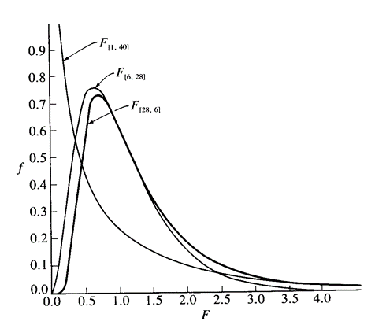
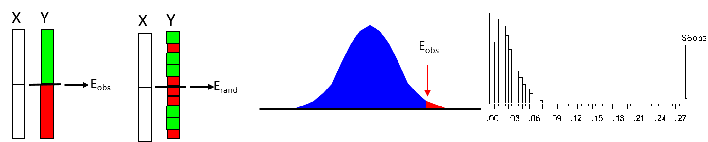

```{r setup, include=FALSE, echo = TRUE, tidy = TRUE}
library(knitr)
library(RRPP)
library(car)  #for confidence ellipse
library(lmodel2)
library(scatterplot3d)
opts_chunk$set(echo = TRUE)
```

# Regression

<style type="text/css">
td {  /* Table  */
  font-size: 20px;
}
code.r{ /* Code block */
    font-size: 12px;
}
pre { /* Code block - determines code spacing between lines */
    font-size: 12px;
}
</style>

A linear model where the response variable $\small\mathbf{Y}$ is continuous, and $\small\mathbf{X}$ contains one or more continuous covariates (predictor variables) 

$$\mathbf{Y}=\mathbf{X}\mathbf{\beta } +\mathbf{E}$$

- $\small{H}_{0}$: No covariation between $\small\mathbf{Y}$ & $\small\mathbf{X}$. More formally, variation in $\small\mathbf{Y}$ is not explained by $\small\mathbf{X}$: i.e., $\small{H}_{0}$: $\small{SS}_{X}\sim{0}$

- $\small{H}_{1}$: Difference covariation is present between $\small\mathbf{Y}$ & $\small\mathbf{X}$. More formally, some variation in $\small\mathbf{Y}$ *is*  explained by $\small\mathbf{X}$: i.e., $\small{H}_{1}$: $\small{SS}_{X}>0$

- Parameters: model coefficients $\small\hat\beta$ represent slopes describing the relationship between $\small\mathbf{Y}$ & $\small\mathbf{X}$ 

- Model  written as: $\small{Y}=\beta_{0}+X_{1}\beta_{1}+\epsilon$

# Assumptions of Regression

1: Independence: $\small\epsilon_{ij}$ of objects must be independent 

2: Normality: requires normally distributed $\small\epsilon_{ij}$ 

3: Homoscedasticity: equal variance 

4: $\small{X}$ values are independent and measured without error

# General Computations

- Fit line that minimizes sum of squared deviations (LS fit) from $\small{Y}$-variates to line (vertical deviations b/c no error in $\small{X}$)

- Slope calculated as: $\small{\beta}_{1}=\beta_{YX}=\frac{\sum\left(X-\overline{X}\right)\left(Y-\overline{Y}\right)}{\sum\left(X-\overline{X}\right)^{2}}$

- Regression line always crosses $\small{\left(\overline{X},\overline{Y}\right)}$ so intercept is: $\small{\beta}_{0}=\overline{Y}-\beta_{1}\overline{X}$

```{r echo=FALSE, fig.height = 3.5, fig.align='center'}
bumpus<-read.csv("lectureData/02.Resampling/bumpus.csv",header=T)
bumpus.data<-log(as.matrix(bumpus[,(5:13)]))
sex<-as.factor(bumpus[,2])
surv<-as.factor(bumpus[,4])
SexBySurv<-as.factor(paste(sex,surv))
Y<-as.matrix(bumpus.data[,1])
X1<-(bumpus.data[,2])
X2<-(bumpus.data[,3])
mydat <- rrpp.data.frame(Y = Y, X1 = X1, X2 = X2, sex = sex, surv = surv, SexBySurv = SexBySurv)

model1<-lm(Y~X1)
par(mar=c(4,4,0,4))
plot(X1,Y,pch=21, bg="black", cex=2)
abline(model1,lwd=2,col="red")
# plot deviations
segments(X1, fitted(model1), X1, Y, col="grey")
```

# Computations: Sums-of-Squares

- SS explained by the model: $\small{SSM}=\sum\left(\hat{Y}-\overline{Y}\right)^{2}$

- SS residual error: $\small{SSE}=\sum\left(Y_{i}-\hat{Y}\right)^{2}$

- Convert to variances (mean squares), calculate $\small{F}$ and assess significance with ($\small{df}_{1},df_{2}$)

```{r, echo = FALSE,out.width="50%", fig.align='center'}
  
```

- Note: in future weeks we will use matrix algebra to obtain $\small{SS}$ for model effects ($\small{SSM}$, $\small{SSE}$, etc.)

# Assessing Significance

- Standard approach: 
	- Compare $\small{F}$-ratio to $\small{F}$-distribution with appropriate $\small{df}$

```{r, echo = FALSE,out.width="20%", fig.align='center'}
  
```

- Resampling Alternative:
	- Shuffle $\small{Y}$ and generate distribution of possible $\small{F}$-values (note: for single-factor regression, shuffling individuals IS a residual randomization)

```{r, echo = FALSE,out.width="70%", fig.align='center'}
  
```

# Regression: Parameter Tests

- $\small{F}$-test assesses variance explained, but not how much $\small{Y}$ changes with $\small{X}$

- Can evaluate the model parameters separately

- Slope test ($\small{\beta}_{1}\neq0$): $\small{t}=\frac{\beta_{1}-0}{s_{\beta_{1}}}$  with $\tiny{s}_{\beta_{1}}=\sqrt{\frac{MSE}{\sum\left(X_{i}-\overline{X}\right)^{2}}}$ & $\tiny{n-2}$ $\small{df}$

- Intercept test ($\small{\beta}_{0}\neq0$): $\small{t}=\frac{\beta_{0}-0}{s_{\beta_{0}}}$  with $\tiny{s}_{\beta_{0}}=\sqrt{MSE\Big[\frac{1}{n}+\frac{\overline{X}^{2}}{\sum\left(X_{i}-\overline{X}\right)^{2}}\Big]}$ & $\tiny{n-2}$ $\small{df}$

- Can also test against particular values (e.g,. Isometry: is $\small\beta_{1}=1$?)

- Very useful for certain biological hypotheses

# Regression Example: Bumpus Data

- Are total length and alar extent associated in sparrows? 

```{r echo=TRUE, out.width="40%", fig.align='center' }
model1<-lm(Y~X1)
anova(model1)
model1$coefficients
```

```{r, echo=FALSE, out.width="40%", fig.align='center'}
plot(X1,Y,pch=21, bg="black", cex=2)
abline(model1,lwd=2,col="red")
```

- Yes. Total length and alar extent covary in sparrows

# Regression Example: Permutations

```{r echo=TRUE, out.width="40%", fig.align='center' }
model2 <- lm.rrpp(Y~X1, print.progress = FALSE, data = mydat)
anova(model2)$table
coef(model2)
```

- Results are identical to parametric solution

# Regression Vs. Correlation

- Correlation and regression are closely linked
- Mathematically: $\small\beta_{YX}=\frac{\sum\left(X-\overline{X}\right)\left(Y-\overline{Y}\right)}{\sum\left(X-\overline{X}\right)^{2}}$ vs. $\small{r}_{YX}=\frac{\sum\left(X-\overline{X}\right)\left(Y-\overline{Y}\right)}{\sqrt{\sum(X-\bar{X})^2\sum(Y-\bar{Y})^2}}$ 
- The difference is in the denominator:
- $\small{r}$ is a *standardized* regression coefficient (i.e. slope in standard deviation units)
- $\small{\beta}$: error in $\small{Y}$ direction only (direction of scatter)
- $\small{r}$: error in $\small{X}$ & $\small{Y}$ (dispersion of scatter)
- Thus, regression models causation ($\small{Y}$ as function of $\small{X}$) and correlation models association (covariation in $\small{X}$ & $\small{Y}$)

# Regression Vs. Correlation

```{r echo=FALSE, out.width="50%", fig.align='center' }
model1<-lm(Y~X1)
plot(X1,Y,pch=21, bg="black", cex=2, xlim=c( (min(X1)-.01), (max(X1+.01))),ylim=c((min(Y)-.01), (max(Y+.01))))
abline(model1,lwd=2,col="red")
# plot deviations
segments(X1, fitted(model1), X1, Y, col="grey")

plot(X1,Y,pch=21, bg="black", cex=2, xlim=c( (min(X1)-.01), (max(X1+.01))),ylim=c((min(Y)-.01), (max(Y+.01))))
ellipse(center = colMeans(cbind(X1,Y)), shape = cov(cbind(X1,Y)),radius = sqrt(qchisq(.95, df=2)),col = 'darkgreen')
```

# Model II Regression: Error in Y & X

- When both $\small{X}$ & $\small{Y}$ contain measurement error, model I regression underestimates slope

- Model II regression accounts for this by minimizing deviations perpendicular to regression line (not in $\small{Y}$ direction only)

- Different types of model II regression, depending on data (major axis, reduced major axis, etc.)

- $\small{X}$ & $\small{Y}$ in ‘same’ units/scale:  major axis regression (PCA)

- $\small{X}$ & $\small{Y}$ not in same units/scale:  standard (reduced) major axis regression

# Model II Regression

- When $\small{X}$ & $\small{Y}$ in ‘same’ units/scale:  *major axis* regression (PCA)
    - Compute covariance matrix for X & Y: $\small{S}_{XY}=\left[ {\begin{array}{cc}
   s^{2}_{X} &  s_{XY} \\
   s_{XY} & s^{2}_{Y} \\
  \end{array} } \right]$
    - Obtain principle eigenvalue $\tiny{\lambda}_{1}=0.5*\left({s^{2}_{X}+s^{2}_{Y}+\sqrt{\left(s^{2}_{X}+s^{2}_{Y}\right)^{2}-4\left(s^{2}_{X}s^{2}_{Y}-s^{2}_{XY}\right)}}\right)$ and associated eigenvector	
    - Slope is: $\small{\beta}_{YX}=\frac{s_{XY}}{\lambda_{1}-s^{2}_{X}}$
	
- When $\small{X}$ & $\small{Y}$ not in same units/scale: use standard *(reduced) major axis* regression
    - Standardize variables to  $\small{N}\left(0,1\right)$ (i.e., convert to standard normal deviates)
    - Calculate SMA slope as: $\small{\beta}_{YX_{RMA}}=\frac{\beta_{YX}}{r_{YX}}$

# Model II Regression: Example

```{r echo=FALSE, out.width="40%", fig.align='center' }
lmodel2(Y~X1,nperm=999) -> res
res$regression.results
res$confidence.intervals
  RMA<-lmodel2(Y~X1)
plot(RMA, pch=21,cex=2, bg="black")
abline(model1,lwd=2,col="blue")
```

# Model II Regression: Comments

- Justification for using model II regression has been overplayed in biology

- What matters is *NOT* whether $\small{X}$ has measurement error: $\small{s^{2}_{\epsilon_{X}}}$

- Instead, ONLY when $\small{s^{2}_{\epsilon_{X}}} / s^{2}_{X}$ is large, might there be an issue with Model I regression. 

  - But even in this case, RMA is not guaranteed to alleviate the problem. (see Kilmer & Rodriguez, 2017)

>- Also, model II regression is strongly biased, because it confounds biological variation and measurement error (see Hansen and Bartoszek 2012)

>- #### Conclusion: Model I regression is prefered 

# Multiple Regression

- Predict $\small{Y}$ using several $\small{X}$ variables simultaneously

- Model:  $\small{Y}=\beta_{0}+X_{1}\beta_{1}+X_{2}\beta_{2}+\dots+\epsilon$

- $\small{\beta}_{i}$ are partial regression coefficients (effect of $\small{X}_{i}$ while holding effects of other $\small{X}$ constant)

- For 2 $\small{X}$ variables, think of fitting a plane to the data

```{r, echo = FALSE, out.width="30%", fig.align='center'}
par(oma=c(1,1,0,1))
plot<-scatterplot3d(X1,X2,Y)
plot$plane3d(lm(Y~X1+X2)) 
```

###### NOTE: One must consider *multicollinearity*: the correlation of $\small{X}$ variables with one another. This can affect statistical inference.

# Multiple Regression Coefficients

- Standard partial regression coefficients $\small{\beta^{'}_{YX_{i}\cdot{X}_{j}}}$ describe relationship of $\small{Y}$ & $\small{X}_{i}$ while holding effect of $\small{X}_{j}$ constant
    - Expresses change in normalized units, i.e., as standard normal deviates $\small\frac{Y-\overline{Y}}{s_{Y}}$ 
    - ADVANTAGE: can be directly compared for each variable
    - Found from variable correlations:  $\small{\beta^{'}_{YX_{1}\cdot{X}_{2}}}=\frac{r_{X_{1}Y}-r_{X_{2}Y}r_{X_{1}X_{2}}}{1-r^{2}_{X_{1}X_{2}}}$

- Interpret, then calculate back to original units and for conventional partial regression coefficients: $\small{\beta_{YX_{1}\cdot{X}_{2}}}=\beta^{'}_{YX_{1}\cdot{X}_{2}}\frac{s_{Y}}{s_{X1}}$

# Multiple Regression: Example

```{r echo=TRUE, out.width="50%", fig.align='center' }
anova(lm(Y~X1+X2))
```

```{r echo=FALSE, out.width="50%", fig.align='center' }
plot<-scatterplot3d(X1,X2,Y)
plot$plane3d(lm(Y~X1+X2))
```

# Multiple Regression: Permutation

```{r echo=TRUE, out.width="50%", fig.align='center' }
anova(lm.rrpp(Y~X1+X2,print.progress = FALSE, data=mydat))$table
  cor(X1,X2)  
```

- Because of multicollinearity, one might consider type II SS here

```{r echo=TRUE, out.width="50%", fig.align='center' }
anova(lm.rrpp(Y~X1+X2,print.progress = FALSE, data=mydat,SS.type = "II"))$table
```

# Multiple Regression: Adding Additional Explanatory Variables

- For all models, $\small{R}^{2}$ is the proportion of variation explained by model

  - By definition, as the number of $\small{X}$ variables increases,  $\small{R}^{2}$ increases (at worst, a new variable contributes no additional information, but it can never decrease the variation explained by the simpler model)

- Should I add another variable to my model? 

  - Different approaches: stepwise addition, stepwise deletion, random addition,etc. 
    - Adjusted  $\small{R}^{2}$ can  be used to compare models (though *AIC* is far more common)
    
- **Important related topic**: model comparison. Which explanatory model best explains variation in  $\small{Y}$?  We discuss this topic later in the semester

###### CAREFUL WITH BIOLOGICAL INTERPRETATION!!! One can over-fit models, or identify a  best fitting model (in terms of some) that is biologically nonsensical

# Comparing Regression Lines

- Say one has two regressions (e.g., allometry patterns in each of two species). Can I compare these trends? 

- To compare the slopes of two regression lines, calculate an $\small{F}$-ratio as:

$$\tiny{F}=\frac{\left(\beta_{1}-\beta_{2}\right)^{2}}{\overline{s}^{2}_{YX}\frac{\sum\left(X_{1}-\overline{X}_{1}\right)^{2}+\sum\left(X_{2}-\overline{X}_{2}\right)^{2}}{\sum\left(X_{1}-\overline{X}_{1}\right)^{2}\sum\left(X_{2}-\overline{X}_{2}\right)^{2}}}$$

Where $\small{\overline{s}_{YX}}$ is the weighted average of $\small{s}_{YX}$, and $\small{df}=1,(n_{1}+n_{2}-4)$

Procedure can be generalized to compare > 2 regression lines (see *Biometry*)

# ANCOVA: Analysis of Covariance

- ANCOVA is a linear model containing *both* a categorical and a continuous $\small{X}$ explanatory variable (i.e., a 'combination' of ANOVA and regression)

- $\small{H}_{0}$: no differences among slopes, no differences among groups

- Must first compare slopes, then compare groups (ANOVA) while holding effects of covariate constant

- Several possible outcomes to ANCOVA

```{r, echo = FALSE,out.width="60%", fig.align='center'}
  
```

# ANCOVA: Computations

- Model: $\small{Y}=\beta_{0}+X_{cov}\beta_{1}+X_{gp}\beta_{2}+X_{cov:gp}\beta_{3}+\epsilon$

###### Note: Factors with 3+ groups will have multiple $\small\beta$ per factor.

- Calculate $\small{SS}$ for the following model effects: 

```{r, echo = FALSE,out.width="60%", fig.align='center'}
  
```

###### NOTE: If interaction term *not* significant (i.e., no evidence of heterogeneous slopes), remove interaction and re-evaluate $\small{Y}$ using a common slopes model to compare least-squares group means (while accounting for covariate) 

# Model Parameters ($\beta$)

$\beta$ contains components of adjusted least-squares (LS) means and group slopes

```{r echo=TRUE, include=TRUE, fig.align='center'} 
y <- c(6, 4, 0, 2, 3, 3, 4, 7 )
x <- c(7,8,2,3,5,4,3,6)
gp <- factor(c(1,1,1,1,2,2,2,2)); 
df <- data.frame(x = x, y = y, gp = gp)

fit <- lm(y~x*gp, data = df); coef(fit)
# gp 2 coefficients 
c(coef(fit)[1]+coef(fit)[3], coef(fit)[2]+coef(fit)[4])

res.gp <- by(df, gp, function(x) lm(y~x, data = x))
sapply(res.gp, coef)
```

# Assessing Significance

- Standard approach: 
	- Compare $\small{F}$-ratio to $\small{F}$-distribution with appropriate $\small{df}$

```{r, echo = FALSE,out.width="20%", fig.align='center'}
  
```

- Resampling Alternative:
	  - Residual randomization: Permute *residuals* $\mathbf{E}_{R}$ from reduced model $\small\mathbf{X}_{R}$ for each model effect to generate empirical sampling distribution of possible $\small{F}$-values 
	  - Evaluates  $\small{SS}_{\mathbf{X}_{F}}$ while holding effects of $\small\mathbf{X}_{R}$ constant

```{r, echo = FALSE,out.width="70%", fig.align='center'}
  
```

# ANCOVA: What are We Doing?

- ANCOVA explicitly evaluates a series of sequential hypotheses

- 1: Are slopes for groups different? ($\small{SS}_{cov:group} > 0$?)
    - If interaction significant, then we *cannot* compare group means, because slopes differ among groups
    - Thus, pairwise comparisons *must* be of the slopes themselves (i.e., comparing the within-group covariation patterns to one another)
    
- 2: If the cov:gp interaction is *NOT* significant, we remove that effect and fit a common slopess model:'Y~cov + group'. This evaluates whether the adjusted LS-means for the groups differ while accounting for a common covariate

###### NOTE: In the former case (i.e., a significant cov:group interaction), our hypothesis has often been changed by the data. That is, we may have initiated the analysis as "Are the groups different even when I account for X?" but our data have told us that we instead must focus on the slope differences among groups, not   differences among group means!

# ANCOVA: Example

- Do groups of sparrows differ from one another in total length while accounting for body weight?

```{r echo=TRUE, out.width="50%", fig.align='center' }
anova(lm(Y~X2*SexBySurv))
```

- Note interaction term is not significant. Fit common slopes model and compare adjusted-LS group means

# ANCOVA: Example Cont.

```{r echo=TRUE, out.width="50%", fig.align='center' }
anova(lm(Y~X2+SexBySurv))  # COMMON SLOPES MODEL
```

```{r echo=FALSE, out.width="50%", fig.align='center' }
model.ancova<-lm(Y~X2+SexBySurv)
colo<-rep("blue",nrow(bumpus.data)); colo[which(SexBySurv == 'f TRUE')]<-"red";
	colo[which(SexBySurv == 'f FALSE')]<-"pink"; colo[which(SexBySurv == 'm FALSE')]<-"lightblue";
par(mar=c(4,4,0,4))
plot(X2,Y,pch=21,cex=2,bg=colo)
abline(model.ancova$coefficients[1],model.ancova$coefficients[2])
abline((model.ancova$coefficients[1]+model.ancova$coefficients[3]),model.ancova$coefficients[2])
abline((model.ancova$coefficients[1]+model.ancova$coefficients[4]),model.ancova$coefficients[2])
abline((model.ancova$coefficients[1]+model.ancova$coefficients[5]),model.ancova$coefficients[2])

```

- There is evidence of group differences while accounting for body weight

# ANCOVA: Pairwise Comparisons

- When there is a significant common slopes model, one wishes to evaluate *which* groups differ from one another. Pairwise comparisons may be utilized, but based on the **fitted values** of the model (these are the values that account for the covariate)

```{r echo=TRUE, out.width="50%", fig.align='center' }
pairwise.t.test(model.ancova$fitted.values, SexBySurv, p.adj = "none")
```

# ANCOVA via Permutation

- All of the above computations may be evaluated using RRPP

```{r echo=TRUE, out.width="50%", fig.align='center' }
model.anc2 <- lm.rrpp(Y~X2*SexBySurv, print.progress = FALSE, data = mydat)
anova(model.anc2)$table

model.anc3 <- lm.rrpp(Y~X2+SexBySurv, print.progress = FALSE, data = mydat)
anova(model.anc3)$table
```

- ANCOVA results analogous to those from parametric evaluation

# Pairwise Tests via Permutation

- With RRPP, one can perform pairwise comparisons of adjusted LS-group means.

```{r echo=TRUE, out.width="50%", fig.align='center' }
res <- summary(pairwise(model.anc3, groups = SexBySurv), test.type = "dist", stat.table = FALSE) 
```

```{r echo=FALSE, out.width="50%", fig.align='center' }
res$pairwise.tables$D  #Distance matrix
res$pairwise.tables$Z  #Effect size
res$pairwise.tables$P  #Significance
```

# Pairwise Tests via Permutation Cont.

- Comparing slopes evaluates why the `cov:group` interaction term is significant

```{r echo=TRUE, out.width="50%", fig.align='center' }
PW <- pairwise(model.anc3, groups = SexBySurv)
summary(PW, test.type = "VC", angle.type = "deg")
```

###### NOTE: For illustrative purposes only, as this particular example did *not* display a significant cov:group interaction

# ANCOVA: Common Errors

- 1: Perform ANOVA on regression residuals: NOT the same as ANCOVA (different $\small{df}$, different pooled $\small{\beta}$, etc.).  Also, lose test of slopes, which is important (see J. Anim. Ecol. 2001. 70:708-711)

- 2: Significant cov:group interaction, but still compare groups: not useful, as answer depends upon where along regression you compare

- 3: “Size may be a covariate, so I’ll use a small size range to ‘standardize’ for it”:  choosing animals of similar sizes will eliminate covariate, but also will eliminate potentially important biological information (e.g., what if male head width grows relatively faster than females (i.e. size:head interaction?)

# Other Regression Models

- Multiple regression models the case where all independent $\small{X}$ variables affect $\small{Y}$ independently:

```{r, echo = FALSE,out.width="30%", fig.align='center'}
  
```

- However, one could have dependent-relationships among $\small{X}$ variables

```{r, echo = FALSE,out.width="30%", fig.align='center'}
  
```

- **Path Analysis** & **Structural Equation Modeling** can be used in such circumstances
