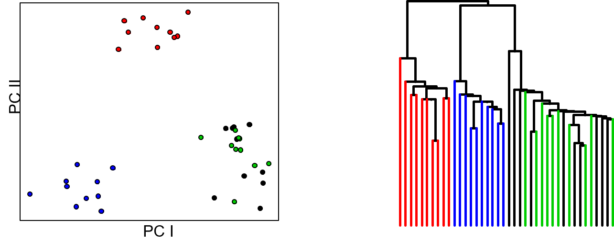
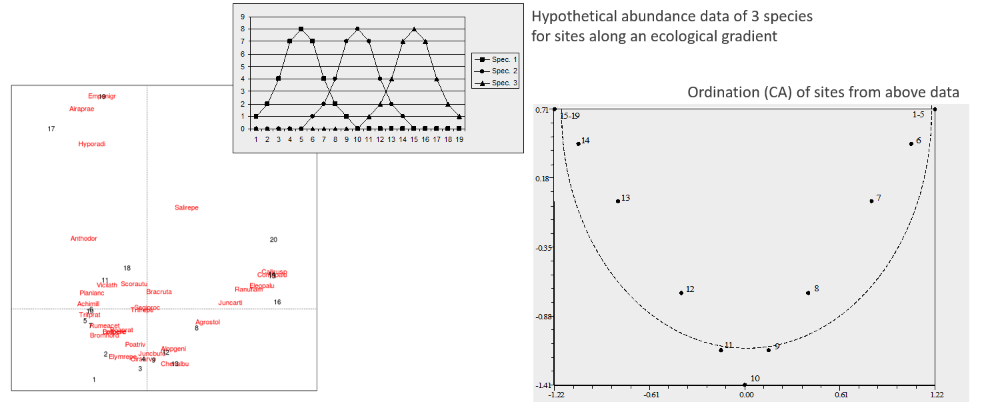
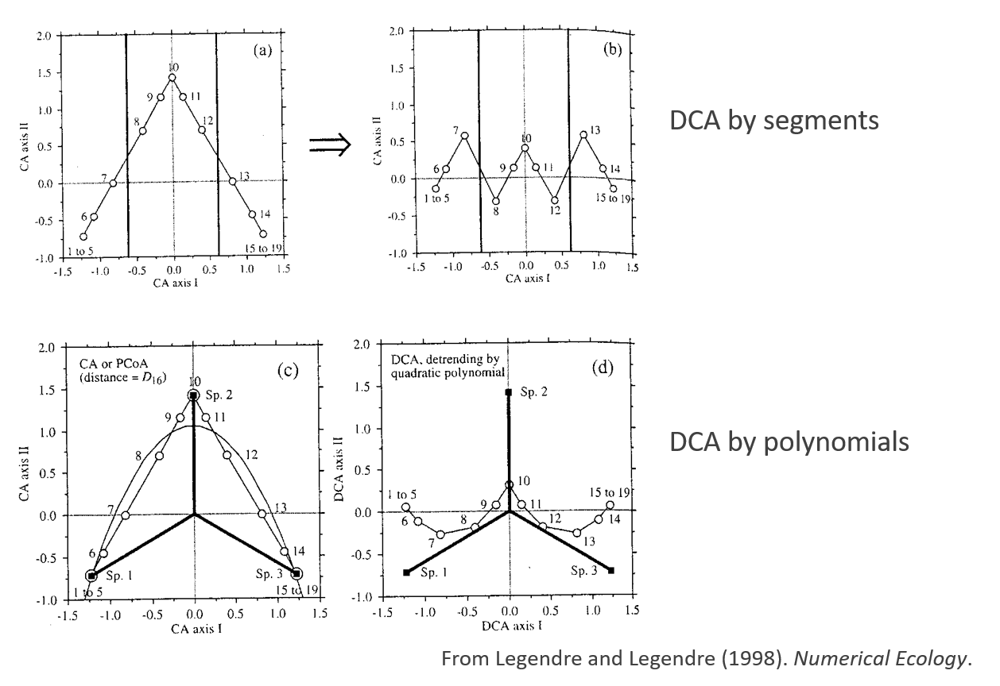

```{r setup, include=FALSE, echo = TRUE, tidy = TRUE}
library(knitr)
library(RRPP)
library(vegan)
knitr::opts_chunk$set(echo = TRUE)
```

# Exploratory Multivariate Methods

<style type="text/css">
td {  /* Table  */
  font-size: 20px;
}
code.r{ /* Code block */
    font-size: 12px;
}
pre { /* Code block - determines code spacing between lines */
    font-size: 12px;
}
</style>

- Data are points in multivariate space
- Human perception does not work very well in >3 dimensions
- Ordination and clustering methods are useful for: 
    - Look for patterns in high-dimensional spaces
    - Generate summary plots of dataspace (ordination)
    - Look for relationships of points (clustering)

```{r, echo = FALSE,out.width="80%"}
  
```

# Motivation for Ordination

- Say we have obtained 8 linear measurements from a set of birds, and wish to examine patterns of variation in these data (the data are actually the Bumpus data).  Obviously, one cannot draw an 8-dimensional dataspace, so what to do?

- One option is to plot pairs of variables and perform some mental gymnastics to stitch these together:

```{r echo=FALSE, out.width="60%", fig.align='center'}
bumpus<-read.csv("lectureData/02.Resampling/bumpus.csv",header=T)
Y<-bumpus[,5:12]
Y <- scale(Y, scale = FALSE) #center data
gp.bumpus <- as.factor(bumpus$sex)
pairs(Y)
```

- But can we instead have a summary plot of the entire dataspace? 

- Ordination approaches provide a solution

# Ordination and Dimension Reduction

- Obtain summarized visualization of points in high-dimensional data space
- Describe variation with a new set of variables (typically orthogonal)
- These are produced under the criterion of finding what varies the most
- They are ordered to represent more $\small\rightarrow$ less variation
- Plot first dimensions to summarize data
- Look at association with original variables to know what varies

# Some Ordination Methods

- Rigid Rotation: Principal Components Analysis (PCA)
- Decomposing a distance matrix: Principal Coordinates Analysis (PCoA)
- Iterative optimization: Non-Metric MultiDimensional Scaling (NMDS)
- Non-continuous data: Correspondence Analysis (CA)

# Principal Components Analysis (PCA)

- PCA combines orthogonal rotation and projection to arrive at a summary plot of the dataspace 
- The objective: to summarize most of the variation in as few dimensions as possible
- It consists of a rigid rotation of the data based on directions of variation, followed by projection to those new summary axes
- First one finds the set of axes the describe progressively less variation in the data
- Next, the data are rotated so that the main axis of variation (PC1) is horizontal
- Subsequent axes are orthogonal to PC1

# PCA: Conceptual Visualization

- This is what PCA does:

```{r echo=FALSE, out.width="80%", fig.align='center' }
Y.2<-cbind(bumpus$TL,bumpus$AE)
par(mfcol = c(1, 2))
plot(Y.2, pch=21, bg="red", xlab="Total Length", ylab="Alar Extent")
```

# PCA: Conceptual Visualization

- This is what PCA does:

```{r echo=FALSE, out.width="80%", fig.align='center' }
Y.2<-cbind(bumpus$TL,bumpus$AE)
Y.pc<-prcomp(Y.2)$x
par(mfcol = c(1, 2))
plot(Y.2, pch=21, bg="red", xlab="Total Length", ylab="Alar Extent")
plot(Y.pc, asp=1,pch=21, bg="red", xlab="PC1", ylab="PC2")
```

- PCA has performed a rigid rotation of the original data, so that variation is aligned with the new (PC) axes

# PCA Computations

Principal component analysis (PCA) is two things: (1) a singular-value decomposition (SVD) of a symmetric matrix and (2) projection of mean-centered or standardized data onto eigenvectors from SVD. 

Using mean-centered data: $\small\mathbf{Y}_c$ we calculate:

$$\small\hat{\mathbf{\Sigma}}=\frac{\mathbf{Y}^{T}_c\mathbf{Y}_c}{n-1}$$

We then decompose the covariance matrix via eigen-analysis (SVD):

$$\small\hat{\mathbf{\Sigma}}=\mathbf{U} \mathbf{\Lambda} \mathbf{U}^T$$

This step identifies a set of orthogonal axes describing directions of variation. These are the columns of $\small\mathbf{U}$. Next we project the data onto these axes as: 

$$\small\mathbf{P} = \mathbf{Y}_c\mathbf{U}$$

Here, $\small\mathbf{P}$ represent the set of projection scores (principal component scores) on each of the PC axes. These are used in the subsequent plot.

Finally, the percent variation explained by any principal component (column of $\mathbf{U}$) is 
$$\frac{\lambda_i}{tr\mathbf{\Lambda}}$$

# PCA: Alternative Computations

Note that one can alternatively perform SVD directly on $\small\mathbf{Y}_c$: 

$$\small{\mathbf{Y}_c}=\mathbf{V} \mathbf{D} \mathbf{U}^T$$

Here, $\small\mathbf{D^2}$ expresses the percent-variation explained by each PC-axis, which are found as the right-singular vectors in: $\small\mathbf{U}$.

PC scores are found as: 

$$\small\mathbf{P} = \mathbf{VD}$$

###### NOTE: eigenanalysis of the *inner product* $\small\mathbf{Y}^{T}_c\mathbf{Y}_c$ yields $\small\mathbf{U}$, while eigenanalysis of the *outer product* $\small\mathbf{Y}_c\mathbf{Y}^{T}_c$ yields $\small\mathbf{V}$

# Side Comment: Matrix Decompositions

Matrix decompositions provide mechanisms for many multivariate methods, including ordinations, linear model coefficient calculations, and matrix covariation analyses. Here we describe two we have just used:

### Eigen analysis
For an $\small{p} \times p$ square matrix, $\small\mathbf{S}$, there exists a vector of $\small{p}$ values, $\small\mathbf{\lambda}$, such that, 

$$\small\mathbf{Sv} =\lambda\mathbf{v}$$
which can also be written (in a more computaionally feasible way) as 
$$\small\left( \mathbf{S}-\lambda\mathbf{I} \right) \mathbf{v} = 0$$  

Solving each *possible* eigenvector ($\small\mathbf{v}$) and eigenvalue ($\small\lambda$) via a characteristic polynomial is called, "eigen analysis".  This is done systematically by first describing the determinant, $\small\left| \mathbf{S}-\lambda\mathbf{I} \right|$.  This will be an equation with $\small{p}$ possible solutions for $\lambda$ that balance the equation.  Up to $\small{p}$ real numbers exist if $\small\mathbf{S}$ is positive-definite.  Some of these numbers might be 0 if $\mathbf{S}$ is not full-rank.  Some can be negative if $\small\mathbf{S}$ is not symmetric. (This is not a certainty but might be common with non-metric association matrices; i.e., the similarity of A to B is not the same as B is to A.)  By finding the values of $\small\lambda$ that work, the vectors, $\small\mathbf{v}$, are estimated such that the solution above holds true.

# Matrix Decompositions (cont.)

### Singular Value decomposition of a Rectangular Matrix

$$\small\mathbf{Y}_{n \times p} =\mathbf{U}_{n \times p'} \mathbf{\Lambda}_{p' \times p'} \mathbf{V}_{p' \times p'}^T$$

$\small\mathbf{U}$ (left singular values) and $\small\mathbf{V}$ (right singular values) are solved via numerical approximation algorithms.  The number of singular values is $\small{p}'= \min(n,p)$. If $\small\mathbf{Y}$ is not full-rank, some of the singular values in $\small\mathbf{\Lambda}$ will be 0.  The singular values decrease from largest to smallest.

### Singular Value decomposition of a Symmetric Matrix

$$\small\mathbf{S}_{p \times p} =\mathbf{U}_{p \times p} \mathbf{\Lambda}_{p \times p} \mathbf{U}_{p \times p}^T$$

$\small\mathbf{U}$ (left and right singular values) are solved via numerical approximation algorithms If $\small\mathbf{S}$ is symmetric, positive-definite, $\small\mathbf{U}$ is the matrix of eigenvectors and $\small\mathbf{\Lambda}$ the matrix of eigenvalues, equal to those found from eigen analysis using the characteristic polynomial function.  This is a "short-cut" method, often employed for principal component analysis when it is sure that $\small\mathbf{S}$ is symmetric, positive-definite.


# PCA: Mathematical Comments

Let's look at the dimensions of all components through this analysis:

1: $\small\mathbf{Y}_c$: The data is a matrix of $\small{n}\times{p}$  dimensions

2: $\small\hat{\mathbf{\Sigma}}=\frac{\mathbf{Y}^{T}_c\mathbf{Y}_c}{n-1}$: The covariance matrix is of dimension $\small{p}\times{p}$ 

3: $\small\hat{\mathbf{\Sigma}}=\mathbf{U} \mathbf{\Lambda} \mathbf{U}^T$: The matrix of eigenvectors $\small\mathbf{U}$ is of dimension $\small{p}\times{p}$ 

4: $\small\mathbf{P} = \mathbf{Y}_c\mathbf{U}$  The matrix of projected scores is of dimension $\small{n}\times{p}$ 

So what we are doing conceptually with PCA is taking a $\small{p}\times{p}$ data space, finding $\small{p}$ new directions within that data space, and rotating the data to these new axes to arrive at the PCA projected space

# PCA: General Comments

- PCA is a rigid rotation where new axes explain % variation
	  - Distances among objects preserved (so long as all dimensions containing variation 		are used)!
- PC axes are loadings of each variable on PC axis (variables with values closer to -1 & +1 are more influential in that direction)
- How well does a particular PC plot represent relationships among objects?  
- Assess by: 
	  - Percent variation explained by PC axes
	  - Mantel correlation and Shepard diagram (plot of distances in reduced PC space vs. distances in full data space)

# PCA Interpretation

- To interpret a PCA we look at:
    - Percent variation explained
    - Structure of PCs (loadings of eigenvectors, or correlations with variables)
ordination of observations in PC plot

- Things to note
    - PCA does nothing to the data, it is just a rigid rotation
    - It does NOT find a particular dimension (group differences, allometry, altitudinal gradient etc): it only finds the direction of highest variability in the data
    - PC axes are orthogonal, so caution is needed in interpreting their biological meaning
    - Some criteria exist for how many PC axes to interpret (broken stick model, log-ratio method, etc.: see Legendre & Legendre Num. Ecol.; also Mardia et al. 1979 Mult. Anal.; Jackson 1993, Ecol.)

# PCA and Dimensionality

In some cases, some dimensions may have 0% variation ($\small\lambda<0$)

When $\small{N > p}$, there are (at most) $\small{N-1}$ PC axes with variation (when using metric data)
When $\small{p > N}$, there are (at most) $\small{p}$ PC axes

Fewer PCs with variation may also occur when there is redundancy in the data 

```{r eval=TRUE}
a <- rnorm(10)
b <-rnorm(10)
c <- a+b
cov.dat <- cov(cbind(a,b,c))
eigen(cov.dat)$values
```

Note we have 3 variables, but only 2 dimensions of data

# PCA: Effect of Trait Scale

If a variable varies much more than others, it dominates the PCA

###### (“more” is relative: 0 - 100cms is numerically “more” than 0 - 1m)

- Particularly relevant when variables are measured in different units
- Standardizing data often alleviates this problem
  - Center and scale Y (subtract the mean and divide by standard deviation)
  - Use the correlation matrix

###### NOTE: a) and b) are equivalent, i.e. `cov(Y.std)` = `cor(Y)`

# PCA: Example

Returning to the bumpus data, we have 8 linear measurements from 136 birds. Thus, $\small\mathbf{Y}_{c}$ is a $\small{136}\times{8}$ dimensional matrix. A PCA of these data is below:

```{r echo=FALSE, out.width="60%", fig.align='center' }
pca.bumpus<-prcomp(Y) 
PC.scores<-pca.bumpus$x
plot(PC.scores,xlab="PC I", ylab="PC II",asp=1,pch=21,bg=gp.bumpus,cex = 1.5)
legend("topright", levels(gp.bumpus), pch = 21,pt.bg=1:2)
pca.bumpus$sdev^2 / sum(pca.bumpus$sdev^2)
pca.bumpus$rotation[,1]
```

Males and females are colored blue and red respectively. PC1 describes 82% of the variation and  PC2 describes 11%. First PC is explained largely by AE and TL

# PCA Example (Cont.)

Shepard's plot of distances:
```{r echo=FALSE, out.width="60%", fig.align='center' }
plot(dist(Y),dist(Y.pc[,1:2]))
```

Note that larger distances are more accurately represented, while there is more 'slop' in the smaller distances. The reason is that objects similar in the PC1-PC2 projection may show differences in higher PC dimensions 

# Principal Components Analysis: Thoughts

PCA is helpful for exploring multivariate space and it may suggest patterns

It is descriptive!  It is nothing more than a rigid rotation of the multivariate data space

No hypotheses are tested

Using the correlation vs. covariance matrix has important implications

It preserves the Euclidean distances among objects in the original multivariate data space

Very useful for summarizing the results of hypothesis-testing approaches applied to multivariate data(e.g. MANOVA)

# Ordination: PCA Bi-Plot

- Ordination plot of objects (rows) and variables (columns)
- Look for sets of vectors with small angles, and clusters of points
- Can use to identify variables with high association with objects

```{r echo=FALSE, out.width="60%", fig.align='center' }
biplot(prcomp(Y))
```

# Using Distances: PCoA: Principal Coordinates Analysis

- Let's do something different. We know that a set of linear measurements of the same units and scale represent multivariate normal (MVN) data. Thus, for the Bumpus data, each bird is a point in an 8-dimensional metric space. The distance measure of that space is Euclidean distance. So let's do the following:
  - 1: Obtain $\small\mathbf{D}_{Euclidean}$ for the Bumpus data. $\small\mathbf{D}_{E}$  is a $\small{136}\times{136}$ dimensional distance matrix.
  - 2: Mean-center this matrix, so the set of distances are at the origin:  $\small\mathbf{G}=\left(\mathbf{I}-\frac{1}{n}\mathbf{11}^{T}\right)\left(-\frac{1}{2}\mathbf{D}_{E}^{2}\right)\left(\mathbf{I}-\frac{1}{n}\mathbf{11}^{T}\right)$
  - 3: Perform an Eigen-analysis of this matrix: $\small\mathbf{G}=\mathbf{E\Lambda{E}}^{T}$

# Using Distances: PCoA: Principal Coordinates Analysis

- Let's do something different. We know that a set of linear measurements of the same units and scale represent multivariate normal (MVN) data. Thus, for the Bumpus data, each bird is a point in an 8-dimensional metric space. The distance measure of that space is Euclidean distance. So let's do the following:
  - 1: Obtain $\small\mathbf{D}_{Euclidean}$ for the Bumpus data. $\small\mathbf{D}_{E}$  is a $\small{136}\times{136}$ dimensional distance matrix.
  - 2: Mean-center this matrix, so the set of distances are at the origin:  $\small\mathbf{G}=\left(\mathbf{I}-\frac{1}{n}\mathbf{11}^{T}\right)\left(-\frac{1}{2}\mathbf{D}_{E}^{2}\right)\left(\mathbf{I}-\frac{1}{n}\mathbf{11}^{T}\right)$
  - 3: Perform an Eigen-analysis of this matrix: $\small\mathbf{G}=\mathbf{E\Lambda{E}}^{T}$
  
```{r echo=FALSE, out.width="50%", fig.align='center' }
par(mar=c(4,4,0,4))
bumpus.dist<-dist(Y)
PCoA<-cmdscale(bumpus.dist) 
plot(-1*PCoA[,1], PCoA[,2],pch=21,bg=gp.bumpus,cex=1.5,asp=1)
legend("topright", levels(gp.bumpus), pch = 21,pt.bg=1:2)
```

Wait, what???

# PCA Vs. PCoA

It seems that, apart from an axis reflection (which means nothing), PCA and this distance-based method (PCoA) yielded identical results

```{r echo=FALSE, out.width="50%", fig.align='center' }
par(mfcol = c(1, 2))
plot(PC.scores, asp=1,pch=21, bg=gp.bumpus, cex=1.5,xlab="PC1", ylab="PC2")
legend("topright", levels(gp.bumpus), pch = 21,pt.bg=1:2)
plot(-1*PCoA[,1], PCoA[,2],pch=21,bg=gp.bumpus,cex=1.5,asp=1)
legend("topright", levels(gp.bumpus), pch = 21,pt.bg=1:2)
```

What in the WORLD is going on???

# Principal Coordinates Analysis (PCoA)

For metric spaces, PCoA provides an identical ordination to PCA (PCoA is sometimes called **Metric Multidimensional Scaling**).  This is most interesting, as PCA is based on the $\small{p}\times{p}$ trait covariance matrix, while PCoA is based on the $\small{n}\times{n}$ specimen distance matrix.  Yet the relationships amongst objects in the two plots are absolutely identical!

```{r echo=FALSE, out.width="50%", fig.align='center' }
par(mfcol = c(1, 2))
plot(PC.scores, asp=1,pch=21, bg=gp.bumpus, cex=1.5,xlab="PC1", ylab="PC2")
legend("topright", levels(gp.bumpus), pch = 21,pt.bg=1:2)
plot(-1*PCoA[,1],PCoA[,2],pch=21,bg=gp.bumpus,cex=1.5,asp=1)
legend("topright", levels(gp.bumpus), pch = 21,pt.bg=1:2)
```

# Principal Coordinates Analysis (PCoA)

```{r echo=FALSE, out.width="50%", fig.align='center' }
par(mfcol = c(1, 2))
plot(PC.scores, asp=1,pch=21, bg=gp.bumpus, cex=1.5,xlab="PC1", ylab="PC2")
legend("topright", levels(gp.bumpus), pch = 21,pt.bg=1:2)
plot(-1*PCoA[,1],PCoA[,2],pch=21,bg=gp.bumpus,cex=1.5,asp=1)
legend("topright", levels(gp.bumpus), pch = 21,pt.bg=1:2)
```

- What we are seeing here is the beauty of metric spaces. As shown by Gower (1966), the variation and relationships amongst objects in Euclidean (and in fact, metric) spaces can be represented either by $\small\hat{\mathbf\Sigma}_{p\times{p}}$ or $\small\mathbf{D}_{n\times{n}}$.
  - The reason is that, for *METRIC* spaces, calculating $\small\hat{\mathbf\Sigma}_{p\times{p}}$ and $\small\mathbf{D}_{n\times{n}}$ is accomplished from the same data, using inner-products and outer-products.
  - That is, the inner-product: $\small\mathbf{Y}_{c}^{T}\mathbf{Y}_{c}$ leads us to $\small\hat{\mathbf\Sigma}_{p\times{p}}$, while the outer-product$\small\mathbf{Y}_{c}\mathbf{Y}_{c}^{T}$ leads us to $\small\mathbf{D}_{n\times{n}}$ 
    - ###### Statistical side-note: $tr(\small\hat{\mathbf{\Sigma}}) = tr(\small\hat{\mathbf{D}})$. Also, the number of PCoA dimensions with variation > 0% may be fewer than $\small{n}$ (and based on the number of original variables)
  - If one had some other distance measure, a visualization via PCoA is possible.   
    - ###### This can yield negative eigenvalues (if distances are semi-metric or nonmetric)

# NMDS: Nonmetric Multidimensional Scaling

PCA and PCoA preserve distances among objects

Non-metric MDS generates ordination where similar objects are close together and dissimilar objects are far apart

Preserves the **relative order** of the objects, but not the distances themselves

Objective is to find a low dimensional representation of the data space

# NMDS: Procedure

- Start with distance matrix 
- Specify number of dimensions for MDS ordination a priori
- Construct initial configuration of objects (a ‘guess’).  
    - This step is crucial, as no distances are optimized, but rather the fit is tested and iterated until stable (the result from PCoA is often used)
- Calculate fitted distances in NMDS space and compare to true distances
- Calculate predicted distances, and goodness of fit (stress: one measure): 

$$\small{stress} =\sqrt{\sum(D_{fitted}-\hat{D}_{fitted})^2/ \sum{(D_{fitted})^2}}$$

- Move objects in NMDS plot and repeat (GOAL:  Monotonic fit of Dobs vs. Dfit) 
- Iterate until $\small\Delta_{stress}$ is below threshold (i.e., convergence)

# NMDS: Example

```{r echo=FALSE, results = 'hide', out.width="70%" }
Y.nmds <- metaMDS(dist(Y), autotransform=FALSE, k=2)
```

```{r echo=FALSE, out.width="70%", fig.align='center' }
par(mfcol = c(1, 2))
plot(PC.scores, asp=1,pch=21, bg=gp.bumpus, cex=1.5,xlab="PC1", ylab="PC2")
legend("topright", levels(gp.bumpus), pch = 21,pt.bg=1:2)
plot(Y.nmds$points, asp=1,pch=21, bg=gp.bumpus, cex=1.5,xlab="NMDS1", ylab="NMDS2")
legend("topright", levels(gp.bumpus), pch = 21,pt.bg=1:2)
par(mfcol = c(1,1))
```

Pretty similar, but *NOT* identical.

# NMDS: Comments

- NMDS seems arbitrary, but works rather well
- Positives:
  - Generally yields fewer dimensions than PCA,PCoA
  - Does not require full distance matrix (missing values ok)
- Negatives:
  - Arbitrary optimization
  - Results dependent on starting configuration (‘guess’)
  - Does not preserve distances among objects (though that is not the objective). Instead, it minimizes the monotonic relationship of Dfit vs. Dobs

```{r echo=FALSE, results = 'hide', out.width="50%" }
data(dune)  #from vegan
dune.dist<-vegdist(dune)  #default = Bray-Curtis distance
dune.nmds <- metaMDS(dune.dist, autotransform=FALSE, k=2)
```
	  
```{r echo=FALSE, out.width="50%", fig.align='center' }
par(mfcol = c(1,2))
plot(dist(Y.pc),dist(Y.nmds$points), xlab='D.obs', ylab='D.plot', asp=1)
plot(dune.dist, dist(scores(dune.nmds, display='sites'), method='eucl'), xlab='B-C Dist', ylab='D.plot',asp=1)
par(mfcol = c(1,1))
```  

# Correspondence Analysis (CA)

Ordination for count and frequency data (sometimes called reciprocal averaging)

Very frequently used in ecology (community data, species presence etc)

Preserves the $\small\chi^2$ distance among objects (a weighted Euclidean distance of conditional probabilities)

$$\small{D}_{\chi^2}=\sqrt{\sum\frac{1}{y_k}(\frac{y_{ki}}{y_i}-\frac{y_{kj}}{y_j})^2}$$

Provides a test of independence of rows and columns

# Correspondence Analysis: Procedure

- Calculate matrix of relative frequencies ($\small\mathbf{Q}$) from contingency table: $\small{p}_{ij}=\frac{f_{ij}}{f_{total}}$
- Standardize $\small\mathbf{Q}$ by centering by rows and columns

Elements of $\small\mathbf{\overline{Q}}$: $\small{q}_{ij}=[\frac{p_{ij}-p_{i+}p_{j+}}{\sqrt{p_{i+}p_{j+}}}]$

- Decompose using SVD: $\small\mathbf{\overline{Q}}=\mathbf{UDV^T}$
    - $\small\mathbf{U}$: eigenvectors for rows
    - $\small\mathbf{V}$: eigenvectors for columns
    - $\small\mathbf{S}$: singular values 
- Obtain ordination plot from scaled and projected row and column factors

# Correspondence Analysis: Example

Dune meadow vegetation data from the Dutch island of Terschelling

rows: 20 2x2m randomly selected plots sampled in the island in 1982 for a dune conservation project

columns: plant species

values: cover class (standardized estimate of density)

```{r, echo = FALSE,out.width="50%", fig.align='center'}
dune.cca<-cca(dune)  #from vegan
plot(dune.cca)
```

# Correspondence Analysis: Issues

Although most ordination methods construct mathematically orthogonal axes, real life is not constrained to be orthogonal!

This may create problems, e.g. the “arch effect” (aka the “horseshoe” effect)

The $\small{2}^{nd}$ axis is an arched function of the 1st axis (common in ecological data, e.g. species counts in sites along an environmental gradient)

```{r, echo = FALSE,out.width="50%"}
  
```

# Detrended Correspondence Analysis (DCA)

- ‘Correct’ for arch effect in CA plots to represent underlying gradient in ordination
Two common approaches:
- DCA by segments
    - Calculate CA ordination and divide DC1 into segments
    - Calculate DC2 (for each segment, calculate mean for DC2, and subtract from DC2 scores)
- DCA by polynomials
    - Additional constraint imposed in CA algorithm, such that DC2 is orthogonal to DC1 (linear), and also polynomials of DC1 (square, cubic, quartic, etc.)

```{r, echo = FALSE,out.width="50%", fig.align='center'}
  
```

# DCA: Comments

- Approaches are arbitrary (how to choose segments? What order polynomial to use?)
- DC2 now completely meaningless (proximities of objects on DC2 cannot be interpreted)
- DCA plot distorted, no longer represents distances among objects
- Detrending eliminates (hides) arch effect, that may in itself be useful information (i.e., the arch IS the pattern in the data!)

- Detrending should absolutely be avoided!

###### For detailed critique see Wartenberg, Ferson, and Rohlf, 1987. Am. Nat. 129:434-448.

# Ordination: Conclusions

- Ordination approaches very useful for visualizing patterns in high-dimensional data

- Methods that preserve distances and directions (PCA, PCoA) retain more of the original pattern, and have greater utility

- For non-MVN data, be certain to use appropriate distance measure or appropriate ordination tool 