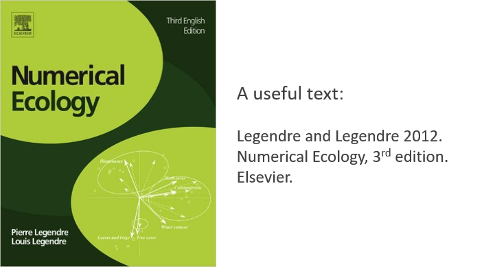
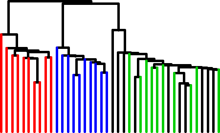
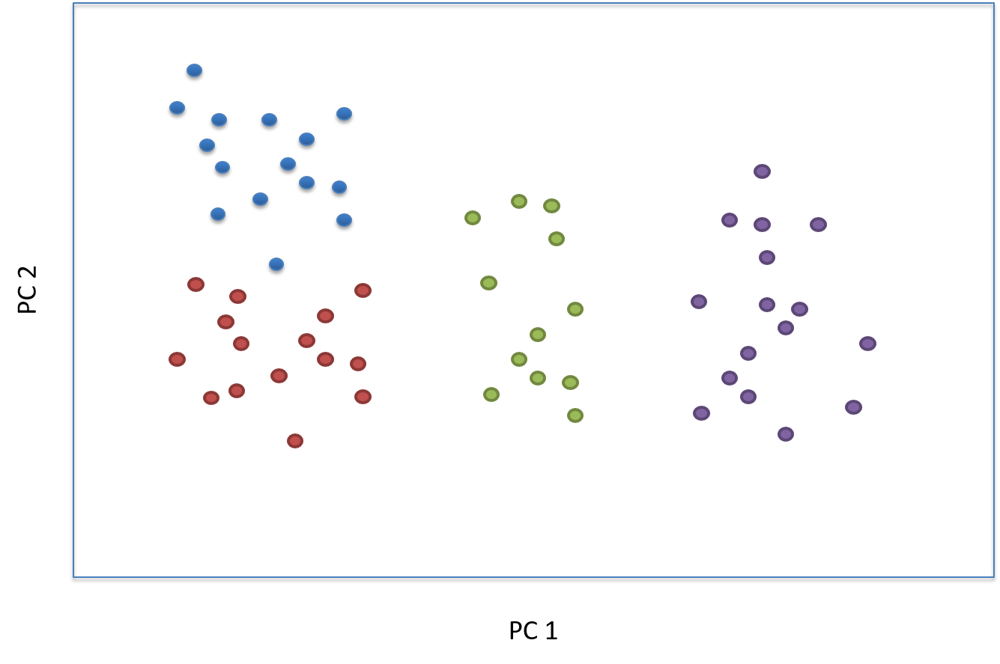
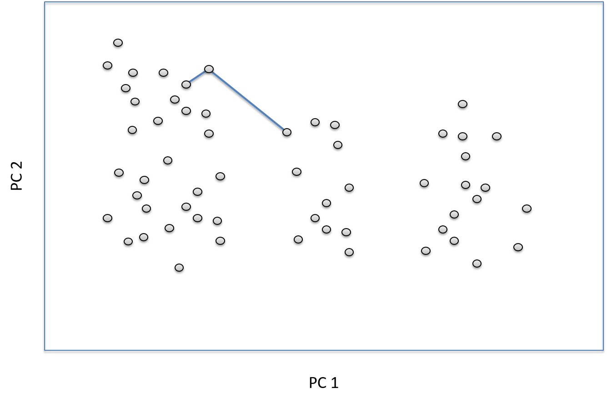
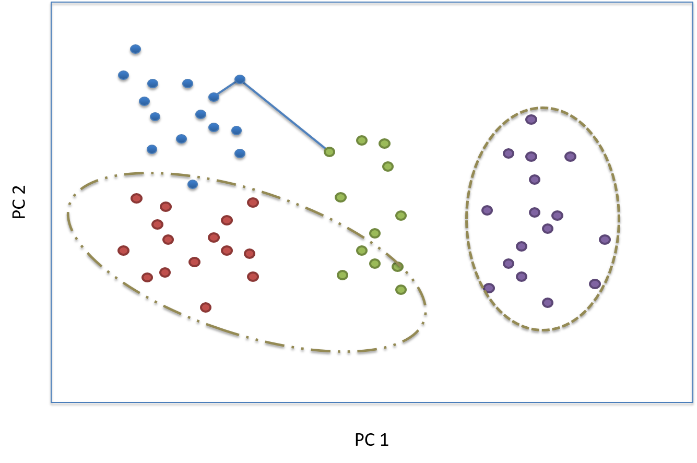
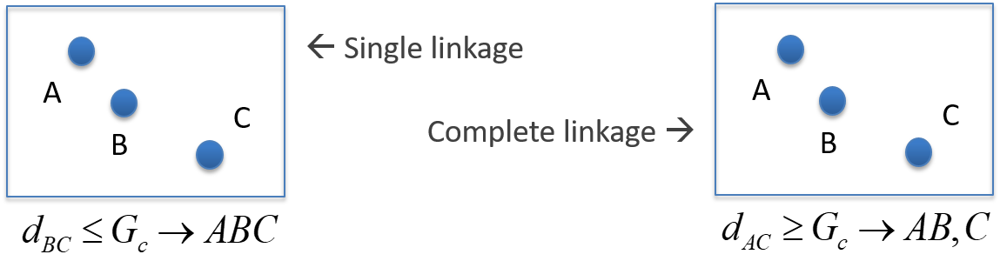
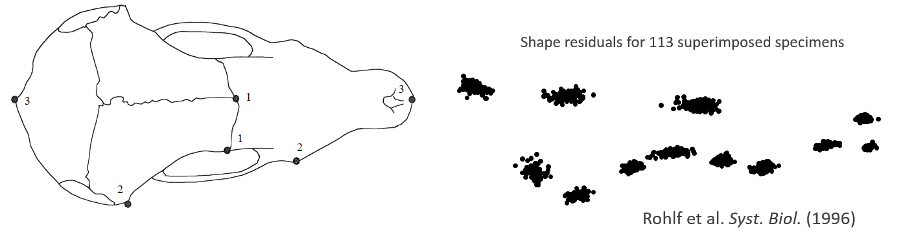
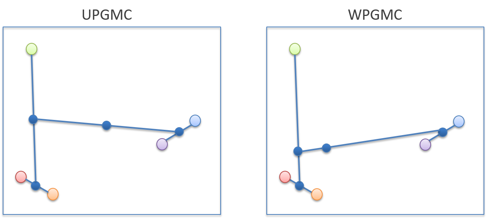

```{r setup, include=FALSE, echo = TRUE, tidy = TRUE}
library(knitr)
library(RRPP)
library(geomorph)
knitr::opts_chunk$set(echo = TRUE)
```

# Outline

<style type="text/css">
td {  /* Table  */
  font-size: 20px;
}
code.r{ /* Code block */
    font-size: 12px;
}
pre { /* Code block - determines code spacing between lines */
    font-size: 12px;
}
</style>

* Clustering

    + SAHN methods: single-link, complete-link, UPGMA, etc.

    + K-means partitioning

```{r, echo = FALSE,out.width="40%"}
  
```


# Clustering

Look for relationships of points in multivariate spaces

Clustering focuses on the similarities (or differences) among observations

Obtain groupings (clusters) of observations based on their similarity or difference

```{r, echo = FALSE, out.width="40%", fig.align='center'}
  
```

Provides complementary view to ordination

Clustering is algorithmic, not algebraic (i.e., a set of [repeated] rules for connecting observations)

# Clustering: General Logic

```{r, echo = FALSE, fig.align='center'}
  
```

Consider points in multivariate space

# Clustering: General Logic

```{r, echo = FALSE, fig.align='center'}
  
```

Connect objects in some way based on similarity

# Clustering: General Logic

```{r, echo = FALSE, fig.align='center'}
  
```

Results in clusters of points

# Clustering Approaches

* Two main categories

    + Hierarchical: clusters are nested (higher-ranked clusters contain lower-ranked clusters)
    
    + Non-hierarchical: strategies for identifying *K* groups of clusters

# Clustering Approaches

* Two main categories

    + Hierarchical: clusters are nested (higher-ranked clusters contain lower-ranked clusters)
    
    + Non-hierarchical: strategies for identifying *K* groups of clusters

* Other ways to think of clustering methods

    + Sequential vs. simultaneous
    
    + Agglomerative vs. divisive (start with one & add vs. start with all and break apart)
    
    + Monothetic vs. polythetic (single descriptor for partitions vs. multiple descriptors)
    
    + Probabilistic vs. non-probabilistic 
    
# Clustering: SAHN Methods

**S**equential, **A**gglomerative, **H**ierarchical, **N**ested

* **Procedure**
    + Using  similarity (or distance) matrix, cluster two most similar objects
    
    + Recalculate some value if required
    
    + Find next two most similar objects, aggregate, and repeat until all objects are clustered
    
# Clustering: SAHN Methods

**S**equential, **A**gglomerative, **H**ierarchical, **N**ested

* **Procedure**
    + Using  similarity (or distance) matrix, cluster two most similar objects
    
    + Recalculate some value if required
    
    + Find next two most similar objects, aggregate, and repeat until all objects are clustered

Equivalent to starting with most similar objects and ‘connecting’ objects with lower and lower similarity as you progress (i.e., more different objects added later)

SAHN generates nested plot (dendrogram) whose axis is similarity

Different criteria used for determining when to include objects to clusters

# Single Linkage and Complete Linkage

**Single Linkage** (nearest neighbor clustering): Add a new object to a cluster when its similarity to the *first* object is reached

# Single Linkage and Complete Linkage

**Single Linkage** (nearest neighbor clustering): Add a new object to a cluster when its similarity to the *first* object is reached

**Complete Linkage** (farthest neighbor clustering): Add a new object to a cluster when its similarity to the *last* object is reached

# Single Linkage and Complete Linkage

**Single Linkage** (nearest neighbor clustering): Add a new object to a cluster when its similarity to the *first* object is reached

**Complete Linkage** (farthest neighbor clustering): Add a new object to a cluster when its similarity to the *last* object is reached

Represent the extremes of SAHN clustering

Difference largely amounts to 'sliding' nodes of dendogram towards tips (single linkage) or towards root (complete linkage)

Some cluster assignments can also change

```{r, echo = FALSE, fig.align='center'}
  
```

# Example Data

Skull shape similarity among populations of European moles

```{r, echo = FALSE,out.width="40%", fig.align='center'}
  
```

Distance matrix based population averages

```{r echo = FALSE, eval=TRUE}
library(kableExtra)
mole.data<-read.csv("lectureData/09.cluster/Moles.csv",header=T,row.names=1)
mole.dist<-as.dist(mole.data)
mole.single<-hclust(mole.dist,method="single")       # Single-link
mole.complete<-hclust(mole.dist,method="complete")   # Complete-link
mole.upgma<-hclust(mole.dist,method="average")       # UPGMA = average-link
mole.upgmc<-hclust(mole.dist,method="centroid")      # UPGMC
mole.wpgma<-hclust(mole.dist,method="mcquitty")      # WPGMA
mole.wpgmc<-hclust(mole.dist,method="median")        # WPGMC
mole.wards<-hclust(mole.dist,method="ward.D")          # Ward's

kable(mole.data,"html") %>%
  kable_styling(bootstrap_options = "condensed",full_width = F, font_size = 7)
```

# Example: Single Vs. Complete Linkage

```{r echo = FALSE, eval=TRUE, out.width="70%", fig.align='center'}
par(mfrow=c(1,2))
plot(as.dendrogram(mole.single),horiz=TRUE,lwd=4,xlim=c(16,-1), main="Single Linkage")  # single-link
plot(as.dendrogram(mole.complete),horiz=TRUE,lwd=4,xlim=c(16,-1), main="Complete Linkage")  # complete-link
par(mfrow=c(1,1))
```

Nodes shifted back in Complete Linkage (right) and some cluster changes (e.g., position of 'M_touc')

# Single and Complete Linkage: Thoughts

Single linkage and complete linkage represent extreme criteria for clustering (include object at first instance vs. include object only when all instances reached)

Can be sensitive to noise in data (especially single linkage)

# Single and Complete Linkage: Thoughts

Single linkage and complete linkage represent extreme criteria for clustering (include object at first instance vs. include object only when all instances reached)

Can be sensitive to noise in data (especially single linkage)

Possible improvement: Use a measure of central tendency for groups rather than raw values

Different measures of central tendency have been used

# UPGMA

**U**nweighted **P**air-**G**roup **M**ethod using Arithmetic **A**verages

* Uses averages of clusters to join additional objects

    + Connect closest 2 objects in a cluster
    + Calculate their average similarity to each object not in cluster
    + Replace original similarity scores with averages
    + Add new object to cluster when distance to average is reached
    + Recalculate average for cluster and continue

Method unweighted because it gives same weight to original similarity scores (e.g., when 3^rd^ object added, new average found by dividing by 3, etc.)

# Example: UPGMA

```{r echo = FALSE, eval=TRUE, out.width="75%", fig.align='center'}
par(mfrow=c(1,3))
plot(as.dendrogram(mole.upgma),horiz=TRUE,lwd=4,xlim=c(16,-1), main = "UPGMA")  # UPGMA
plot(as.dendrogram(mole.single),horiz=TRUE,lwd=4,xlim=c(16,-1),main="Single Linkage")  # single-link
plot(as.dendrogram(mole.complete),horiz=TRUE,lwd=4,xlim=c(16,-1),main="Complete Linkage")  # complete-link
par(mfrow=c(1,1))
```

Nodes more intermediate as compared with SL and CL


# Representing Object Relationships

```{r echo = FALSE, eval=TRUE, fig.align='center'}
data(plethodon)
gp<-as.factor(paste(plethodon$species,plethodon$site))
  PC.scores<-prcomp(two.d.array(gpagen(plethodon$land,print.progress=FALSE)$coords))$x
pleth.dist<-dist(PC.scores)
PC12.dist<-dist(PC.scores[,1:2])
pleth.upgma<-hclust(pleth.dist,method="average") 
```

Ordination: Large distances more accurately represented

```{r echo = FALSE, eval=TRUE, out.width = "450px", out.height= "300px", fig.align='center'}
par(mfrow=c(1,2),mar=c(4,4,0,4))
plot(PC.scores, asp=1, pch=21, bg=gp)
plot(pleth.dist,PC12.dist)
par(mfrow=c(1,1))
```

Clustering: Small distances more accurately represented

```{r echo = FALSE, eval=TRUE, out.width = "450px", out.height= "300px", fig.align='center'}
par(mfrow=c(1,2),mar=c(4,4,0,4))
plot(as.dendrogram(pleth.upgma),horiz=TRUE,lwd=4)  # UPGMA
plot(pleth.dist,cophenetic(pleth.upgma))
par(mfrow=c(1,1))
```

Ordination & Clustering are complementary views of high-D relationships

# WPGMA

Weighted pair-group method using arithmetic averages

Same as UPGMA, but weighted (new averages always found by dividing by 2 regardless of how many objects are in the cluster)

```{r echo = FALSE, eval=TRUE, out.width="50%", fig.align='center'}
plot(as.dendrogram(mole.wpgma),horiz=TRUE,lwd=4,xlim=c(16,-1))  # WPGMA
```

# UPGMC & WPGMC

* Use centroids of clusters to join objects

    + Connect two closest objects
    + Calculate centroid from simlarity scores & distances of centroid to objects
    + Replace original distances with those to centroid
    + Repeat
    
```{r echo = FALSE, eval=TRUE, out.width="50%", fig.align='center'}
  
```

# UPGMC & WPGMC

* Use centroids of clusters to join objects

    + Connect two closest objects
    + Calculate centroid from simlarity scores & distances of centroid to objects
    + Replace original distances with those to centroid
    + Repeat
    
```{r echo = FALSE, eval=TRUE, out.width="50%", fig.align='center'}
  
```

Can result in 'reversals' (negative branch lengths): when distance of 3^rd^ object to centroid is smaller than distance between original pair

# Examples

```{r echo = FALSE, eval=TRUE, out.width="50%", fig.align='center'}
par(mfrow=c(1,2))
plot(as.dendrogram(mole.upgmc),horiz=TRUE,lwd=4,xlim=c(16,-1), main="UPGMC")  # UPGMC
plot(as.dendrogram(mole.wpgmc),horiz=TRUE,lwd=4,xlim=c(16,-1),main="WPGMC")  # WPGMC
par(mfrow=c(1,1))
```

Note negative branch lengths in these examples

# Ward's Minimum Variance Method

Use cluster variance (TESS: total error sums of squares: pooled within-group variance)

Add object to cluster such that TESS is increased the *least*

# Ward's Minimum Variance Method

Use cluster variance (TESS: total error sums of squares: pooled within-group variance)

Add object to cluster such that TESS is increased the *least*

```{r echo = FALSE, eval=TRUE, out.width="50%", fig.align='center'}
par(mfrow=c(1,2))
plot(as.dendrogram(mole.wards),horiz=TRUE,lwd=4,xlim=c(16,-1), main="Ward's")  # Ward's
plot(as.dendrogram(mole.upgma),horiz=TRUE,lwd=4,xlim=c(16,-1),main="UPGMA")  # UPGMA
par(mfrow=c(1,1))
```

# Clustering: K-Means

Non-hierarchical method of identifying groups

* Partition data into groups to  minimize TESS

    + Define number of groups (K)
    
    + Assign specimens to groups, calculate centroid, and TESS
    
    + Repeat many times and choose solution with minimal TESS

Entire process can be repeated for K = 2,3,4 etc. to find optimal number of groups

Does not yield dendrogram (not hierarchical); only yields # groups and group membership

# Example

Attempt 2, 3 and 4 clusters (NOTE: results can change across multiple runs)

```{r eval=TRUE,out.width = "50%", fig.align='center'}
# K-means
kclusters2<-kmeans(PC.scores,2)
kclusters3<-kmeans(PC.scores,3)
kclusters4<-kmeans(PC.scores,4)
```

```{r eval=TRUE,echo=FALSE,out.width = "75%", fig.align='center'}
par(mfrow=c(2,2))
plot(PC.scores[,1:2],col=kclusters2$cluster, main="K=2")
points(kclusters2$centers, col = 1:2, pch = 8, cex=2)

plot(PC.scores[,1:2],col=kclusters3$cluster, main="K=3")
points(kclusters3$centers, col = 1:3, pch = 8, cex=2)

plot(PC.scores[,1:2],col=kclusters4$cluster, main="K=4")
points(kclusters4$centers, col = 1:4, pch = 8, cex=2)
par(mfrow=c(1,1))

```

# Evaluate TESS by N-Groups

```{r eval=TRUE, out.width="40%", fig.align='center'}
TESS<-array(NA,6)
for (i in 1:6){
  TESS[i]<-kmeans(PC.scores,i)$tot.withinss
}
```

```{r eval=TRUE, echo=FALSE,out.width="40%", fig.align='center'}
par(mfrow=c(1,2))
plot( TESS, cex=2)  # seems to bottom out at 3 groups
plot(PC.scores[,1:2],col=kclusters3$cluster)
points(kclusters3$centers, col = 1:3, pch = 8, cex=2)
par(mfrow=c(1,1))
```

TESS levels at K=3 (PC plot confirms this is reasonable)

However, in this case we have 4 groups...

# Clustering: Summary

Clustering provides ‘connected’ view of object similarity

VERY useful when combined with ordination (provide complementary views of data space)

Change of metric/distance measure may alter results

One must make sure clustering method is commensurate with ordination method (e.g., K-means uses Euclidean distance to measure TESS.  Corresponds to PC plot)

* **Methods do NOT assume process!!**  Careful in interpretation

    + Phylogenetic tree estimation is process-based clustering: not the same mathematically

Other methods exist: minimum spanning tree, flexible-link clustering, probabilistic clustering, evolutionary model-based phylogenetics (parsimony, ML, Bayesian, neighbor-joining, etc.)

# Conclusions

Clustering is a useful visualization tool for multivariate data

Displays overall similarity among objects

A complement to ordination approaches we've used (e.g., PCA)
