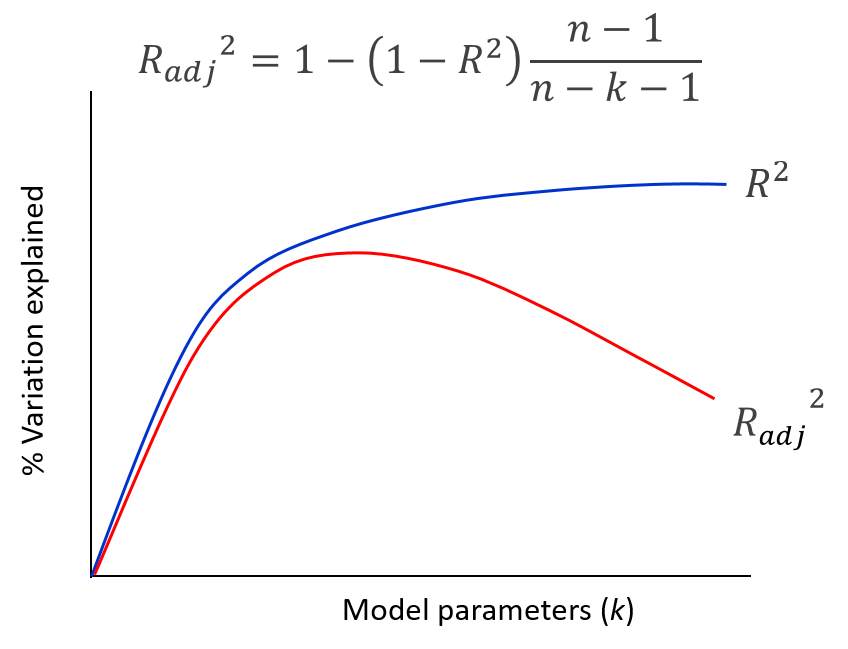
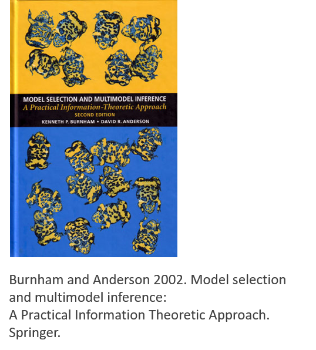
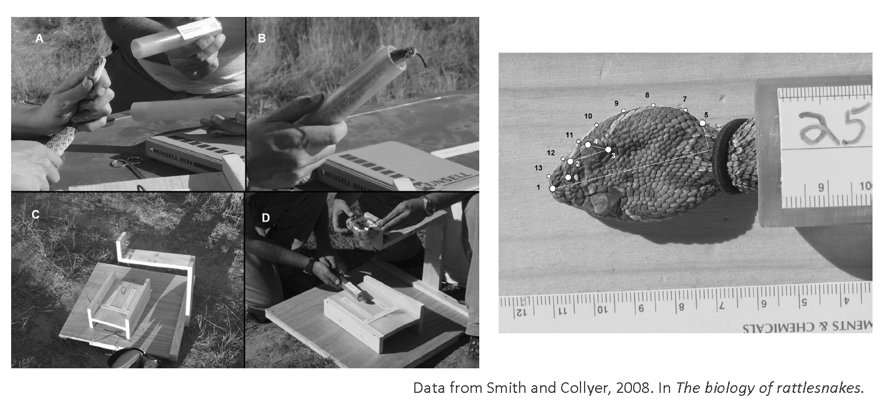
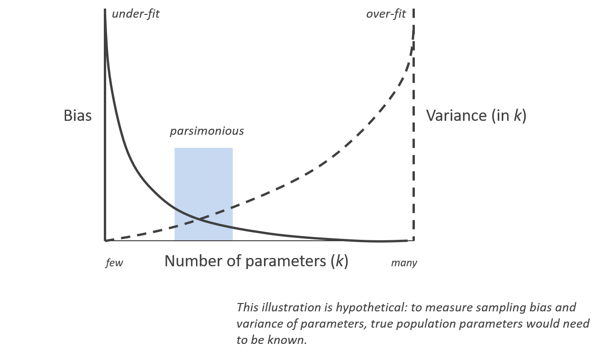
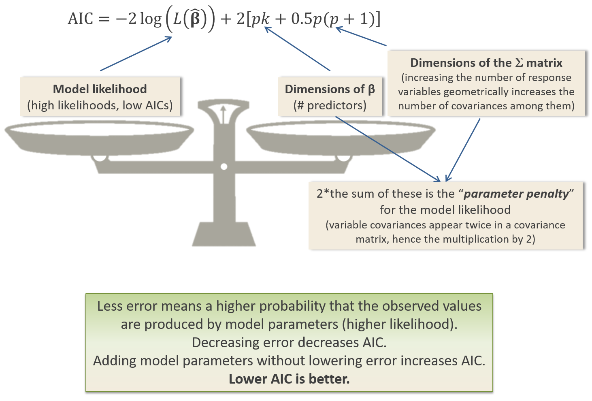

```{r setup, include=FALSE, echo = TRUE, tidy = TRUE}
library(knitr)
library(RRPP)
library(geomorph)
library(MASS)
library(geiger)
library(phytools)
knitr::opts_chunk$set(echo = TRUE)
```

# Model Comparison

<style type="text/css">
td {  /* Table  */
  font-size: 20px;
}
code.r{ /* Code block */
    font-size: 12px;
}
pre { /* Code block - determines code spacing between lines */
    font-size: 12px;
}
</style>

- Often, (especially in observational studies) it is unknown what ‘explanatory’ variables are important sources of variation.

- How do we compare models and 'select' the optimal one?
 
- We can always ‘dump’ any or all explanatory variables into a model, but there are some problems with this.

# Model Comparison

- Often, (especially in observational studies) it is unknown what ‘explanatory’ variables are important sources of variation.

- How do we compare models and 'select' the optimal one?
 
- We can always ‘dump’ any or all explanatory variables into a model, but there are some problems with this.

- Increasing model parameters ($\small{k}$) results in:
    - Reduction of explained information relative to the model “size”
    - Potential loss of statistical power (i.e., eventually model df > error df)

```{r, echo = FALSE,out.width="40%", fig.align='center' }
  
```

# Model Comparison: Goals and Aims

- The goal is to evaluate two or more models with different sets of parameters to determine if one is ‘better’ (i.e., explains more variation in the response given certain criteria).

- Today we discuss:
    - Likelihood Ratio Tests: statistical comparison of nested models
    - Information Theoretic approaches: ranking of models based on parsimony criteria
    - Cross-validation procedures: measure robustness of a specific model

```{r, echo = FALSE,out.width="40%", fig.align='center' }
  
```

# Likelihood Ratio Tests

- Likelihood ratio tests are used to statistically compare one model (e.g., full model) with an alternative model that is nested within the full model (e.g., reduced model).

- But first, what is the **model likelihood** of a model?  This describes the likelihood of a set of model parameters ($\small\beta$), given the data ($\small\mathbf{Y}$). It is equal to the probability of the observed outcomes given the parameters.

$$\small{L}\mathbf{(\hat{\beta}|Y)}$$

# Likelihood Ratio Tests

- Likelihood ratio tests are used to statistically compare one model (e.g., full model) with an alternative model that is nested within the full model (e.g., reduced model).

- But first, what is the **model likelihood** of a model?  This describes the likelihood of a set of model parameters ($\small\beta$), given the data ($\small\mathbf{Y}$). It is equal to the probability of the observed outcomes given the parameters.

$$\small{L}\mathbf{(\hat{\beta}|Y)}$$

- For univariate data (OLS model), we have: 

$$\small\log{L} = -\frac{n}{2}ln{2\pi}-\frac{n}{2}ln(\hat{\sigma}^2)-\frac{1}{2\hat{\sigma}^{2}}{\left(\mathbf{Y}-\mathbf{X\beta}\right)^{T}\left(\mathbf{Y}-\mathbf{X\beta}\right)}$$

# Likelihood Ratio Tests

- Likelihood ratio tests are used to statistically compare one model (e.g., full model) with an alternative model that is nested within the full model (e.g., reduced model).

- But first, what is the **model likelihood** of a model?  This describes the likelihood of a set of model parameters ($\small\beta$), given the data ($\small\mathbf{Y}$). It is equal to the probability of the observed outcomes given the parameters.

$$\small{L}\mathbf{(\hat{\beta}|Y)}$$

- For univariate data (OLS model), we have: 

$$\small\log{L} = -\frac{n}{2}ln{2\pi}-\frac{n}{2}ln(\hat{\sigma}^2)-\frac{1}{2\hat{\sigma}^{2}}{\left(\mathbf{Y}-\mathbf{X\beta}\right)^{T}\left(\mathbf{Y}-\mathbf{X\beta}\right)}$$

- The likelihood for multivariate OLS models is: 

$\small\log{L}=-\frac{np}{2}ln{2\pi}-\frac{n}{2}ln{\begin{vmatrix}\mathbf{\hat{\Sigma}}\end{vmatrix}}-\frac{1}{2}tr{\left(\mathbf{Y}-\mathbf{X\beta}\right)^{T}\mathbf{\hat{\Sigma}}^{-1}\left(\mathbf{Y}-\mathbf{X\beta}\right)}$

- But what is this really???

# What's In a Likelihood?

- Breaking things down, we see that the $\small\log{L}$ has three components:


$$\small\log{L}=-\frac{np}{2}ln{2\pi}-\frac{n}{2}ln{\begin{vmatrix}\mathbf{\hat{\Sigma}}\end{vmatrix}}-\frac{1}{2}tr{\left(\mathbf{Y}-\mathbf{X\beta}\right)^{T}\mathbf{\hat{\Sigma}}^{-1}\left(\mathbf{Y}-\mathbf{X\beta}\right)}$$

Element | Component      | Meaning                    
:------ | :------------- | :------------------------------------------
1 | $\small\frac{np}{2}ln{2\pi}$ | **A constant**
2 | $\small\frac{1}{2}tr{\left(\mathbf{Y}-\mathbf{X\beta}\right)^{T}\mathbf{\hat{\Sigma}}^{-1}\left(\mathbf{Y}-\mathbf{X\beta}\right)}$ | Represents summed-squared deviations from the predicted values in some fashion  
3 | $\small\frac{n}{2}ln{\begin{vmatrix}\mathbf{\hat{\Sigma}}\end{vmatrix}}$  | The error covariance of the model  

- Question, which of these varies across different models? 
    - Surely 2 and 3, right???

# What's In a Likelihood?

- Breaking things down, we see that the $\small\log{L}$ has three components:

$$\small\log{L}=-\frac{np}{2}ln{2\pi}-\frac{n}{2}ln{\begin{vmatrix}\mathbf{\hat{\Sigma}}\end{vmatrix}}-\frac{1}{2}tr{\left(\mathbf{Y}-\mathbf{X\beta}\right)^{T}\mathbf{\hat{\Sigma}}^{-1}\left(\mathbf{Y}-\mathbf{X\beta}\right)}$$

Element | Component      | Meaning                    
:------ | :------------- | :------------------------------------------
1 | $\small\frac{np}{2}ln{2\pi}$ | **A constant**
2 | $\small\frac{1}{2}tr{\left(\mathbf{Y}-\mathbf{X\beta}\right)^{T}\mathbf{\hat{\Sigma}}^{-1}\left(\mathbf{Y}-\mathbf{X\beta}\right)}$ | Represents summed-squared deviations from the predicted values in some fashion  
3 | $\small\frac{n}{2}ln{\begin{vmatrix}\mathbf{\hat{\Sigma}}\end{vmatrix}}$  | The error covariance of the model  

- Question, which of these varies across different models? 
    - Surely 2 and 3, right???
    
- **WRONG!!** 

# Likelihood: Component Parts

Let's look at the $\small\frac{1}{2}tr{\left(\mathbf{Y}-\mathbf{X\beta}\right)^{T}\mathbf{\hat{\Sigma}}^{-1}\left(\mathbf{Y}-\mathbf{X\beta}\right)}$ component across two models for the same data: 

$\tiny\mathbf{Y}=\begin{bmatrix} 
6\\ 7\\ 4\\ 5\\ 9\\ 3\\ 2\\ 5
\end{bmatrix}$  $\tiny\mathbf{X_{0}}=\begin{bmatrix} 
1\\ 1\\ 1\\ 1\\ 1\\ 1\\ 1\\ 1
\end{bmatrix}$ $\tiny\mathbf{X_{1}}=\begin{bmatrix} 
1 & 1\\ 1& 3\\ 1& 3\\ 1& 4\\ 1& 5\\ 1& 6\\ 1& 7\\ 1& 8
\end{bmatrix}$

```{r, echo=FALSE}
y<-c(6,7,4,5,9,3,2,5)
N<-length(y)
x<-rep(1,N)
x1<-cbind(x,c(1,2,3,4,5,6,7,8))
N<-length(y)
```

```{r}
beta<-solve(t(x)%*%x)%*%t(x)%*%y
sigma<-(t(y-x%*%beta)%*%(y-x%*%beta) ) / N
beta1<-solve(t(x)%*%x)%*%t(x)%*%y
sigma1<-(t(y-x%*%beta1)%*%(y-x%*%beta1) ) / N

(t(y-x%*%beta)%*%(y-x%*%beta)) / (2*sigma)
(t(y-x%*%beta1)%*%(y-x%*%beta1)) / (2*sigma1)
```

Wait! What? For two different models this component is *IDENTICAL*!

**ALGEBRA, please provide us with wisdom...**

# Likelihood: Component Parts

And algebra answers..."Yes I will!"

# Likelihood: Component Parts

And algebra answers..."Yes I will!"

$\small\frac{1}{2}tr{\left(\mathbf{Y}-\mathbf{X\beta}\right)^{T}\mathbf{\hat{\Sigma}}^{-1}\left(\mathbf{Y}-\mathbf{X\beta}\right)}$ must be a constant, specifically $\small\frac{np}{2}$

First, recall that: $\small\mathbf{\hat{\Sigma}} = \frac{\left(\mathbf{Y} -\mathbf{X\hat{\beta}}\right)^T \left(\mathbf{Y} -\mathbf{X\hat{\beta}}\right)}{n}$

>- From which the numerator:  $\small\left(\mathbf{Y} -\mathbf{X\hat{\beta}}\right)^T \left(\mathbf{Y} -\mathbf{X\hat{\beta}}\right)={SSCP}$   which is square and symmetric. 

>- This component is found twice in the equation above (once within $\small\mathbf{\hat{\Sigma}}^{-1}$ and the components on either side). So with a little algebra, that component becomes: $\small\mathbf{(SSCP}^{-1}\mathbf{SSCP)}$

>- Now, for any symmetric matrix: $\small{trace}\left(\mathbf{S}^{-1}\mathbf{S}\right) = p$, and also $\small\left(n^{-1}\right)^{-1} = n$.  

>- Thus, when we substitute back in we are left with $\small\frac{np}{2}$.

>- REGARDLESS of the data in $\small\mathbf{Y}$:   $\small\frac{1}{2}tr{\left(\mathbf{Y}-\mathbf{X\beta}\right)^{T}\mathbf{\hat{\Sigma}}^{-1}\left(\mathbf{Y}-\mathbf{X\beta}\right)}=\frac{np}{2}$ 

>- ###### This result holds for the general GLS models as well.

# Revisiting the logL Components

Ok, so for OLS models, what does the likelihood really contain?

$$\small\log{L}=-\frac{np}{2}ln{2\pi}-\frac{n}{2}ln{\begin{vmatrix}\mathbf{\hat{\Sigma}}\end{vmatrix}}-\frac{1}{2}tr{\left(\mathbf{Y}-\mathbf{X\beta}\right)^{T}\mathbf{\hat{\Sigma}}^{-1}\left(\mathbf{Y}-\mathbf{X\beta}\right)}$$

Element | Component      | Meaning                    
:------ | :------------- | :------------------------------------------
1 | $\small\frac{np}{2}ln{2\pi}$ | **A constant**
2 | $\small\frac{1}{2}tr{\left(\mathbf{Y}-\mathbf{X\beta}\right)^{T}\mathbf{\hat{\Sigma}}^{-1}\left(\mathbf{Y}-\mathbf{X\beta}\right)}$ | **A constant**
3 | $\small\frac{n}{2}ln{\begin{vmatrix}\mathbf{\hat{\Sigma}}\end{vmatrix}}$  | The error covariance of the model 

# Revisiting the logL Components

Ok, so for OLS models, what does the likelihood really contain?

$$\small\log{L}=-\frac{np}{2}ln{2\pi}-\frac{n}{2}ln{\begin{vmatrix}\mathbf{\hat{\Sigma}}\end{vmatrix}}-\frac{1}{2}tr{\left(\mathbf{Y}-\mathbf{X\beta}\right)^{T}\mathbf{\hat{\Sigma}}^{-1}\left(\mathbf{Y}-\mathbf{X\beta}\right)}$$

Element | Component      | Meaning                    
:------ | :------------- | :------------------------------------------
1 | $\small\frac{np}{2}ln{2\pi}$ | **A constant**
2 | $\small\frac{1}{2}tr{\left(\mathbf{Y}-\mathbf{X\beta}\right)^{T}\mathbf{\hat{\Sigma}}^{-1}\left(\mathbf{Y}-\mathbf{X\beta}\right)}$ | **A constant**
3 | $\small\frac{n}{2}ln{\begin{vmatrix}\mathbf{\hat{\Sigma}}\end{vmatrix}}$  | The error covariance of the model 

This exploration reveals that the only component of $\small\log{L}$ that is free to vary is $\small\frac{n}{2}ln{\begin{vmatrix}\mathbf{\hat{\Sigma}}\end{vmatrix}}$

By extension, this implies that **ALL** parametric statistical hypothesis testing becomes a comparison of the error covariance of the model: lower error covariance means a better fitting model 

As such, model comparisons (via LRT AIC, etc.) are also based on this one component: the **error covariance of the model**.

Now let's get back to model comparisons and see how this is done...

# Likelihood Ratio Tests: Nested Models

The formal method for comparing *nested* models (e.g., `Y~X1+X2` vs. `Y~X1`) is a likelihood ratio test (LRT):

$$\small\log \left( \frac{\mathcal{L}\left(\mathbf{Y}| \mathbf{X}_f\right)}
{\mathcal{L}\left(\mathbf{Y}| \mathbf{X}_r\right)}
\right)=$$

$$\small-\frac{1}{2} \left( 
np - n\log|\mathbf{\hat{\Sigma}}_{p_f}| - np\log\left(2\pi \right )
\right) +
\frac{1}{2} \left( 
np - n\log|\mathbf{\hat{\Sigma}}_{p_r}| - np\log\left(2\pi \right )
\right) =$$

# Likelihood Ratio Tests: Nested Models

The formal method for comparing *nested* models (e.g., `Y~X1+X2` vs. `Y~X1`) is a likelihood ratio test (LRT):

$$\small\log \left( \frac{\mathcal{L}\left(\mathbf{Y}| \mathbf{X}_f\right)}
{\mathcal{L}\left(\mathbf{Y}| \mathbf{X}_r\right)}
\right)=$$

$$\small-\frac{1}{2} \left( 
np - n\log|\mathbf{\hat{\Sigma}}_{p_f}| - np\log\left(2\pi \right )
\right) +
\frac{1}{2} \left( 
np - n\log|\mathbf{\hat{\Sigma}}_{p_r}| - np\log\left(2\pi \right )
\right) =$$

Eliminate the constants and one has:

$$\small\frac{n}{2}\left(\log|\mathbf{\hat{\Sigma}}_{p_f}| - \log|\mathbf{\hat{\Sigma}}_{p_r}|\right)$$

# Likelihood Ratio Tests: Nested Models

The formal method for comparing *nested* models (e.g., `Y~X1+X2` vs. `Y~X1`) is a likelihood ratio test (LRT):

$$\small\log \left( \frac{\mathcal{L}\left(\mathbf{Y}| \mathbf{X}_f\right)}
{\mathcal{L}\left(\mathbf{Y}| \mathbf{X}_r\right)}
\right)=$$

$$\small-\frac{1}{2} \left( 
np - n\log|\mathbf{\hat{\Sigma}}_{p_f}| - np\log\left(2\pi \right )
\right) +
\frac{1}{2} \left( 
np - n\log|\mathbf{\hat{\Sigma}}_{p_r}| - np\log\left(2\pi \right )
\right) =$$

Eliminate the constants and one has:

$$\small\frac{n}{2}\left(\log|\mathbf{\hat{\Sigma}}_{p_f}| - \log|\mathbf{\hat{\Sigma}}_{p_r}|\right)$$

For univariate data, we could say, 
$$\small{D} = 2\log\left(\frac{\mathcal{L}_1}{\mathcal{L}_2}\right) =
n\left(\log|\mathbf{\hat{\Sigma}}_{p_f}| - \log|\mathbf{\hat{\Sigma}}_{p_r}|\right)
= $$

$$\small{n}\left(\log \hat{\sigma}_{f}^2 - \log \hat{\sigma}_{r}^2\right)
\sim\chi^2(k_f-k_r)$$

where $k$ corresponds to the rank of the two model design matrices, $\mathbf{X}$. 

# Likelihood Ratio Hypothesis Tests

- Although not explicitly stated, we have performed many likelihood ratio tests thus far, e.g., MANOVA with $\small\Lambda_{Wilks}$

$$\small{LRT}={2}\log\left(\frac{\mathcal{L}_f}{\mathcal{L}_r}\right) = nlog\left(\frac{|\mathbf{\hat{\Sigma}}_{p_f}|}{|\mathbf{\hat{\Sigma}}_{p_r}|}\right)=\Lambda_{Wilks}$$

- Thus, LRT typically involve statistically comparing one model with an alternative model that is nested within the full model.

- The null hypothesis of an LRT is that the additional parameters in the full model offer no improvement over the simpler set of parameters in the reduced model.  A significant LRT (rejection of the null hypothesis) implies that significantly more variation of the dependent variable was described by the additional parameters of the full model.  Therefore, the full model is considered a significant improvement over the reduced model.

# LRT: Example

- Patterns of phenotypic variation in the heads of *LIVE* rattlesnakes quantified

- Compared several existing hypotheses which seek to describe phenotypic variation
    - Size hypothesis: head variation associated with size
    - Region hypothesis: head variation associated with regional differences
    - Sex hypothesis: head variation associated with sexual dimorphism 

```{r, echo = FALSE,out.width="60%", fig.align='center' }
  
```

# LRT: Example (Cont.)

Models considered: 

- Full: `Head ~ SVL + Sex + Region + Sex × Region`
- Red1: `Head ~ SVL + Region`
- Red2: `Head ~ SVL`
- Red3: `Head ~ Region`
 
LRTs: 

- Full vs. Red1: Test of sexual dimorphism
- Red1 vs. Red2: Test of regional variation
- Red1 vs. Red3: Test of head/size variation

# LRT: Example (Cont.)

Results: Full model MANOVA

```{r, echo=FALSE}
# Read data from Smith and Collyer 2008
snake<-read.csv("lectureData/11.model.comparison/Lab-11-snake.csv",header=T)
site<-as.factor(snake[,1]);region<-as.factor(snake[,2]);sex<-as.factor(snake[,3])
svl<-snake[,4]; hs<-snake[,5] # hs= head size, calculated as centroid size from lm
Y<-as.matrix(snake[,-(1:5)])
```

```{r, eval=TRUE}
Full<-lm(Y~svl + sex*region, model=T,x=T)
Red1<-lm(Y~svl + region, model=T,x=T)
Red2<-lm(Y~svl, model=T,x=T)
Red3<-lm(Y~region, model=T,x=T)
anova(Full)
anova(Full, Red1)
```

# LRT: Example (Cont.)

```{r, eval=TRUE}
anova(Red1,Red2)
anova(Red1,Red3)
```

Conclusions:

Sexual dimorphism does not contribute to phenotypic variation, but region and SVL are important

LRTs demonstrate that adding parameters for Sex and Sex × Region does not offer a significant improvement over a simpler model!

# Likelihood Ratio Tests: Thoughts

**Advantages**

Provides a statistical assessment of model difference, based on importance of parameters that differ between models – ELEGANT!

Can be performed on any level of hierarchical structure (e.g., a model with parameters A, B, C, D, E, F can be compared to one with parameters A and E, one with just F, or one with B, C, and D in the same manner).

**Disadvantages**

As long as n:kp ratio is large, significant differences between models are likely, even for small effects.

Models must be nested comparisons

# Likelihood Ratio Tests: Thoughts

**Advantages**

Provides a statistical assessment of model difference, based on importance of parameters that differ between models – ELEGANT!

Can be performed on any level of hierarchical structure (e.g., a model with parameters A, B, C, D, E, F can be compared to one with parameters A and E, one with just F, or one with B, C, and D in the same manner).

**Disadvantages**

As long as n:kp ratio is large, significant differences between models are likely, even for small effects.

Models must be nested comparisons

$$\small{LRT}={2}\log\left(\frac{\mathcal{L}_f}{\mathcal{L}_r}\right) = nlog\left(\frac{|\mathbf{\hat{\Sigma}}_{p_f}|}{|\mathbf{\hat{\Sigma}}_{p_r}|}\right)=\Lambda_{Wilks}$$

Really? What about this equation implies models must be nested?

# LRT for Non-Nested Models

- For nested models, $\small{Q}={2}\log\left(\frac{\mathcal{L}_A}{\mathcal{L}_B}\right)$  is always positive.

- For non-nested models, it can be negative, depending on which model is assigned to `A` and `B`, so direct comparison to $\small\chi^2$ not possible.

- Procedure for LRT of non-nested models
    - Calculate $\small{Q}_{obs}$ 
    - Simulate data under model `A` and generate distribution of $\small{Q}_{rand}$
    - Compare $\small{Q}_{obs}$ to $\small{Q}_{rand}$
    - Simulate data under model `B` and repeat

# LRT for Non-Nested Models

- For nested models, $\small{Q}={2}\log\left(\frac{\mathcal{L}_A}{\mathcal{L}_B}\right)$  is always positive.

- For non-nested models, it can be negative, depending on which model is assigned to `A` and `B`, so direct comparison to $\small\chi^2$ not possible.

- Procedure for LRT of non-nested models
    - Calculate $\small{Q}_{obs}$ 
    - Simulate data under model `A` and generate distribution of $\small{Q}_{rand}$
    - Compare $\small{Q}_{obs}$ to $\small{Q}_{rand}$
    - Simulate data under model `B` and repeat

- Possible outcomes: 
    - $\small{Q}_{obs}$ significant when `A` null, but not when `B` null: (`B` is preferred)
    - $\small{Q}_{obs}$ significant when `B` null, but not when `A` null: (`A` is preferred)
    - $\small{Q}_{obs}$ significant when both are null (neither model preferred)
    - $\small{Q}_{obs}$ not significant when both are null (no discrimination between models)

###### See Lewis et al. 2011. Methods Ecol. Evol. 

# Information Theory Criteria

Approach compares models by ranking them based on some score: typically AIC (Akaike’s information criterion) 

Model that explains the most information with the fewest parameters (a ‘parsimony’ criterion) is then chosen as the preferred model

IT scores “reward” an increase in likelihood, but “penalize” the increase in number of parameters

Does NOT use significance testing!

Instead, best model is chosen when difference between models is $\small\Delta_{AIC} > 4$ 

>- ###### Note: why $\small\Delta_{AIC} > 4$ ? Because $\small\chi^2_{1df} = 3.814\approx4$    (i.e., still rooted in frequentist statistical theory!)

# Information Theory: Parsimony Principle

Goal of model comparison is to select the model that explains the most information with the fewest parameters

```{r, echo = FALSE,out.width="70%", fig.align='center' }
  
```

# Akaike Information Criterion (AIC)

The most commonly used criterion to score and compare candidate models is: 

$$\small\mathrm{AIC} = -2\mathcal{L} + 2K$$

where $\mathcal{L}$ is the model likelihood, and $\small{2K}$ is the *parameter penalty*, which is usually presented as $K=k+1$ (the number of model coefficients: $\small{k}$ = rank of the design matrix, and $\small{1}$ for the residual model variance $\small\sigma^2$).

# Akaike Information Criterion (AIC)

The most commonly used criterion to score and compare candidate models is: 

$$\small\mathrm{AIC} = -2\mathcal{L} + 2K$$

where $\mathcal{L}$ is the model likelihood, and $\small{2K}$ is the *parameter penalty*, which is usually presented as $K=k+1$ (the number of model coefficients: $\small{k}$ = rank of the design matrix, and $\small{1}$ for the residual model variance $\small\sigma^2$).

Actually, this is the *univariate* version of AIC.  The general **multivariate** form is (Bedrick and Tsai 1994): 

$$\small\mathrm{AIC} = -2\mathcal{L} + 2[pk+0.5p(p+1)]$$

where the number of parameters for the matrix of coefficients for multivariate data is $\small{pk}$ and the number of parameters for the residual covariance matrix is $\small\frac{1}{2}p(p + 1)$. 

# AIC Dissected

```{r, echo = FALSE,out.width="60%", fig.align='center' }
  
```

# AIC Modifications

AIC is essentially the likelihood of the model ($\mathcal{L}$) plus a parameter penalty for model complexity.  The quantification of this parameter penalty is arbitrary, and various have been proposed:

$\small\mathrm{AIC} = -2\mathcal{L} + 2K$

$\small\mathrm{AIC}_c = -2\mathcal{L} + 2K\frac{n}{n-K-1}$  (often considered a 'sample size correction')

$\small\mathrm{QAIC} = -2\mathcal{L}/c + 2K$   where $\small{c}$ is a dispersion index based on the $\small\chi^2$ distribution, to account for overdispersion

$\small\mathrm{BIC} = -2\mathcal{L} + 2K\log{(n)}$  Bayesian AIC

And there are many, many others (see Burnham and Anderson. 2002)

# AIC: Example

- Revisit the snake data (patterns of phenotypic variation in rattlesnake heads)

- Models
    - Full: `Head ~ SVL + Sex + Region + Sex × Region`
    - Red1: `Head ~ SVL + Region`
    - Red2: `Head ~ SVL`
    - Red3: `Head ~ Region`

```{r, echo=FALSE}
maic<-function(x,...){ # each x is a model
    y<-resid(x)
    E<-t(y)%*%y
    d<-det(E)
    if(length(E)>1) n<-nrow(y) else n<-length(y)
    if(length(E)>1) p<-ncol(y) else p<-1
    k<-x$rank # same as df in "AIC" except "AIC" adds one for variance
    lh<-n*(log(d/n^p)+p)
    LLik<- (-2*((-.5*n*(log(d/n^p)+p))-(0.5*(n*log(2*pi)))))
    pen<-2*(p*k+0.5*p*(p+1))
    m<-LLik+pen
    maic<-c(k,m)
} 
maic.Full<-maic(Full)
maic.Red1<-maic(Red1)
maic.Red2<-maic(Red2)
maic.Red3<-maic(Red3)
res <- rbind(maic.Full, maic.Red1, maic.Red2,maic.Red3)
res <- cbind(res,res[,2]-min(res[,2]))
colnames(res) <- c('df','AIC','dAIC')
```

```{r, eval=TRUE}
res
```

Best model (as found by $\small\Delta{AIC}$) is Red1: `Y~SVL + Region`.  No other model is within 4 $\small\Delta{AIC}$ units, so this model is strongly preferred.

# Nested Models: LRT or AIC?

- In the previous example, models were nested and LRT and IC gave the same results. That brings up the question: in such cases, which should be used (LRT or AIC?)

- Burnham and Anderson (1998) believe that ITMS should be performed in place of LRT.  
    - They provide a ‘thought’ experiment, where models become more complex. They claim that no change in AIC is accompanied with a $\small{k} = 8$ change in model parameters, which eventually results in a significant LRT (i.e., the 	additional 8 parameters caused a significant difference between full and reduced models)
    - However, their logic is flawed because AIC contains model likelihood; thus no change in AIC would require a linear $\small{-1:1}$ change between model likelihood and the parameter penalty described by additional parameters – that is impossible!

# Nested Models: LRT or AIC?

- In the previous example, models were nested and LRT and IC gave the same results. That brings up the question: in such cases, which should be used (LRT or AIC?)

- Burnham and Anderson (1998) believe that ITMS should be performed in place of LRT.  
    - They provide a ‘thought’ experiment, where models become more complex. They claim that no change in AIC is accompanied with a $\small{k} = 8$ change in model parameters, which eventually results in a significant LRT (i.e., the 	additional 8 parameters caused a significant difference between full and reduced models)
    - However, their logic is flawed because AIC contains model likelihood; thus no change in AIC would require a linear $\small{-1:1}$ change between model likelihood and the parameter penalty described by additional parameters – that is impossible!

- From a mathematical perspective, AIC offers no advantage: 

$$\small\Delta{AIC}=(n\log|\mathbf{\hat{\Sigma}}_{f}| + 2[pk_f+0.5p(p+1)])-(n\log|\mathbf{\hat{\Sigma}}_{r}| + 2[pk_r+0.5p(p+1)])=$$

>- $$\small\Delta{AIC}=n\left(\log|\mathbf{\hat{\Sigma}}_{f}| - \log|\mathbf{\hat{\Sigma}}_{r}|\right)+2p(k_f-k_r)=$$

>- $$\small\Delta{AIC}=n\log\left(\frac{|\mathbf{\hat{\Sigma}}_{f}|}{|\mathbf{\hat{\Sigma}}_{r}|}\right)+2p(k_f-k_r)=$$

>- $$\small\Delta{AIC}=LRT+2p(k_f-k_r)$$

>- In other words, for nested models, $\small\Delta{AIC}$ is simply the likelihood ratio test plus a parameter penalty!  No need to abandon statistical hypothesis testing in this case.

# Model Uncertainty

- Sometimes, a single best model cannot be identified (i.e., $\small\Delta{AIC}$ are 'close')

- For example:

Model      | $\small\Delta{AIC}$   
:--------- | :------------- 
`A` | 3
`A + B` | 0
`C` | 2

# Model Uncertainty

- Sometimes, a single best model cannot be identified (i.e., $\small\Delta{AIC}$ are 'close')

- For example:

Model      | $\small\Delta{AIC}$   
:--------- | :------------- 
`A` | 3
`A + B` | 0
`C` | 2

- One way of looking at the support for different models is by using Akaike weights: $\small{w}_i=\frac{exp(-\frac{1}{2}\Delta{AIC}_i)}{\sum_i^C{exp}(-\frac{1}{2}\Delta{AIC}_i)}$

- Model weight is akin to the probability of model $\small{i}$ given the set of $\small{C}$ candidate models 

# Model Uncertainty

- Sometimes, a single best model cannot be identified (i.e., $\small\Delta{AIC}$ are 'close')

- For example:

Model      | $\small\Delta{AIC}$   
:--------- | :------------- 
`A` | 3
`A + B` | 0
`C` | 2

- One way of looking at the support for different models is by using Akaike weights: $\small{w}_i=\frac{exp(-\frac{1}{2}\Delta{AIC}_i)}{\sum_i^C{exp}(-\frac{1}{2}\Delta{AIC}_i)}$

- Model weight is akin to the probability of model $\small{i}$ given the set of $\small{C}$ candidate models 

Model      | $\small\Delta{AIC}$  | $\small{w}_i$ 
:--------- | :------------- |:--------------------
`A` | 3  |  0.122
`A + B` | 0  | 0.547
`C` | 2  |  0.331

# Model Averaging

- Model weights are often used as a means of performing model averaging: 

- Model averaging obtains a new model by combining parameters from all 'close' models weighted by their respective $\small{w}_i$ 

Model      | $\small\Delta{AIC}$  | $\small{w}_i$ 
:--------- | :------------- |:--------------------
`A` | 3  |  0.122
`A + B` | 0  | 0.547
`C` | 2  |  0.331

$$\small\beta^*=(0.122+0.547)\beta_A+0.547\beta_B+0.331\beta_C$$

# Model Averaging

- Model weights are often used as a means of performing model averaging: 

- Model averaging obtains a new model by combining parameters from all 'close' models weighted by their respective $\small{w}_i$ 

Model      | $\small\Delta{AIC}$  | $\small{w}_i$ 
:--------- | :------------- |:--------------------
`A` | 3  |  0.122
`A + B` | 0  | 0.547
`C` | 2  |  0.331

$$\small\beta^*=(0.122+0.547)\beta_A+0.547\beta_B+0.331\beta_C$$

- This can be very bad practice!
    - The choice of models to include is arbitrary (thus so too is the averaged model)
    - Multicollinearity in $\small{X}$ guarantees model averaged parameters are nonsensical, particularly when variables in different units/scale (Cade. 2015. *Ecol.*)
    - The likelihood (and AIC) of the averaged model can be **worse** than that of the candidate models
    
    
# Model Averaging: Example

Returning to the snake data (univariate this time), consider two models:

`Y~SVL+Region+SVL:Region`

`Y~SVL+Region`

```{r, echo=FALSE}
hs.svl.by.reg<-lm(hs~svl*region, model=T,x=T)
hs.svl.reg<-lm(hs~svl + region, model=T,x=T)
```

```{r, eval=TRUE}
AIC(hs.svl.by.reg, hs.svl.reg)
```

Models have very similar AIC values. Obtain $\Delta{AIC}$ , $\small{w}_i$, and model averaged coefficients:

```{r, echo=FALSE}
c1<-exp(-.5*0)
c2<-exp(-.5*(AIC(hs.svl.by.reg)-AIC(hs.svl.reg)))
w1<-c1/(c1+c2)  #AIC weights
w2<-c2/(c1+c2)
beta1<-w1*(hs.svl.reg$coef)
beta2<-w2*(hs.svl.by.reg$coef)

beta.avg<-c((beta1[1]+beta2[1]),(beta1[2]+beta2[2]),(beta1[3]+beta2[3]),
            (beta1[4]+beta2[4]),beta2[5],beta2[6])
```


```{r, eval=TRUE}
c(w1,w2)
beta.avg
```

# Model Averaging: Example (Cont.)

Now fit averaged model and obtain AIC:

```{r echo=FALSE}
#FIND AIC for averaged model (need likelihood and its parameters)
Terms<-terms(formula(hs.svl.by.reg))  #set up X matrix
X<-model.matrix(Terms)
resid<-hs-X%*%beta.avg
E<-t(resid)%*%resid  #Note: univariate, so this IS the det(E)

n<-nrow(resid); p<-1  #NOTE: p<-ncol(resid) for multivariate
k<-hs.svl.by.reg$rank # same as df in "AIC" except "AIC" adds one for variance
LLik<- (-2*((-.5*n*(log(E/n^p)+p))-(0.5*(n*log(2*pi)))))
pen<-2*(p*k+0.5*p*(p+1))
AIC.mdl.avg<-LLik+pen
```

```{r eval=TRUE}

c(AIC(hs.svl.reg), AIC(hs.svl.by.reg), AIC.mdl.avg )
```

Here the averaged model attains a **WORSE** AIC than the models from which it was averaged! This makes no sense, as the point of model averaging is to arrive at a *Better* model than those in the candidate set!

# Model Averaging: Example (Cont.)

Now fit averaged model and obtain AIC:

```{r echo=FALSE}
#FIND AIC for averaged model (need likelihood and its parameters)
Terms<-terms(formula(hs.svl.by.reg))  #set up X matrix
X<-model.matrix(Terms)
resid<-hs-X%*%beta.avg
E<-t(resid)%*%resid  #Note: univariate, so this IS the det(E)

n<-nrow(resid); p<-1  #NOTE: p<-ncol(resid) for multivariate
k<-hs.svl.by.reg$rank # same as df in "AIC" except "AIC" adds one for variance
LLik<- (-2*((-.5*n*(log(E/n^p)+p))-(0.5*(n*log(2*pi)))))
pen<-2*(p*k+0.5*p*(p+1))
AIC.mdl.avg<-LLik+pen
```

```{r eval=TRUE}

c(AIC(hs.svl.reg), AIC(hs.svl.by.reg), AIC.mdl.avg )
```

Here the averaged model attains a **WORSE** AIC than the models from which it was averaged! This makes no sense, as the point of model averaging is to arrive at a *Better* model than those in the candidate set!

Finally, for this particular example (of 2 nested models), we know the preferred model. It is actually the simpler model:

```{r eval=TRUE}
anova(hs.svl.by.reg)
  
```

###### Don't forget basic statistical logic. Here, the more complex model containing the `SVL:Region` interaction was not a significant improvement in fit over the main effects model. Thus, the interaction term should *not* be included!  

###### Exclusive reliance on AIC-based philosophy (and its extensions to model averaging) can cloud one's judgement and get one into trouble! Thinking is always encouraged in statistical endeavors!

# AIC: A Comment on Multivariate Data

- With multivariate data, several aspects of model comparisons via AIC require a re-think
- First, with $\small{p} > 1$, the cut-off criterion of $\small\Delta{AIC} > 4$ is probably inappropriate. 
    - The reason is that this rule-of-thumb was based on univariate data. Imagine two univariate models with identical $\small\log{L}$. If they differ by $\small{k}=1$ parameter,  $\small\Delta{AIC} = 2$. Since this is less than the cut-off criterion $\small\Delta{AIC} > 4$, one would conclude that these are comparable models.
    - But now consider multivariate data with ($\small{p} = 10$). Again imagine two models with identical $\small\log{L}$.  In this case, the expected difference in AIC is: $\small{2}\left(p(k+1)+ \frac{1}{2}p(p + 1)\right) - 2\left(pk +\frac{1}{2}p(p + 1)\right) = 2(pk + p - pk) = 2p=20$!  Since $\small\Delta{AIC} = 20$ is consderably larger than the cut-off of $\small\Delta{AIC} > 4$, one would assert that one model is strongly preferred over the other. But this conclusion has ignored the dimensionality of the dataset!  This needs to be considered.
- Second, AIC weights require a rethink with multivariate data. As data become more highly multivarite, AIC weights essentially become binary; thereby placing all weight on the single-best model. This provides yet another reason that model averaging is not useful. 

# Information Criteria: Thoughts

**Advantages**

Can consider non-nested models
Penalizes model likelihood by the number of parameters needed in the model

**Limitations** 

Choice of parameter penalty is arbitrary.  Although there are sound statistical reasons to choose one type of information criterion (IC) over another, there are no statistical distributions for ICs, and ICs do not incorporate biological reasoning.

Indices are univariate even if data are multivariate.  ICs only measure magnitude of deviation of models, but not direction in the parameter space.

**Disadvantages**

Not really a statistical test, and proponents of ITMS have argued strongly that statistical tests are useless. However, the statistical theory of LRT is well-founded and does not necessarily differ from IC for nested models.

Model averaging – proceed with extreme caution **IF AT ALL** 

# Cross-Validation

- The goal of model comparison is to select the best model from a set of candidate models.  But what if all the models are garbage?  

- Cross-validation evaluates the robustness of a particular model

- It is related to model comparison in that the model that is most robust (from a set of candidates) may be considered the best.

- Procedure:
	- Break the data in two subsets
	- Estimate parameters using one subset
	- Use those parameters to predict values in the second subset
	measure error

- A robust model is one where error is minimized

# Cross-Validation: Example

Here is some data: 

```{r echo=FALSE, eval=TRUE, fig.align='center' }
x<-seq(1:10)
y<-c(2,2,3,4,4,7,7,7,8,8)
plot(x,y)
anova(lm(y~x))
```

# Cross-Validation (Cont.)

- We will fit two models:

$$\tiny{Y}=\beta_0+\beta_1X$$

$$\tiny{Y}=\beta_0$$

- To evaluate them we use the following procedure: 
    - Randomly choose 5 values and estimate coefficients for both models
    - Use these coefficients to estimate the value for the other 5 (for both models)
    - Calculate the residuals for the remaining 5 values (for both models)
    - Describe the cross-validation criterion as the sum of squared residuals (SS)
    - Repeat 1000 times
    
# Cross-Validation (Cont.)

- We will fit two models:

$$\tiny{Y}=\beta_0+\beta_1X$$

$$\tiny{Y}=\beta_0$$

- To evaluate them we use the following procedure: 
    - Randomly choose 5 values and estimate coefficients for both models
    - Use these coefficients to estimate the value for the other 5 (for both models)
    - Calculate the residuals for the remaining 5 values (for both models)
    - Describe the cross-validation criterion as the sum of squared residuals (SS)
    - Repeat 1000 times

```{r echo=FALSE, eval=TRUE, fig.align='center' }
iter=1000
rep<-lapply(1:iter, function(j) sample(seq(1:10),5))
diff<-lapply(1:iter, function(j) setdiff(seq(1:10),rep[[j]]))
  #full model
model.x<- lapply(1:iter, function(j) lm(y[rep[[j]]]~x[rep[[j]]])) 
resid.y<-lapply(1:iter, function(j)  resid(model.x[[j]],newdata=data.frame(c(x[diff[[j]]]))))
ss.x<-unlist(lapply(1:iter, function(j) crossprod(resid.y[[j]])))
  #reduced model
model.1<- lapply(1:iter, function(j) lm(y[rep[[j]]]~1)) 
resid.1<-lapply(1:iter, function(j)  resid(model.1[[j]],newdata=data.frame(c(x[diff[[j]]]))))
ss.1<-unlist(lapply(1:iter, function(j) crossprod(resid.1[[j]])))
```

```{R}
c(mean(ss.1),var(ss.1))
c(mean(ss.x),var(ss.x))
```

Cross-validation demonstrates that $\tiny{Y}=\beta_0+\beta_1X$ is a more robust model for these data.

# Model Comparisons: Summary

- Some concluding thoughts: 
    - Model comparison is useful when it is not clear what potential sources of variation exist (i.e., maybe not needed for an experimental study where treatments are controlled).
    - Model comparison does not make inferences for you: it merely provides guidance on preffered model from set of candidates.
    - Never abandon biological reasoning! Use appropriate candidate models that include relevant parameters (i.e., 'model dredging' should be avoided, and yes, one can have this problem with both LRT or AIC)
    - Model comparison is a tool in a large toolbox of statistical and analytical procedures.  It SHOULD NOT be the focus of the data analysis, nor does it replace statistical hypothesis-testing.
    - Do not abandon the other tools in one's statistical toolkit. They too are useful.
