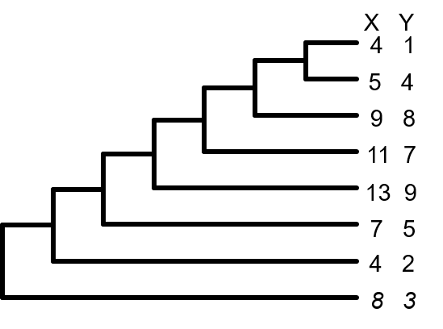
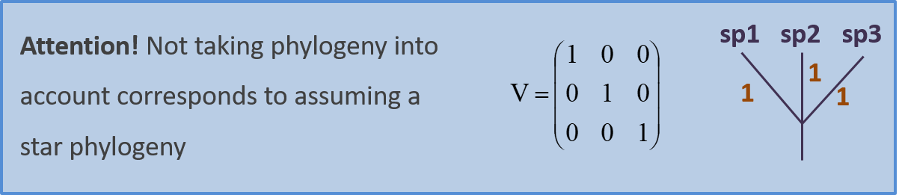
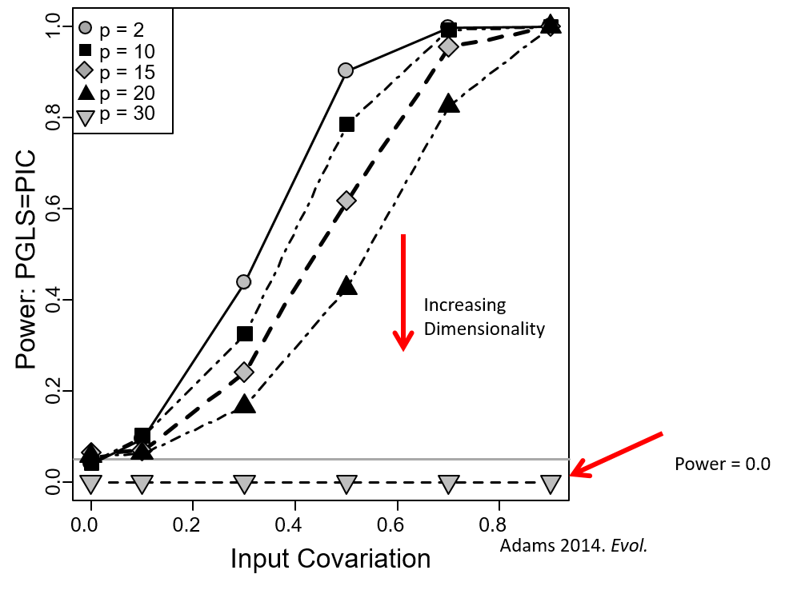

```{r setup, include=FALSE, echo = TRUE, tidy = TRUE}
library(knitr)
library(RRPP)
library(ape)
library(geiger)
library(nlme)
library(geomorph)
library(MCMCglmm)
opts_chunk$set(echo = TRUE)
```

# The Accumulation of Biodiversity

<style type="text/css">
td {  /* Table  */
  font-size: 20px;
}
code.r{ /* Code block */
    font-size: 12px;
}
pre { /* Code block - determines code spacing between lines */
    font-size: 12px;
}
</style>

Taxonomic Diversity

```{r, echo = FALSE, out.width="15%"}
include_graphics(c("lectureData/12.pcm/11-PCM-TaxDiv1.png","lectureData/12.pcm/11-PCM-TaxDiv2.png"))
```

# The Accumulation of Biodiversity

Taxonomic Diversity

```{r, echo = FALSE, out.width="15%"}
include_graphics(c("lectureData/12.pcm/11-PCM-TaxDiv1.png","lectureData/12.pcm/11-PCM-TaxDiv2.png"))

```

Morphological Diversity

```{r, echo = FALSE, out.width="25%"}
include_graphics(c("lectureData/12.pcm/11-PCM-MorphDiv1.png","lectureData/12.pcm/11-PCM-MorphDiv2.png"))

```

# The Accumulation of Biodiversity

Taxonomic Diversity

```{r, echo = FALSE, out.width="15%"}
include_graphics(c("lectureData/12.pcm/11-PCM-TaxDiv1.png","lectureData/12.pcm/11-PCM-TaxDiv2.png"))

```

Morphological Diversity

```{r, echo = FALSE, out.width="25%"}
include_graphics(c("lectureData/12.pcm/11-PCM-MorphDiv1.png","lectureData/12.pcm/11-PCM-MorphDiv2.png"))

```

How do we characterize patterns, and hypothesize processes?

# Comparative Biology Tradition

Trait correlations often used to study coevolution and adaptation

Species values commonly utilized

```{r, echo = FALSE, out.width="40%"}
include_graphics(c("lectureData/12.pcm/11-PCM-Metab.png","lectureData/12.pcm/11-PCM-PrimateCoev.png"))

```

> The problem? 

> Species are not independent of one another

# Phylogenetic Comparative Methods (PCMs)

Phylogenetic comparative methods *condition* the data on the phylogeny during the analysis

Allows one to assess trait covariation while accounting for the non-independence due to shared evolutionary history

```{r, echo = FALSE, out.width="80%"}
  
```

# PCMs: An Incomplete Historical Walk

The conceptual development of PCMs

```{r, echo = FALSE, out.width="80%"}
  
```


# Outline

* Phylogenetic regression/anova/association models

    + Phylogenetic Generalized Least Squares methods

    + Phylogenetic PLS


* Phylogenetic ordination

    + Phylomorphospace
    
    + Phylogenetic PCA
    
    + Phylogenetically Aligned Component Analysis (PACA)


* Exploring and modeling evolutionary processes

    + Phylogenetic signal

    + Evolutionary rates

    + Evolutionary models 

# PCMs: General Statistical Concepts

- PCMs condition the data on the phylogeny under an evolutionary model

- Data conditioning: Account for phylogenetic non-independence
    - (i.e., examine pattern ‘given’ the phylogeny)  

- Evolutionary model: How trait variation is expected to accumulate
    - Brownian motion (BM): A common null model of trait change
    - No change in $\small\mu$ but $\small\sigma^2\uparrow\propto{time}$
    
```{r echo = FALSE, eval=TRUE, out.width="30%",  results='hide'}
 nsim <- 100
  t <- 0:100  # time
  sig2 <- 0.005
  X <- matrix(rnorm(n = nsim * (length(t) - 1), sd = sqrt(sig2)), nsim, length(t) - 1)
  X <- cbind(rep(0, nsim), t(apply(X, 1, cumsum)))
  plot(t, X[1, ], xlab = "time", ylab = "phenotype", ylim = c(-2, 2), type = "l")
  apply(X[2:nsim, ], 1, function(x, t) lines(t, x), t = t)
```
    
# PCM: General Model

Most PCMs use GLS (generalized least squares) as a model:

$$\small\mathbf{Y}=\mathbf{X{\hat{\beta}}+\epsilon}$$
Here, $\small\epsilon$ is not *iid* but is $\small\sim\mathcal{N}(0,\textbf{V})$: containing expected covariation between taxa as described by the phylogeny (in matrix $\small\mathbf{V}$)

$\small\mathbf{V}$ is the *phylogenetic covariance matrix*

Describes the amount of evolutionary time species share via common ancestry (and thus how similar they are expected to be)

```{r, echo = FALSE, out.width="60%"}
include_graphics("lectureData/12.pcm/11-PCM-PhyCovMat.png")  
```

###### Sometimes **V** is called **C** (particularly when derived under Brownian motion)

# PCM: General Model

$$\small\mathbf{Y}=\mathbf{X{\hat{\beta}}+\epsilon}$$

Model design ($\small\mathbf{X}$) describes the type of analysis

```{r, echo = FALSE, out.width="80%"}
  
```

Parameters of model (and model significance) obtained in various ways

###### see Adams and Collyer. *Syst. Biol.* (2018); Adams and Collyer. *Ann. Rev. Ecol. Evol. Syst.* (2019)

# 1: Phylogenetic Regression 

Evaluate $\small\mathbf{Y}=\mathbf{X}\mathbf{\beta } +\mathbf{E}$   in a phylogenetic context

The workhorse of PCMs
      
```{r, echo = FALSE, out.width="80%"}
  
```

# 1: Phylogenetic Regression 

ANOVA and regression models that account for phylogeny

Requires a model of evolutionary change: typically **Brownian motion** (BM) 

# 1: Phylogenetic Regression 

ANOVA and regression models that account for phylogeny

Requires a model of evolutionary change: typically **Brownian motion** (BM) 

$\Delta\mu = 0$  

$\sigma^2$ (variance among taxa) $\uparrow$  $\propto$ time

```{r echo = FALSE, eval=TRUE, out.width="30%",  results='hide'}
 nsim <- 100
  t <- 0:100  # time
  sig2 <- 0.005
  X <- matrix(rnorm(n = nsim * (length(t) - 1), sd = sqrt(sig2)), nsim, length(t) - 1)
  X <- cbind(rep(0, nsim), t(apply(X, 1, cumsum)))
  plot(t, X[1, ], xlab = "time", ylab = "phenotype", ylim = c(-2, 2), type = "l")
  apply(X[2:nsim, ], 1, function(x, t) lines(t, x), t = t)
```

# 1: Phylogenetic Regression 

ANOVA and regression models that account for phylogeny

Requires a model of evolutionary change: typically **Brownian motion** (BM) 

$\Delta\mu = 0$  

$\sigma^2$ (variance among taxa) $\uparrow$  $\propto$ time

```{r echo = FALSE, eval=TRUE, out.width="30%",  results='hide'}
  plot(t, X[1, ], xlab = "time", ylab = "phenotype", ylim = c(-2, 2), type = "l")
  apply(X[2:nsim, ], 1, function(x, t) lines(t, x), t = t)
```

Statistical model: $\small\mathbf{Y}=\mathbf{X}\mathbf{\beta } +\mathbf{E}$ where $\small\mathbf{E} \sim \mathcal{N}(0,\textbf{V})$

Several implementations possible (yield identical results if implemented properly)

# Phylogenetically Independent Contrasts

Estimate contrast scores between pairs of taxa (tips or nodes)

Use contrasts for analyses (OLS solution)

```{r, echo = FALSE, out.width="40%"}
  
```

###### see Felsenstein. *Am. Nat.* (1985)

# Phylogenetically Independent Contrasts

```{r, echo = FALSE, out.width="60%"}
  
```

Coefficients found as: $\small\hat{\mathbf{\beta }}=\left ( \mathbf{X}^{T}_{pic} \mathbf{X}_{pic}\right )^{-1}\left ( \mathbf{X}^{T}_{pic} \mathbf{Y}_{pic}\right )$

# Phylogenetically Independent Contrasts: Example

```{r, echo = FALSE, out.width="30%"}
  
```

What is the association between Y and X?

# Phylogenetically Independent Contrasts: Example

```{r echo = FALSE, eval=TRUE, out.width="30%"}
n=8
tree<-compute.brlen(stree(n,type="left"), method=c(7,1,6,1,5,1,4,1,3,1,2,1,1,1))
X<-c(8,4,7,13,11,9,5,4)
names(X)<-tree$tip.label
Y<-c(3,2,5,9,7,8,4,1)
names(Y)<-tree$tip.label
pic.x<-pic(x=X,phy=tree) 
pic.y<-pic(x=Y,phy=tree) 
```

```{r, echo = FALSE, out.width="30%"}

plot(pic.y~pic.x, asp=1, cex=2, pch=21,bg="black")  
```

What is the association between Y and X?

```{r echo = TRUE, eval=TRUE, out.width="30%"}
anova(lm(pic.y~pic.x + 0))
coef(lm(pic.y~pic.x+0))
```

# Phylogenetic Generalized Least Squares (PGLS)

Use GLS model with non-independent error structure

Statistical model: $\small\mathbf{Y}=\mathbf{X}\mathbf{\beta } +\mathbf{E}$ where $\small\mathbf{E} \sim \mathcal{N}(0,\textbf{V})$

# Phylogenetic Generalized Least Squares (PGLS)

Use GLS model with non-independent error structure

Statistical model: $\small\mathbf{Y}=\mathbf{X}\mathbf{\beta } +\mathbf{E}$ where $\small\mathbf{E} \sim \mathcal{N}(0,\textbf{V})$

$\textbf{V}$ is the **phylogenetic covariance matrix**

Describes expected covariance among taxa due to shared evolutionary history (typically under BM)

```{r, echo = FALSE, out.width="40%"}
include_graphics("lectureData/12.pcm/11-PCM-PhyCovMat.png")  
```

Coefficients found as: $\small\hat{\mathbf{\beta }}=\left ( \mathbf{X}^{T}  \mathbf{V}^{-1}  \mathbf{X}\right )^{-1}\left ( \mathbf{X}^{T} \mathbf{V}^{-1}\mathbf{Y}\right )$

###### see Grafen. *Phil. Trans. Roy. Soc.* (1989)

# PGLS: Example

```{r, echo = FALSE, out.width="30%"}

```

```{r echo = FALSE, eval=TRUE, out.width="30%"}
df <- data.frame(X=X, Y=Y, species = names(X))
```

```{r echo = TRUE, eval=TRUE, out.width="30%"}
bm.gls<-gls(Y~X, correlation=corBrownian(phy=tree,form = ~species), data=df)
anova(bm.gls)
coef(bm.gls)  
```

Identical results to PICs!

# Statistical Digression: OLS vs GLS

To understand what PGLS is doing, consider the following methods for obtaining model parameters

OLS model: $\small\hat{\mathbf{\beta }}=\left ( \mathbf{X}^{T}\mathbf{X}\right )^{-1}\left ( \mathbf{X}^{T} \mathbf{Y}\right )$

# Statistical Digression: OLS vs GLS

To understand what PGLS is doing, consider the following methods for obtaining model parameters

OLS model: $\small\hat{\mathbf{\beta }}=\left ( \mathbf{X}^{T}\mathbf{X}\right )^{-1}\left ( \mathbf{X}^{T} \mathbf{Y}\right )$

Unweighted GLS model:  $\small\hat{\mathbf{\beta }}=\left ( \mathbf{X}^{T}  \mathbf{V}_{id}^{-1}  \mathbf{X}\right )^{-1}\left ( \mathbf{X}^{T} \mathbf{V}_{id}^{-1}\mathbf{Y}\right )$  where 

$$\tiny\mathbf{V}_{id}= \left( \begin{array}{ccc} 1 & 0 & 0 \\ 0 & 1 & 0 \\ 0 & 0 & 1 \end{array} \right) $$


# Statistical Digression: OLS vs GLS

To understand what PGLS is doing, consider the following methods for obtaining model parameters

OLS model: $\small\hat{\mathbf{\beta }}=\left ( \mathbf{X}^{T}\mathbf{X}\right )^{-1}\left ( \mathbf{X}^{T} \mathbf{Y}\right )$

Unweighted GLS model:  $\small\hat{\mathbf{\beta }}=\left ( \mathbf{X}^{T}  \mathbf{V}_{id}^{-1}  \mathbf{X}\right )^{-1}\left ( \mathbf{X}^{T} \mathbf{V}_{id}^{-1}\mathbf{Y}\right )$  where 

$$\tiny\mathbf{V}_{id}= \left( \begin{array}{ccc} 1 & 0 & 0 \\ 0 & 1 & 0 \\ 0 & 0 & 1 \end{array} \right) $$


Weighted GLS model:  $\small\hat{\mathbf{\beta }}=\left ( \mathbf{X}^{T}  \mathbf{V}_{phy}^{-1}  \mathbf{X}\right )^{-1}\left ( \mathbf{X}^{T} \mathbf{V}_{phy}^{-1}\mathbf{Y}\right )$  where 

$$\tiny\mathbf{V}_{id}= \left( \begin{array}{ccc} (v_1+v_2) & v_{12} & 0 \\ v_{12} & (v_1+v_2) & 0 \\ 0 & 0 & 1 \end{array} \right) $$

In PGLS, the weights are the phylogenetic distances, which describe the phylogenetic non-independence

# Statistical Digression: OLS vs GLS

To understand what PGLS is doing, consider the following methods for obtaining model parameters

OLS model: $\small\hat{\mathbf{\beta }}=\left ( \mathbf{X}^{T}\mathbf{X}\right )^{-1}\left ( \mathbf{X}^{T} \mathbf{Y}\right )$

Unweighted GLS model:  $\small\hat{\mathbf{\beta }}=\left ( \mathbf{X}^{T}  \mathbf{V}_{id}^{-1}  \mathbf{X}\right )^{-1}\left ( \mathbf{X}^{T} \mathbf{V}_{id}^{-1}\mathbf{Y}\right )$  where 

$$\tiny\mathbf{V}_{id}= \left( \begin{array}{ccc} 1 & 0 & 0 \\ 0 & 1 & 0 \\ 0 & 0 & 1 \end{array} \right) $$


Weighted GLS model:  $\small\hat{\mathbf{\beta }}=\left ( \mathbf{X}^{T}  \mathbf{V}_{phy}^{-1}  \mathbf{X}\right )^{-1}\left ( \mathbf{X}^{T} \mathbf{V}_{phy}^{-1}\mathbf{Y}\right )$  where 

$$\tiny\mathbf{V}_{id}= \left( \begin{array}{ccc} (v_1+v_2) & v_{12} & 0 \\ v_{12} & (v_1+v_2) & 0 \\ 0 & 0 & 1 \end{array} \right) $$

In PGLS, the weights are the phylogenetic distances, which describe the phylogenetic non-independence

```{r, echo = FALSE, out.width="80%"}

```

# Phylogenetic Transformation

Utilize OLS transformation of GLS models 

Phylogenetic transformation matrix: $\small\mathbf{T}=\left ( \mathbf{U}\mathbf{W}^{-1/2}  \mathbf{U}^{T}\right )^{-1}$

**U** and **W** are eigenvectors and eigenvalues of **V**

Transformed data: $\small\tilde{\mathbf{Y}}=\mathbf{TY}$

Transformed design matrix: $\small\tilde{\mathbf{X}}=\mathbf{TX}$

Coefficients solved as: $\small\hat{\mathbf{\beta }}=\left ( \mathbf{\tilde{X}}^{T} \mathbf{\tilde{X}}\right )^{-1}\left ( \mathbf{\tilde{X}}^{T} \mathbf{\tilde{Y}}\right )$

###### see Garland and Ives. *Am. Nat.* (2000); Adams. *Evol.* (2014); Adams and Collyer. *Evol.* (2018)

# Phylogenetic Transformation: Example

```{r, echo = FALSE, out.width="30%"}

df$Cov <- vcv.phylo(tree)
```

```{r echo = TRUE, eval=TRUE}
pgls.res<-lm.rrpp(Y~X, Cov = df$Cov,data=df, print.progress = FALSE) 
anova(pgls.res)
pgls.res$LM$gls.coefficients
```

Identical results to PICs & PGLS!

# Phylogenetic Regression Via LMM

One can also use linear mixed models (PGLMM: phylogenetic generalized linear mixed models) to evaluate trait associations

Here the phylogeny is considered a random effect (sense Lynch 1991)

Results from MCMC runs are analogous (though not always identical) to the linear model solutions

```{r, echo = FALSE, out.width="30%"}
df$taxa <- names(X)
inv.phylo<-inverseA(tree,nodes="TIPS",scale=TRUE)  #NOTE: this is invC + other stuff
prior<-list(G=list(G1=list(V=1,nu=0.02)),R=list(V=1,nu=0.02))
model_simple<-MCMCglmm(Y~X,random=~taxa,
          family="gaussian",ginverse=list(taxa=inv.phylo$Ainv),
          prior=prior,data=df,nitt=50000,burnin=1000,thin=500, verbose = FALSE)

```

```{r echo = TRUE, eval=TRUE}
pgls.res$LM$gls.coefficients
summary(model_simple)$solutions
```

# Assessing Significance

PIC, PGLS, and Phylogenetic transform yield identical parameter estimates 

$$\tiny
\hat{\mathbf{\beta }}=\left ( \mathbf{X}^{T}  \mathbf{V}^{-1}  \mathbf{X}\right )^{-1}\left ( \mathbf{X}^{T} \mathbf{V}^{-1}\mathbf{Y}\right )$$

$$\tiny
=\left ( \mathbf{X}^{T}_{pic} \mathbf{X}_{pic}\right )^{-1}\left ( \mathbf{X}^{T}_{pic} \mathbf{Y}_{pic}\right )$$

$$\tiny
=\left ( \mathbf{\tilde{X}}^{T} \mathbf{\tilde{X}}\right )^{-1}\left ( \mathbf{\tilde{X}}^{T} \mathbf{\tilde{Y}}\right )$$

* Model significance typically accomplished using parametric procedures

    + F-ratios compared to parametric F-distribution

    + Optimize $\log{L}$ for model

$$\tiny
\log{L}=\log{
\left(\frac{exp{\left({-\frac{1}{2}{\left({\mathbf{Y}-E(\mathbf{Y})}\right)^{T}}}
\mathbf{V}^{-1}\left({\mathbf{Y}-E(\mathbf{Y})}\right)\right)}}
{\sqrt{\left({2\pi}\right)^{Np}\times\begin{vmatrix} \mathbf{V} \end{vmatrix}}}\right)}$$ 

# Assessing Significance

PROBLEM: Parametric significance testing suffers from Rao's paradox

Power reduces as *p*-dimensions increase

```{r, echo = FALSE, out.width="60%"}

```

Another solution required

###### Adams. *Evol.* (2014); Adams and Collyer. *Syst. Biol.* (2018)

# Assessing Significance: RRPP

Transform data: $\small\tilde{\mathbf{Y}}=\mathbf{TY}$, 
$\small\tilde{\mathbf{X}}_{F}=\mathbf{TX}_{F}$, 
$\small\tilde{\mathbf{X}}_{R}=\mathbf{TX}_{R}$

Obtain Parameter estimates: $\small\hat{\mathbf{\beta }}=\left ( \mathbf{\tilde{X_{F}}}^{T} \mathbf{\tilde{X_{F}}}\right )^{-1}\left ( \mathbf{\tilde{X_{F}}}^{T} \mathbf{\tilde{Y}}\right )$

Permute residuals from reduced model ($\small\tilde{\mathbf{E}}_{R}$), add to predicted values ($\small\hat{\mathbf{Y}}_{R}$), assess model, repeat

# Assessing Significance: RRPP

Transform data: $\small\tilde{\mathbf{Y}}=\mathbf{TY}$, 
$\small\tilde{\mathbf{X}}_{F}=\mathbf{TX}_{F}$, 
$\small\tilde{\mathbf{X}}_{R}=\mathbf{TX}_{R}$

Obtain Parameter estimates: $\small\hat{\mathbf{\beta }}=\left ( \mathbf{\tilde{X_{F}}}^{T} \mathbf{\tilde{X_{F}}}\right )^{-1}\left ( \mathbf{\tilde{X_{F}}}^{T} \mathbf{\tilde{Y}}\right )$

Permute residuals from reduced model ($\small\tilde{\mathbf{E}}_{R}$), add to predicted values ($\small\hat{\mathbf{Y}}_{R}$), assess model, repeat

```{r, echo = FALSE, }

```

Appropriate for ANOVA, regression and more complex PGLS models with high-dimensional data (Adams & Collyer. *Evol.* 2018)

**RULE: Transform first, permute second!**

###### For discussion on permutation in PGLS see: Adams and Collyer. *Evol.* (2015); Adams and Collyer. *Evol.* (2018)

# Phylogenetic Regression: Example

Are body dimensions associated with overall size across *Plethodon* salamander species?

```{r echo = FALSE, eval=TRUE,out.width="40%"}
tree.best<-read.nexus("lectureData/12.pcm/Consensus of 1000 salamander trees.nex") #Maximum Credible Tree
plethdata<-read.csv("lectureData/12.pcm/meandata-CinGlutOnly.csv",row.names=1, header=TRUE )
 Y<-plethdata[,c(3:8)]
     Y<-apply(Y,2,as.numeric);row.names(Y)<-row.names(plethdata)
 size<-plethdata[,2];names(size)<-row.names(plethdata) 
 gp<-as.factor(plethdata[,1]); names(gp)<-row.names(plethdata)
plethtree<-treedata(phy = tree.best,data = plethdata, warnings = FALSE)$phy
plot(plethtree)
axisPhylo(1)

```

# Phylogenetic Regression: Example

Are body dimensions associated with overall size across *Plethodon* salamander species?

```{r echo = FALSE, eval=TRUE,out.width="40%"}
plot(plethtree)
axisPhylo(1)

gdf <- geomorph.data.frame(Y=Y, size=size,gp=gp,phy = plethtree)
```

```{r echo = TRUE, eval=TRUE,out.width="40%"}
PGLS.reg<-procD.pgls(Y ~ size, phy = phy, data = gdf, iter = 999, print.progress = FALSE)
PGLS.reg$aov.table
```

# Phylogenetic ANOVA: Example

Do body dimensions differ by salamander ecotype?

```{r echo = FALSE, eval=TRUE,out.width="40%"}
plot(plethtree)
axisPhylo(1)

```

```{r echo = TRUE, eval=TRUE,out.width="40%"}
PGLS.reg<-procD.pgls(Y ~ gp, phy = phy, data = gdf, iter = 999, print.progress = FALSE)
PGLS.reg$aov.table
```

# Phylogenetic ANOVA: Group Aggregation

How groups are distributed on the phylogeny can make a difference: Adams and Collyer. *Evol.* (2018)

```{r, echo = FALSE, }

```

Too few group 'state' changes across phylogeny results in lower power

# 2: Phylogenetic PLS

Assess correlation between two blocks of variables in a phylogenetic context

PLS of evolutionary covariance (rate) matrix

$$\small\mathbf{R}=\frac{\left(\mathbf{Y}-E(\mathbf{Y})\right)^{T}\mathbf{V}^{-1}
\left(\mathbf{Y}-E(\mathbf{Y})\right)}
{N-1}$$

SVD of $\small\mathbf{R}_{12}=\mathbf{U}_{12}\mathbf{D}\mathbf{V}^{T}_{12}$

# 2: Phylogenetic PLS

Assess correlation between two blocks of variables in a phylogenetic context

PLS of evolutionary covariance (rate) matrix

$$\small\mathbf{R}=\frac{\left(\mathbf{Y}-E(\mathbf{Y})\right)^{T}\mathbf{V}^{-1}
\left(\mathbf{Y}-E(\mathbf{Y})\right)}
{N-1}$$

SVD of $\small\mathbf{R}_{12}=\mathbf{U}_{12}\mathbf{D}\mathbf{V}^{T}_{12}$

Equivalently found from PLS of $\small\Sigma$ from $\small\tilde{\mathbf{Y}}=\mathbf{TY}$

Significance from RRPP of $\small\tilde{\mathbf{Y}}$

###### Adams and Felice. *PLoS One* (2014); Adams and Collyer. *Syst. Biol.* (2018)

###### Use of PICs equivalent (Klingenberg and Marugan-Loban. *Syst. Biol.* 2013)

# Phylogenetic PLS: Example

Do head traits correlate with body traits (same data)? 

```{r echo = FALSE, eval=TRUE,out.width="40%"}

```

```{r echo = TRUE, eval=TRUE,out.width="40%"}
PLS.Y <- phylo.integration(A = Y[,2:3], A2 = Y[,c(1,4:6)], phy= plethtree, print.progress = FALSE)
PLS.Y$r.pls; PLS.Y$P.value
```

```{r echo = FALSE, eval=TRUE,out.width="40%"}
plot(PLS.Y)
```

# Phylogenetic PLS: Example 2

Is there evolutionary integration across species between cranial and mandible morphology?

```{r, echo = FALSE, }

```

Yes

# Phylogenetic Ordination

- Ordinations that incorporate phylogenetic relatedness

1. Phylomorphspace: project phylogeny into PCA space (using ancestral states)
    - Rotates data to directions of maximal variation 

2. Phylogenetic PCA (pPCA): account for phylogeny in PCA computations: 
    - SVD of evolutionary rate matrix (the covariance matrix ‘standardized’ by phylogeny):       $\tiny\mathbf{R}=\frac{(\mathbf{Y}-E(\mathbf{Y}))^{T}\mathbf{C}^{-1}(\mathbf{Y}-E(\mathbf{Y}))}{N-1}$
    - Rotates data such that pPC1 is *independent* of phylogenetic signal

3. Phylogenetically-aligned component analysis (PACA)
    - Rotates data to directions that *maximize* phylogenetic signal (Collyer and Adams 2021)

- Approaches can provide important visual insights into macroevolutionary patterns

# Phylo-PCA: Example

```{r echo = FALSE, eval=TRUE,out.width="90%"}

```

# Phylomorphospace: Examples

```{r echo = FALSE, eval=TRUE,out.width="40%"}


```

Visual inspection of phylomorphospaces useful for hypothesis generation

# PACA

```{r echo = FALSE, eval=TRUE,out.width="80%"}

```


# 4: Phylogenetic Signal

The degree to which phenotypic similarity associates with phylogenetic relatedness

```{r echo = FALSE, eval=TRUE,out.width="70%"}
include_graphics("lectureData/12.pcm/11-PCM-PhySigFels85.png")
```

# Phylogenetic Signal

Kappa statistic: Blomberg et al. *Evol.* (2003)

$$\small
K=\frac{\left(\mathbf{Y}-E(\mathbf{Y})\right)^{T}
\left(\mathbf{Y}-E(\mathbf{Y})\right)}
{\left(\mathbf{Y}-E(\mathbf{Y})\right)^{T}\mathbf{V}^{-1}
\left(\mathbf{Y}-E(\mathbf{Y})\right)} /
\frac{tr(\mathbf{V})-N(\mathbf{1}^{T}\mathbf{V1})^{-1}}{N-1}$$

```{r echo = FALSE, eval=TRUE,out.width="70%"}

```

Univariate response data only!

# Multivariate Phylogenetic Signal

$\small{K}_{mult}$: A multivariate generalization of *Kappa* (Adams. *Syst. Biol.* 2014)

Based on distances between objects in original and phylo-transformed dataspaces

$$\small\
K_{mult}=
\frac{\mathbf{D}_{\mathbf{Y},E(\mathbf{Y})}^{T}\mathbf{D}_{\mathbf{Y},E(\mathbf{Y})}}
{\mathbf{PD}_{\tilde{\mathbf{Y}},0}^{T}\mathbf{PD}_{\tilde{\mathbf{Y}},0}} 
/
\frac{tr(\mathbf{V})-N(\mathbf{1}^{T}\mathbf{V1})^{-1}}{N-1}$$

# Multivariate Phylogenetic Signal

$\small{K}_{mult}$: A multivariate generalization of *Kappa* (Adams. *Syst. Biol.* 2014)

Based on distances between objects in original and phylo-transformed dataspaces

$$\small\
K_{mult}=
\frac{\mathbf{D}_{\mathbf{Y},E(\mathbf{Y})}^{T}\mathbf{D}_{\mathbf{Y},E(\mathbf{Y})}}
{\mathbf{PD}_{\tilde{\mathbf{Y}},0}^{T}\mathbf{PD}_{\tilde{\mathbf{Y}},0}} 
/
\frac{tr(\mathbf{V})-N(\mathbf{1}^{T}\mathbf{V1})^{-1}}{N-1}$$

Where $\small\mathbf{D}_{\mathbf{Y},E(\mathbf{Y})}$ is the distance from each object to the phylogenetic mean, and $\small\mathbf{PD}_{\tilde{\mathbf{Y}},0}$ is the distance between each object in the phylogenetically-transformed space (found as: $\small\tilde{\mathbf{Y}}=\mathbf{P}(\mathbf{Y-E(\mathbf{Y})})$) and the origin

# Multivariate Phylogenetic Signal: Example

Do body dimensions in *Plethodon* display phylogenetic signal? 

```{r echo = TRUE, eval=TRUE,out.width="40%"}
PS.shape <- physignal(A=Y,phy=plethtree,iter=999, print.progress = FALSE)
PS.shape
```

```{r echo = FALSE, eval=TRUE,out.width="40%"}
plot(PS.shape)
```

Yes they do.

# 5: Comparing Evolutionary Models

What evolutionary model best describes trait variation? 

Fit data to phylogeny under differing evolutionary models

```{r echo = FALSE, eval=TRUE, out.width="50%",  results='hide'}
 nsim <- 100
  t <- 0:100  # time
  sig2 <- 0.005
  X <- matrix(rnorm(n = nsim * (length(t) - 1), sd = sqrt(sig2)), nsim, length(t) - 1)
  X <- cbind(rep(0, nsim), t(apply(X, 1, cumsum)))
  plot(t, X[1, ], xlab = "time", ylab = "phenotype", ylim = c(-2, 2), type = "l",
       main = "Brownian Motion Trait Evolution")
  apply(X[2:nsim, ], 1, function(x, t) lines(t, x), t = t)
  
   OU.sim <- function(n, theta, alpha, sigma,x0){
    dw  <- rnorm(n, 0)
    x <- c(x0)
    for (i in 2:(n+1)) {
      x[i]  <-  x[i-1] + alpha*(theta-x[i-1]) + sigma*dw[i-1]
    }
    return(x);
  }
  OU1.sim2 <- replicate(100, OU.sim(n=100, theta=0.25, alpha=0.25, sigma=0.03, x0=0.75), simplify=FALSE)
  plot(OU1.sim2[[1]],xlab = "time", ylab = "phenotype", ylim = c(0,1), type = "l",
       main = "Ornstein-Uhlenbeck Trait Evolution")
    for(i in 2:100){lines(OU1.sim2[[i]])}
```

# 5: Comparing Evolutionary Models

What evolutionary model best describes trait variation? 

Fit data to phylogeny under differing evolutionary models

```{r echo = FALSE, eval=TRUE, out.width="50%",  results='hide'}
  plot(t, X[1, ], xlab = "time", ylab = "phenotype", ylim = c(-2, 2), type = "l",
       main = "Brownian Motion Trait Evolution")
  apply(X[2:nsim, ], 1, function(x, t) lines(t, x), t = t)
  plot(OU1.sim2[[1]],xlab = "time", ylab = "phenotype", ylim = c(0,1), type = "l",
       main = "Ornstein-Uhlenbeck Trait Evolution")
    for(i in 2:100){lines(OU1.sim2[[i]])}
```

Model comparisons of:

1: Evolutionary rate models: BM1, BMM, etc.

2: Evolutionary 'mode' models: BM1, OU1, OUM, etc.

# Evolutionary Rates

*"How fast, as a matter of fact, do animals evolve in nature?"* (Simpson, 1944)

```{r echo = FALSE, eval=TRUE,out.width="90%"}

```

# Comparing Rates Among Traits

Is there evidence that one trait evolves faster than another? 

Obtain $\small\mathbf{R}_0$ and $\small{logL}$: 

$$\tiny\mathbf{R}=\frac{(\mathbf{Y}-E(\mathbf{Y}))^{T}\mathbf{C}^{-1}(\mathbf{Y}-E(\mathbf{Y}))}{N-1}=\left( \begin{array}{ccc} \sigma^2_{1} & \sigma^2_{1,2} & \sigma^2_{1,3} \\ \sigma^2_{2,1} & \sigma^2_{2} & \sigma^2_{2,3} \\ \sigma^2_{3,1} & \sigma^2_{3,2} & \sigma^2_{3} \end{array} \right)$$

$$\tiny\log{L}=-\frac{np}{2}ln{2\pi}-\frac{n}{2}ln{\begin{vmatrix}{(\mathbf{R\otimes{C}})}\end{vmatrix}}-\frac{1}{2}tr{(\mathbf{Y}-E(\mathbf{Y}))^{T}(\mathbf{R\otimes{C}})^{-1}(\mathbf{Y}-E(\mathbf{Y}))}$$

# Comparing Rates Among Traits

Is there evidence that one trait evolves faster than another? 

Obtain $\small\mathbf{R}_0$ and $\small{logL}$: 

$$\tiny\mathbf{R}=\frac{(\mathbf{Y}-E(\mathbf{Y}))^{T}\mathbf{C}^{-1}(\mathbf{Y}-E(\mathbf{Y}))}{N-1}=\left( \begin{array}{ccc} \sigma^2_{1} & \sigma^2_{1,2} & \sigma^2_{1,3} \\ \sigma^2_{2,1} & \sigma^2_{2} & \sigma^2_{2,3} \\ \sigma^2_{3,1} & \sigma^2_{3,2} & \sigma^2_{3} \end{array} \right)$$

$$\tiny\log{L}=-\frac{np}{2}ln{2\pi}-\frac{n}{2}ln{\begin{vmatrix}{(\mathbf{R\otimes{C}})}\end{vmatrix}}-\frac{1}{2}tr{(\mathbf{Y}-E(\mathbf{Y}))^{T}(\mathbf{R\otimes{C}})^{-1}(\mathbf{Y}-E(\mathbf{Y}))}$$

Estimate $\small\mathbf{R}_C$ and $\small{logL}_C$ where diagonal of $\mathbf{R}$ is contrained to be equal:  

$$\tiny\mathbf{R}_C=\left( \begin{array}{ccc} \sigma^2_{p} &  &  \\ \sigma^2_{2,1} & \sigma^2_{p} &  \\ \sigma^2_{3,1} & \sigma^2_{3,2} & \sigma^2_{p} \end{array} \right)$$

Compare $\small{logL}_C$ against $\small{logL}$

###### Adams. *Syst. Biol.* (2013); Denton and Adams. *Evol.* (2015)

# Compare Rates Among Traits: Example

```{r echo = FALSE, eval=TRUE,out.width="90%"}

```

# Compare Rates Among Clades

Is there evidence for multiple evolutionary rates on the phylogeny? 

```{r echo = FALSE, eval=TRUE,out.width="30%"}

```

**Procedure**: Fit data to phylogeny under single-rate and multi-rate models. Estimate $\small\mathbf{R}$ and $\small\log{L}$ & compare $\small\log{L}$ between models (LRT, AIC, simulation, etc.)

# Compare Rates Among Clades

Is there evidence for multiple evolutionary rates on the phylogeny? 

```{r echo = FALSE, eval=TRUE,out.width="30%"}

```

**Procedure**: Fit data to phylogeny under single-rate and multi-rate models. Estimate $\small\mathbf{R}$ and $\small\log{L}$ & compare $\small\log{L}$ between models (LRT, AIC, simulation, etc.)

Works well for univariate $\mathbf{Y}$, but Type I error $\small\uparrow$ with *p*-dimensions

```{r echo = FALSE, eval=TRUE,out.width="60%"}

```

**$\small\log{L_{mult}}$ not a general solution for high-dimensional data**

###### see: Adams. *Syst. Biol.*  (2014); Adams and Collyer. *Syst. Biol.* (2018); Adams and Collyer. *Ann. Rev. Ecol. Evol. Syst.* (2019)

# Compare Multivariate Rates: $\small\sigma^{2}_{mult}$

Generalizes $\small\sigma^{2}$ to estimate the *net* evolutionary rate in multivariate data

**Procedure**: Phylogenetic-transform data $\small\tilde{\mathbf{Y}}=\mathbf{TY}$

Estimate $\small\sigma^{2}_{mult}=\frac{\mathbf{PD}_{\tilde{\mathbf{Y}},0}^{T}\mathbf{PD}_{\tilde{\mathbf{Y}},0}}{N}$ for regimes in BMM

Obtain rate ratio: $\small{RR}=\frac{\sigma^{2}_{mult.max}}{\sigma^{2}_{mult.min}}$; evaluate via simulation or permutation (RRPP).

Displays appropriate type I error and power (breaks Rao's paradox)

```{r echo = FALSE, eval=TRUE,out.width="40%"}

```

###### Adams. *Syst. Biol.* (2014); Denton and Adams. *Evol.* (2015)

# Comparing Evolutionary 'Modes'

Compare models that describe the manner in which trait variation accumulates over evolutionary time

BM1, BMM, OU (Ornstein-Uhlenbeck), Early Burst (EB), ACDC, etc.

Fit data to phylogeny under differing evolutionary models and compare fit (LRT, AIC, etc.)

```{r echo = FALSE, eval=TRUE, out.width="30%",  results='hide'}
  plot(t, X[1, ], xlab = "time", ylab = "phenotype", ylim = c(-2, 2), type = "l",
       main = "Brownian Motion Trait Evolution")
  apply(X[2:nsim, ], 1, function(x, t) lines(t, x), t = t)
  plot(OU1.sim2[[1]],xlab = "time", ylab = "phenotype", ylim = c(0,1), type = "l",
       main = "Ornstein-Uhlenbeck Trait Evolution")
    for(i in 2:100){lines(OU1.sim2[[i]])}
```

# Comparing Evolutionary 'Modes': Example

- How did *Anolis* body size groups evolve?
     - 5 models: BM, $\small{OU}_1$, $\small{OU}_3$ $\small{OU}_4$ (3 group+anc), $\small{OU}_{LP}$ (3 gp + history of colonization)

```{r echo = FALSE, eval=TRUE,out.width="80%"}

```

- $\small{OU}_{LP}$ (3 gp + col. hist.) best explains body size evolution


# Comparing Multivariate Evolutionary 'Modes'

Unfortunately, *ALL* current implementations for multivariate OU models display high misspecification rates

More work is needed in this area

```{r echo = FALSE, eval=TRUE,out.width="80%"}

```

###### see: Adams. *Syst. Biol.* (2014); Adams and Collyer. *Syst. Biol.* (2018); Adams and Collyer. *Ann. Rev. Ecol. Evol. Syst.* (2019)


# Univariate PCMs: Conclusions

- Phylogenetic comparative method provide useful tools to account for phylogenetic non-independence among observations
- Hypotheses one can evaluate include:
    - phylogenetic ANOVA
    - Phylogenetic regression
    - Phylogenetic correlation (PLS)
    - Phylogenetic signal
    - Comparing rates and modes of evolution

- There is now a rich analytical toolkit for PCMs for univariate data: this lecture serves only as a gateway to this literature

# Multivariate PCMs: Conclusions

- Multivariate PCMs have developed rapidly in recent years
- Algebraic generalization methods (phylogenetic-transform + RRPP) are useful for 
    - PGLS, PLS, phylogenetic signal, and net evolutionary rate comparisons
- More work needed on high-dimensional model comparison (i.e., comparing evolutionary 'modes')

```{r echo = FALSE, eval=TRUE,out.width="75%"}

```

