```{r setup, include=FALSE, echo = TRUE, tidy = TRUE}
library(knitr)
library(vegan)
library(RRPP)
library("spatstat")
opts_chunk$set(echo = TRUE)
```

# Overview

* Point Patterns

    + What is spatial association?


* Mantel

    + Association between response and geography
    

* Partial Mantel

    + Association between response and ecology, given geography
    

* GLS

    + Estimating ecology effects wth respect to geography


* Comparisons: Multiple methods - which is best?

* Summary: Areas for future exploration

# Geography in Biological Data

* Biological organisms inhabit physical space

* Several interesting questions relate to geography/space

    + How are my observations distributed? 
  
    + Are my data associated with geography?

    + Are my data spatially autocorrelated?

    + Can I account for spatial autocorrelation in my analysis? 

# Point Patterns

* The distribution of objects in space can be of possible interest

* Possible distributions: locations are **random**, they are more **clumped** than expected, they are more **regular** (dispersed) than expected

```{r, echo = FALSE, out.width="80%"}
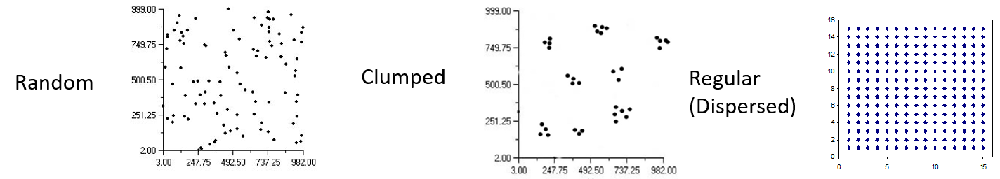  
```

# Point Patterns

* The distribution of objects in space can be of possible interest

* Possible distributions: locations are **random**, they are more **clumped** than expected, they are more **regular** (dispersed) than expected

```{r, echo = FALSE, out.width="80%"}
  
```

* Other options depend on the *grain scale* (the scale at which the pattern is evaluated)

```{r, echo = FALSE, out.width="60%"}
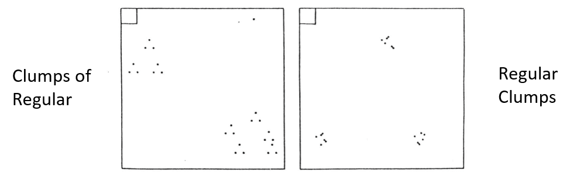  
```

* One statistically assesses these distributions using **Area Partition Methods** and **Distance Methods**

# Point Patterns: Aggregation Index

* Are points random, clumped, or regular? 

```{r, echo = FALSE, out.width="80%"}
  
```

* $\small{1}^{st}$ order nearest neighbor index (index of aggreggation: **R**)

    + Calculate nearest neighbor distances (NND)
    + Obtain average NND: $\small{\overline{r}_{obs}}$
    + Determine ratio of observed vs. expected: $\small{R}=\frac{\overline{r}_{obs}}{\overline{r}_{exp}}$

###### see Clark and Evans (1954: Ecology) for description of obtaining expected values (based on bivariate random data: expected value obtained analytically: see their Appendix)

# Point Patterns: Aggregation Index

* Are points random, clumped, or regular? 

```{r, echo = FALSE, out.width="80%"}
  
```

* $\small{1}^{st}$ order nearest neighbor index (index of aggreggation: **R**)

    + Calculate nearest neighbor distances (NND)
    + Obtain average NND: $\small{\overline{r}_{obs}}$
    + Determine ratio of observed vs. expected: $\small{R}=\frac{\overline{r}_{obs}}{\overline{r}_{exp}}$

###### see Clark and Evans (1954: Ecology) for description of obtaining expected values (based on bivariate random data: expected value obtained analytically: see their Appendix)
	
* $\small{R<1}$: clumped	

* $\small{R=1}$: random	

* $\small{R>1}$: dispersed

* Test for significance via effect size conversion: $\small{Z-score}$

# Point Patterns: Ripley's K

* Models the point pattern relative to some process

$$\small{K=\frac{E(pts)}{\lambda}}$$

where $\small{E(pts)}$ is the the expected number of points in some area, and $\small\lambda$ is the density of points 

* $\small{K}$ describes number of points in some area relative to expectation

# Point Patterns: Ripley's K

* Models the point pattern relative to some process

$$\small{K=\frac{E(pts)}{\lambda}}$$

where $\small{E(pts)}$ is the the expected number of points in some area, and $\small\lambda$ is the density of points

* $\small{K}$ describes number of points in some area relative to expectation

* May be used to test hypotheses of clustering or regular distribution (assessed via stochastic simulation)
    
```{r echo = FALSE, eval=TRUE, out.width="60%",  results='hide'}
data(cells)
#plot(cells)
#plot(Kest(cells))   #shows K for various models: isotropic, poisson, etc.
E<-envelope(cells,Kest,nsim=100,rank=2)
plot(E) # plot shows that observed are underdispersed at small spatial scales
```

# Point Patterns: Area Partition Methods

* Quadrat method: 

    + Break area into $\small{n}$ quadrats and count $\small{X}$ objects in each

    + Calculate **Index of Dispersion**: $\small{ID=\frac{\sigma^2_X}{\overline{X}}}$

```{r, echo = FALSE, out.width="50%"}
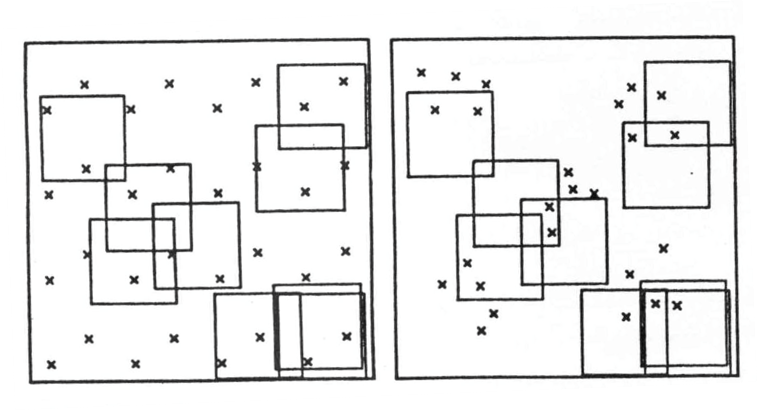  
```

* **ID** can estimate whether points differ from a random dispersion, but not *HOW* they differ (i.e., cannot distinguish between clumped & regular)

# Point Patterns: Area Partition Methods

* Contiguous quadrat method

    + Break area into successively smaller quadrats nested one within the other, such that each quadrat is half the size of its ‘parent’

    + Count objects in each quadrat
    
    + For each quadrat size (r) calculate: $\small{G=2T_r-T_{2r}}$; where $\small{T_r}$ is SS for the $\small{r}^{th}$ quadrat size
    
    + Test each quadrat size using: $\small\frac{G_r}{G_1}$; tested against   $\small{F_{N/2r,N/2}}$
    
```{r, echo = FALSE, out.width="50%"}
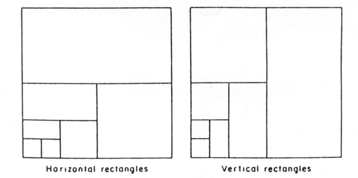  
```

* Random points: constant $\small{G_r}$ with r; Clumped points: $\small{G_r}$ peaks at the clump size (r); Regular points: $\small{G_r}$ decreases and bottoms out at regular grain size (r) 

###### Note: There are many other dispersion indices (see Dale, 1999; Rosenberg, 2003)

# Point Patterns: Distance Methods

* Use distances among objects to determine whether they are farther apart, or closer together than expected by chance (randomness)

* Plant-Plant Distance (W): Calculate distance between objects and their $\small{1}^{st}$, $\small{2}^{nd}$, $\small{3}^{rd}$ (etc.) nearest neighbors 

* Point-Plant Distance (X): Calculate distance between randomly chosen locations and their $\small{1}^{st}$, $\small{2}^{nd}$, $\small{3}^{rd}$ (etc.) nearest neighbor objects 

* Point-Plant-Plant Distance (Y):  choose random location, find the nearest object to it, and calculate the distance from that object to its $\small{1}^{st}$, $\small{2}^{nd}$, $\small{3}^{rd}$ (etc.) nearest neighbors

* Determining whether the distribution of objects is different from Poisson random is basically asking the probability that another object is within an area radius W (or X, Y)

* MANY different tests for randomness have been proposed based on these measurements 

* One can also compare observed data to randomly generated point patterns

# When Traits are Influenced by Spatial Gradients

```{r echo = FALSE, eval=TRUE, out.width="60%"}
lat<-runif(50,0,5); long<-runif(50,0,5)
g<-cbind(lat,long)  #create an XY spatial grid
y <- sqrt(diag(g%*%t(g))) + rnorm(nrow(g))  #a spatially-autocorrelated variable
        # Valuee is associated with distance from origin
t <- sample(rep(c(1,2),length(y)/2))  #2 ecological 'groups' constrained by spatial contingency
sc <- 0.0   #spatial contingency: 0->1
for(i in 1:length(y)){
  z = scale(y,scale=sd(y))
  crit = 1-sc
  crit =c(-crit/2,crit/2)*3
  if(z[i]<=min(crit)) t[i]=1
  if(z[i]>=max(crit)) t[i]=2 
}

plot(g, pch=21, bg=t, cex=y, asp=1, main="Species diversity proprotional to circle size 
Color designates ecological type")
```

* Here we see data that are influenced by spatial location. Such patterns exhibit **spatial autocorrelation**. 

# Spatial Autocorrelation: General Considerations

```{r echo = FALSE, eval=TRUE, out.width="30%"}
plot(g, pch=21, bg=t, cex=y, asp=1)
```

* Here we see data ($\small\mathbf{Y}$) that are influenced by spatial location. Such patterns exhibit **spatial autocorrelation**. 

* Here are some questions one may consider:

    + How are my observations distributed in space? (point patterns: discussed previously)

    + Are the data ($\small\mathbf{Y}$) associated with geography? Or more precisely, are changes found among subjects associated with changes in geography?
    
    + Are the data ($\small\mathbf{Y}$) spatially autocorrelated? (NOTE: not the same as associated: a more precise meaning)
    
    + If my data ($\small\mathbf{Y}$) have spatial autocorrelation, how can I assess ecological hypotheses while taking this into consideration (i.e., without geography becoming a counfounding variable)?
    
    + Of the various methods to address the previous concerns, which are suited for what kind of circumstances?

# Association with Geography 

```{r echo = FALSE, eval=TRUE, out.width="30%"}
plot(g, pch=21, bg=t, cex=y, asp=1)
```

* Let us again examine this pattern. Here we see that species diversity and geography seem associated.  

* One could assess this using the **Mantel Test** using distances between subjects for geography $\small\mathbf{X}$ and species diversity $\small\mathbf{Y}$

# Association with Geography

```{r echo = FALSE, eval=TRUE, out.width="30%"}
plot(g, pch=21, bg=t, cex=y, asp=1)
```

* Let us again examine this pattern. Here we see that species diversity and geography seem associated.  

* One could assess this using the **Mantel Test** using distances between subjects for geography $\small\mathbf{X}$ and species diversity $\small\mathbf{Y}$

    + Obtain: $\small{z}_M= \sum{\mathbf{X}_{i}\mathbf{Y}_{i}}$ where $\small\mathbf{X}$ & $\small\mathbf{Y}$ are the *unfolded* distance matrices

    + Estimate the Mantel correlation coefficient: $\small{r}_M = \frac{z_M}{[n(n-1)/2]-1}$

    + Assess significance of $\small{r_M}$ via permutation, where R/C of distance matrix are permuted.

# Mantel Test: Example

```{r echo = TRUE, eval=TRUE, out.width="30%"}
mantel(dist(g), dist(y), permutations = 999)  
plot(dist(g), dist(y))
```

* There is an association of species diversity with geography (locations that are geographically-proximate are similar in their levels of species abundance) 

# Mantel Tests: Basic Design

* One can think of this implementation of the Mantel test as evaluating: 

```{r, echo = FALSE, out.width="80%"}
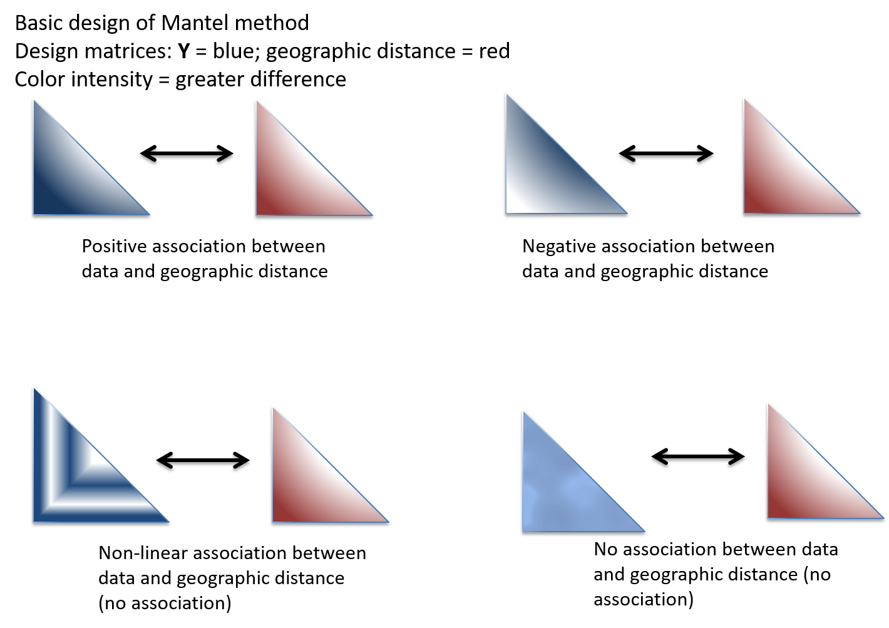  
```

* This is **one way** of evaluating whether there is spatial association in one's variables
  
# Accounting for Geography: Partial Mantel Tests

```{r echo = FALSE, eval=TRUE, out.width="30%"}
plot(g, pch=21, bg=t, cex=y, asp=1)
```

* If $\small\mathbf{X}$ and $\small\mathbf{Y}$ both covary with geogaphy $\small\mathbf{Z}$, one can consider *partialing out* the effect of geography

* Conceptually: $\small\mathbf{Y~X|Z}$  

* Assesses relationship of $\small\mathbf{Y}$ and $\small\mathbf{X}$ \while holding $\small\mathbf{Z}$ constant

```{r echo = TRUE, eval=TRUE, out.width="30%"}
mantel.partial(dist(t), dist(y), dist(g), permutations = 999)
```

* There is an association between species diversity and ecotype while partialling out effects of geography

# Mantel Tests: Cautions

* Mantel tests seem appropriate for all manner of spatial hypothesis testing. But remember

    + They suffer from inflated type I error, low power, and can have significant bias, particularly with autocorrelated error
    
    + Other approaches should be used for these sorts of hypotheses 

###### See: Oden and Sokal 1992. *J. Classif.*; Legendre 2000. *J. Stat. Comp. Simul.*; Harmon and Glor 2010. *Evolution*; Guillot & Rousset 2013. *Methods Ecol. Evol.*

# Spatial Autocorrelation: Digging Deeper

* What can produce spatial autocorrelation (SAC)?

    + Biological processes (e.g., assortative mating)
    + Ecological processes/Natural Selection/Adaptation/Phenotypic plasticity
    + Non-linear relationships between species and environment modeled as linear
    + An undetected environmental covariate, which is, itself, SAC (Spatial dependency, but not SAC: Legendre et al. 2002. Ecography 25: 601-615) 
    
# Spatial Autocorrelation: Digging Deeper

* What can produce spatial autocorrelation (SAC)?

    + Biological processes (e.g., assortative mating)
    + Ecological processes/Natural Selection/Adaptation/Phenotypic plasticity
    + Non-linear relationships between species and environment modeled as linear
    + An undetected environmental covariate, which is, itself, SAC (Spatial dependency, but not SAC: Legendre et al. 2002. Ecography 25: 601-615) 

* In general statistical terms, we can consider the problem as a linear model:

$$\small\mathbf{Y}=\mathbf{X{\hat{\beta}}+\epsilon}$$
Here, $\small\epsilon$ is not *iid*, as these assumptions are not met (there is SAC). Thus, we should model $\small\epsilon$ something like: $\small\sim\mathcal{N}(0,\mathbf{\Sigma})$. where $\small\mathbf{\Sigma}$ embodies the expected spatial covariation between subjects. 

# Spatial Autocorrelation: Digging Deeper

* What can produce spatial autocorrelation (SAC)?

    + Biological processes (e.g., assortative mating)
    + Ecological processes/Natural Selection/Adaptation/Phenotypic plasticity
    + Non-linear relationships between species and environment modeled as linear
    + An undetected environmental covariate, which is, itself, SAC (Spatial dependency, but not SAC: Legendre et al. 2002. Ecography 25: 601-615) 

* In general statistical terms, we can consider the problem as a linear model:

$$\small\mathbf{Y}=\mathbf{X{\hat{\beta}}+\epsilon}$$
Here, $\small\epsilon$ is not *iid*, as these assumptions are not met (there is SAC). Thus, we should model $\small\epsilon$ something like: $\small\sim\mathcal{N}(0,\mathbf{\Sigma})$. where $\small\mathbf{\Sigma}$ embodies the expected spatial covariation between subjects. 

* This leads to two steps:

    + Determining if geography could influence variation in $\small\mathbf{Y}$ (i.e., is there spatial autocorrelation?)
    + Describe the spatial autocorrelation in some way (i.e., estimate  $\small\mathbf{\Sigma}$)
    
# Spatial Autocorrelation

* **Spatial Autocorrelation**:  lack of independence of values based on spatial properties (self-correlation)

* Can test whether observed values at one locality depend (at least in part) on those at neighboring localities.

* Knowing the spatial auto-correlation ‘structure’ informs one how to model ecological factors

# Spatial Autocorrelation

* **Spatial Autocorrelation**:  lack of independence of values based on spatial properties (self-correlation)

* Can test whether observed values at one locality depend (at least in part) on those at neighboring localities.

* Knowing the spatial auto-correlation ‘structure’ informs one how to model ecological factors

* Procedure:
    + Obtain data $\small\mathbf{Y}$ for each locality (can be continuous or categorical data)
    + Determine which localities are ‘neighbors’ (or distance classes)
    + Neighbors represented in a CONNECTIVITY MATRIX (or **weight** matrix)
    + Estimate spatial autocorrelation for neighbors/distance class 

# Connectivity (W): Neighbors and Distances

```{r, echo = FALSE, out.width="95%"}
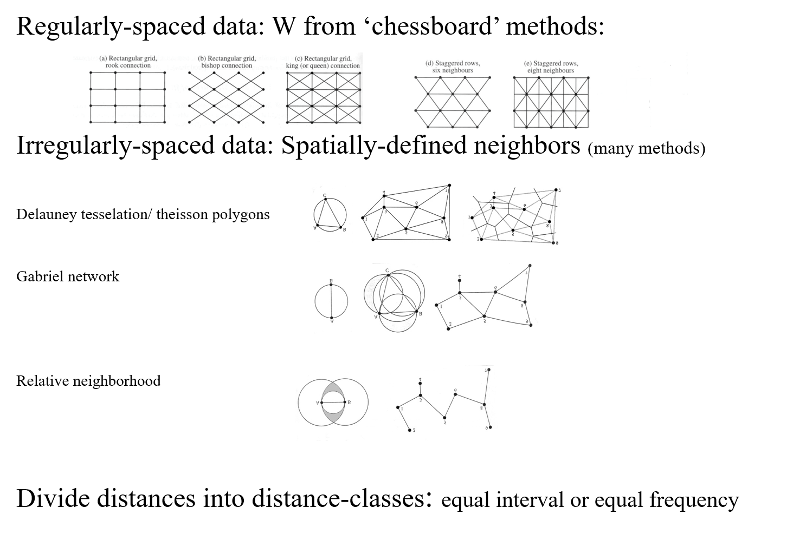  
```

# Measuring Autocorrelation: Join Counts

* For categorical data (A,B) 

    + Join-Count statistic: sums the number of connections of a given type:

```{r, echo = FALSE, out.width="95%"}
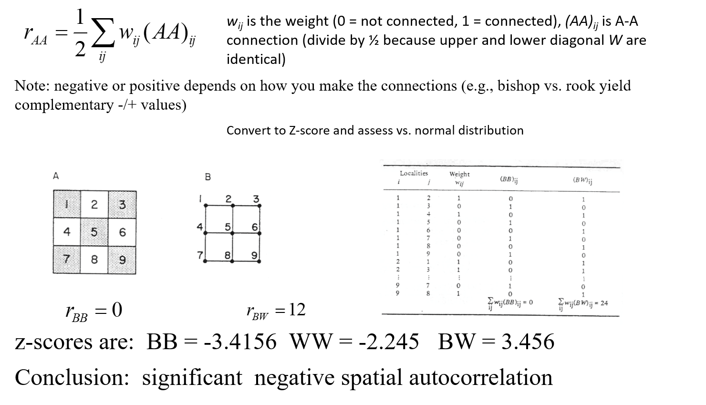  
```

# Measuring Autocorrelation: Continuous Data

* For continuous data, one still measures $\small\sum{(weights \times{data})}$

* **Moran’s I**:  $\small{I}=\frac{n\sum\sum{w_{ij}(y_i-\hat{y})(y_j-\hat{y})}}{W\sum(y_i-\hat{y})^2}$
    
    + where $\small{w_{ij}}$ is the weight of influence of site $\small{j}$ over $\small{i}$, $\small{y_i}$ is the data, $\small\hat{y}$ is the estimate for that distance class, and   $\small{W=\sum{w_{ij}}}$
    + range –1 to +1 (- are negative autocorrelation, + are positive autocorrelation)
    
# Measuring Autocorrelation: Continuous Data

* For continuous data, one still measures $\small\sum{(weights \times{data})}$

* **Moran’s I**:  $\small{I}=\frac{n\sum\sum{w_{ij}(y_i-\hat{y})(y_j-\hat{y})}}{W\sum(y_i-\hat{y})^2}$
    
    + where $\small{w_{ij}}$ is the weight of influence of site $\small{j}$ over $\small{i}$, $\small{y_i}$ is the data, $\small\hat{y}$ is the estimate for that distance class, and   $\small{W=\sum{w_{ij}}}$
    + range –1 to +1 (- are negative autocorrelation, + are positive autocorrelation)

* **Geary's c**: $\small{c}=\frac{(n-1)\sum\sum{w_{ij}(y_i-y_j)^2}}{2W\sum(y_i-\hat{y})^2}$

    + range 0 to positive values (0 is positive autocorrelation, + values are negative)

* For both, significance based on normal approximation (see Legendre et al. 2012): $\small{z}_I=\frac{I_{obs}-E(I)}{\sigma_I}$ where $\small{E(I)}= -\frac{1}{n-1}$. Also, $\small{E(c)=1}$

##### Note: Semivariograms are based on unstandardized Geary's c

# Spatial Autocorrelation: Example

* Sokal and Thompson (1987) examined distribution and attributes of *Aralia nudicaulis* (an understory plant), including: fecundity, density, canopy cover, and percent female


* Found significant spatial autocorrelation for most variables (not fecundity), none of which displayed the same pattern

* Thus, variables exhibited autocorrelation, but not the spatial association with one another


```{r, echo = FALSE, out.width="95%"}
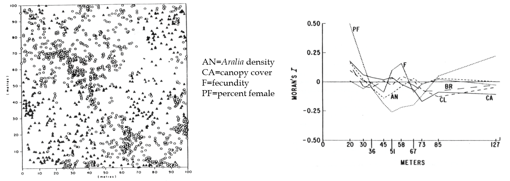  
```

# Measuring Spatial Autocorrelation: Importance of Model

* Evaluating spatial autocorrelation is not just *'procedural'*. One is measuring the degree of pattern across spatial scales. That requires a model!

```{r, echo = FALSE, out.width="95%"}
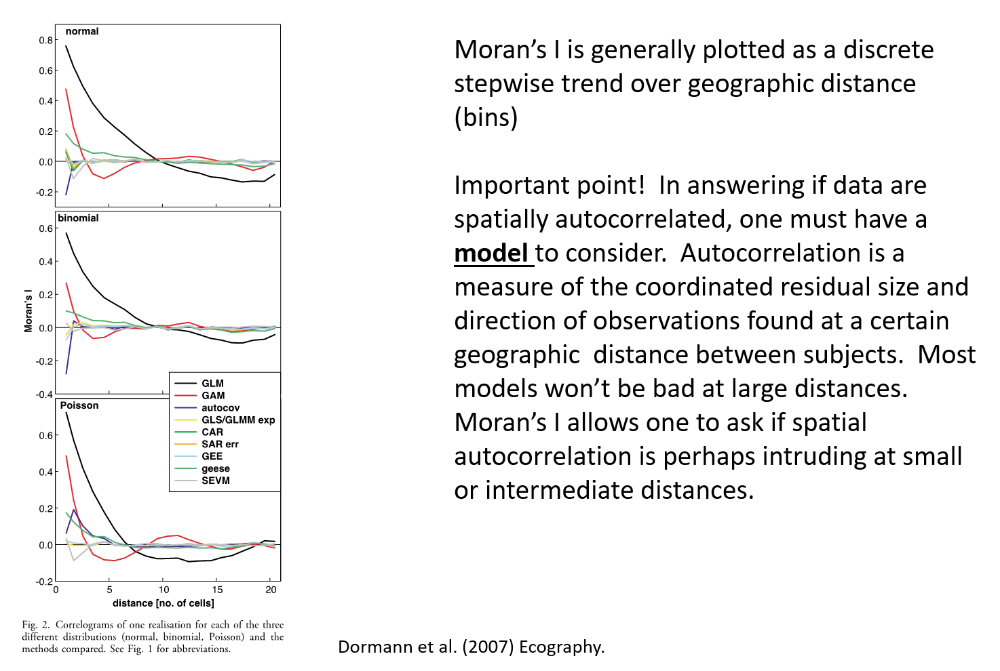  
```

# Modeling Spatial Non-Independence

* We now return to the GLS model: 

$$\small\mathbf{Y}=\mathbf{X{\hat{\beta}}+\epsilon}$$

Here, $\small\epsilon$ is not *iid*, as these assumptions are not met (there is SAC). Thus, we should model $\small\epsilon$ something like: $\small\sim\mathcal{N}(0,\mathbf{\Sigma})$. where $\small\mathbf{\Sigma}$ embodies the expected spatial covariation between subjects. 

Thus, given an estimate $\small\mathbf{\Sigma}$, we can fit the model as: 
$\small\hat{\mathbf{\beta }}=\left ( \mathbf{X}^{T}  \mathbf{\Sigma}^{-1}  \mathbf{X}\right )^{-1}\left ( \mathbf{X}^{T} \mathbf{\Sigma}^{-1}\mathbf{Y}\right )$

The question is: what is $\small\mathbf{\Sigma}$?

# Modeling Spatial Non-Independence

* We now return to the GLS model: 

$$\small\mathbf{Y}=\mathbf{X{\hat{\beta}}+\epsilon}$$

Here, $\small\epsilon$ is not *iid*, as these assumptions are not met (there is SAC). Thus, we should model $\small\epsilon$ something like: $\small\sim\mathcal{N}(0,\mathbf{\Sigma})$. where $\small\mathbf{\Sigma}$ embodies the expected spatial covariation between subjects. 

Thus, given an estimate $\small\mathbf{\Sigma}$, we can fit the model as: 
$\small\hat{\mathbf{\beta }}=\left ( \mathbf{X}^{T}  \mathbf{\Sigma}^{-1}  \mathbf{X}\right )^{-1}\left ( \mathbf{X}^{T} \mathbf{\Sigma}^{-1}\mathbf{Y}\right )$

The question is: what is $\small\mathbf{\Sigma}$?

It turns out there are various ways to parameterize $\small\mathbf{\Sigma}$, but it is always an $\small{n\times{n}}$ matrix with values estimating the expected covariance between subjects as based on the geographic distance between them.

##### Note: this is conceptually identical to what we discussed with phylogenetic comparative methods, where $\small\mathbf{\Sigma}$ was the phylogenetic covariance matrix ($\small\mathbf{V}$)

# Modeling Spatial Non-Independence

* In general, $\small\mathbf{\Sigma}$ describes the expected covariance among locations, with coefficients proportional to distance (or the decay of expected similarity as a function of distance)

* *MANY* models have been proposed to describe spatial non-independence. Here are a few:

$$\small{Exponential}= \sigma^2e^{-r/d}$$


$$\small{Gaussian}= \sigma^2e^{(-r/d)^2}$$

$$\small{Spherical}= \sigma^2(1-2/\pi(r/d\sqrt{1-r^2/d^2}+sin^{-1}r/d))$$

where $\small{r}$ describes the expected covariance (correlation) between a pair of subjects, and $\small{d}$ is the distance between them over which this corralation decays. 

###### NOTE: There are many other models of spatial dependence! (see Dormann et al. (2007) Ecography.)

# Spatial Dependence: Autoregressive Models

* Some approaches use 'autoregressive' approaches to account for spatial dependence 

```{r, echo = FALSE, out.width="95%"}
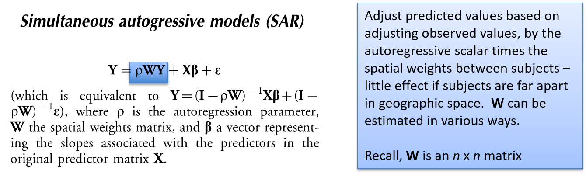  
```

###### NOTE: There are many other models of spatial dependence! (see Dormann et al. (2007) Ecography.)

# Spatial Dependence: Autoregressive Models

* Some approaches use 'autoregressive' approaches to account for spatial dependence 

```{r, echo = FALSE, out.width="95%"}
  
```

```{r, echo = FALSE, out.width="95%"}
  
```

###### see Dormann et al. (2007) Ecography

# Spatial Dependence: Comparing Models

* Dormann et al. (2007) compared numerous models

```{r, echo = FALSE, out.width="95%"}
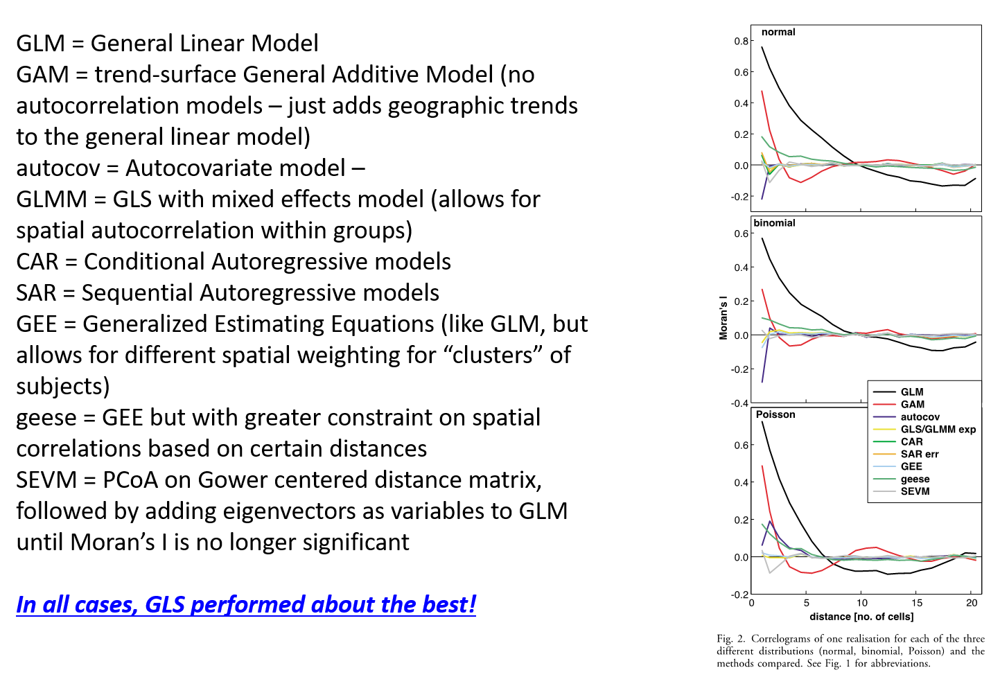  
```

Results imply that GLS approach (i.e., a spatially-weighted model) performs quite well!

# Spatial Statistics: Summary

* Having a spatial context is hugely important to consider in biology

* How are my observations distributed? 
	
	  + **Point Pattern Analysis**  

* Are my data associated with geography?
	
	  + **Mantel tests** (and others)

* Are my data spatially autocorrelated?
	
	  + **Moran’s I & Geary's c**

* Can I account for spatial autocorrelation in my analysis? 
	
	  + **GLS is general and very useful model**

