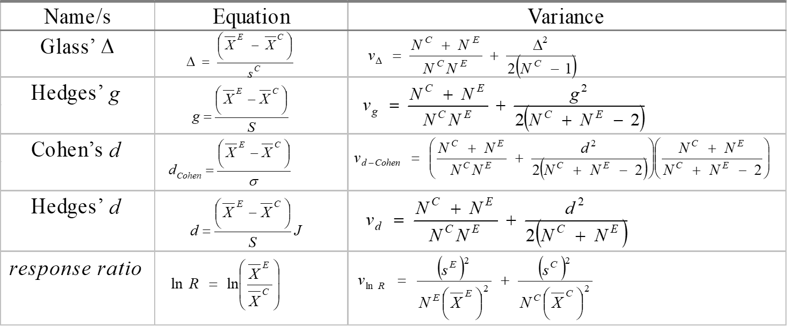
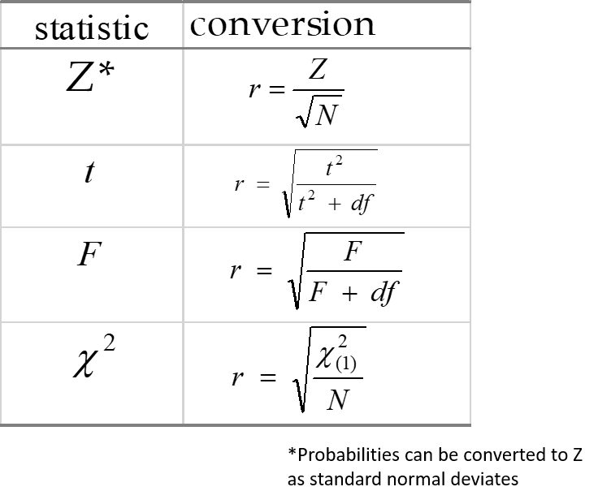
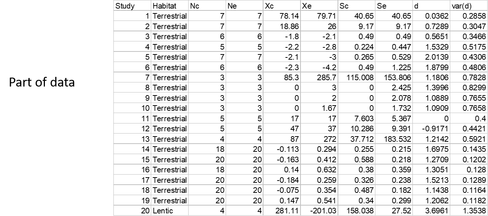
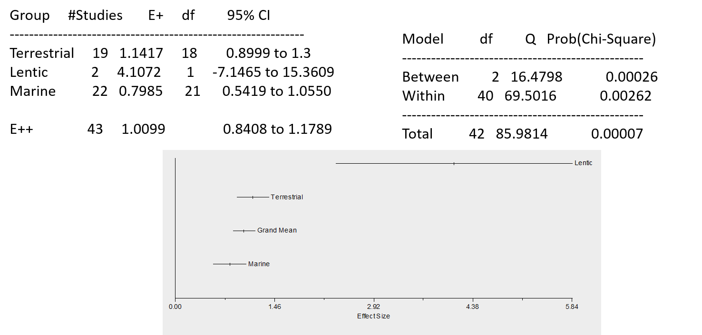
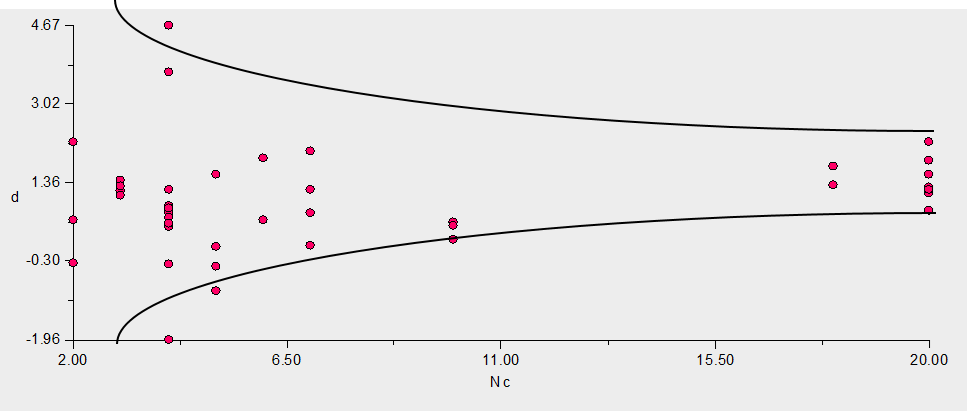
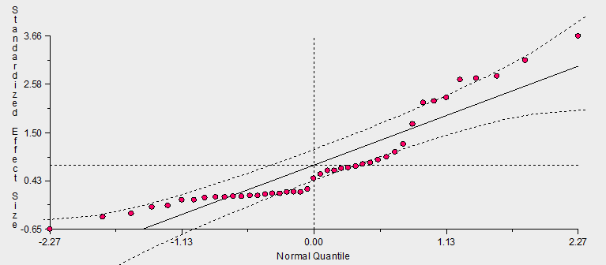
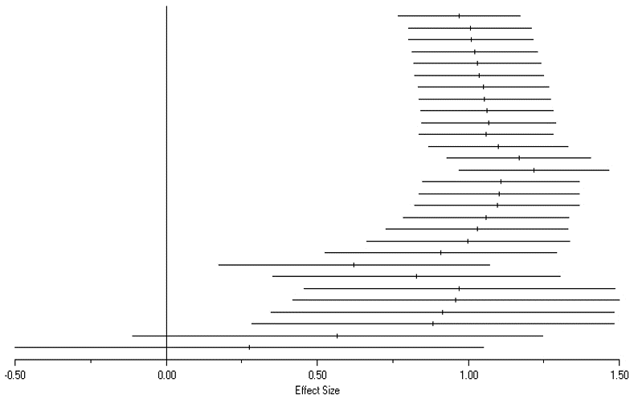

```{r setup, include=FALSE, echo = TRUE, tidy = TRUE}
library(knitr)
library(vegan)
library(RRPP)
library("spatstat")
opts_chunk$set(echo = TRUE)
```

# Outline

- Methods for quantitative research synthesis

- Brief history of methods for combining results from prior studies

- Vote-counting

- Combined probability method

- Meta-analysis

######For further information see: Cooper and Hedges (1994). Handbook of Research Synthesis. Hedges and Olkin (2000). Statistical Methods for Meta-Analysis. Rosenberg, Adams, and Gurevitch (2000). MetaWin: Statistical Software for Meta-Analysis. vsn. 2.

# Synthesizing Prior Research

- One important goal of science is synthesizing existing knowledge 

    - What does a body of literature say about a particular topic?
    - Does existing published evidence support a particular hypothesis?
    - Is there a general ‘consensus’ about the importance of a hypothesis?

- This is an obvious question to ask (what do we already know?)

# Synthesizing Prior Research

- One important goal of science is synthesizing existing knowledge 

    - What does a body of literature say about a particular topic?
    - Does existing published evidence support a particular hypothesis?
    - Is there a general ‘consensus’ about the importance of a hypothesis?

- This is an obvious question to ask (what do we already know?)

- Literature reviews are common approach: usually narrative

- Other more quantitative methods exist, and fall into three main approaches:

    - Vote counting
    - Combined probability methods
    - Meta-analysis

# Quant. Res. Synthesis: A Brief History

- Quantitative research synthesis as old as modern statistics

- First QRS: Pearson (1904) calculated average correlation from several studies on effectiveness of typhoid vaccine

- Early $\small{20}^{th}$ century: narrative reviews most common (and still are)

- 1930’s: several methods for combining probabilities developed (but infrequently used)

- 1970’s: ‘modern’ meta-analytic methods for combining effect sizes from independent studies developed by Glass (1976), Rosenthal etc.

- Currently, meta-analytic methods common in social sciences and medicine; use in ecology and evolutionary biology is increasing

# Preliminary Concepts

- ANY research synthesis begins with a hypothesis (e.g., does smoking significantly increase cancer rates?)

- Published studies* are then obtained via a literature search (e.g., keyword search on Web of Science, Scholar.Google, Biological Abstracts, etc.)

- Unusable articles are discarded based on certain criteria (e.g., incomplete information) 

- Remaining articles are reviewed and summarized in some way

###### * NOTE: unpublished studies that can be obtained from authors can also be included

# 1: Vote Counting

- Begin with hypothesis and set of published studies

- Results from each study classified as 1 of 3 outcomes

    - Significant in expected direction
    - Significant in unexpected direction
    - Not significant

- Calculate proportion of each class, and that class with highest proportion represents the ‘support’ (for, against, equivocal)

# 1: Vote Counting

- Begin with hypothesis and set of published studies

- Results from each study classified as 1 of 3 outcomes

    - Significant in expected direction
    - Significant in unexpected direction
    - Not significant

- Calculate proportion of each class, and that class with highest proportion represents the ‘support’ (for, against, equivocal)

- **Advantages**: quick and easy to calculate, intuitive

- **Disadvantages**: overly conservative, low statistical power (# non-significant findings > expected # significant findings), ignores magnitude of effects of studies, not sensitive to sample sizes (all studies treated equally)

# 2: Combining Probabilities

- Begin with hypothesis and set of published studies (with significance levels)

- Combine probabilities in some way

- Many methods exist for various distributions (uniform, normal, $\small{t}$, $\small\chi^2$, etc: see Becker, 1994 in Handbook of Research Synthesis: Cooper & Hedges)

# 2: Combining Probabilities

- Begin with hypothesis and set of published studies (with significance levels)

- Combine probabilities in some way

- Many methods exist for various distributions (uniform, normal, $\small{t}$, $\small\chi^2$, etc: see Becker, 1994 in Handbook of Research Synthesis: Cooper & Hedges)

- **Advantages**: relatively easy to calculate, sample sizes taken into account (b/c use exact probabilities), general approach (can almost always obtain p-value from a study)

- **Disadvantages**: don’t directly assess magnitude of study effects, cannot assess direction of effects, cannot assess whether effects are homogeneous

###### NOTE: often called omnibus tests (only depend on exact probabilities of each study)

# 2: Combining Probabilities: Some Methods

- Minimum $\small{P}$ method (Tippet, 1931): uses uniform distribution, significant if any study is significant at critical-$\small\alpha$:

$$\small\alpha={1-(1-\alpha^*)^{1/n}}$$

- Sum of logs method (Fisher, 1932): uses inverse $\small\chi^2$ distribution, significant if $\small{P}< 0.05$ relative to $\small\chi^2$ @ 2n df

$$\small{P}= -2\sum{log{(p_i)}}$$

######NOTE: see similarity to LRT tests

- Sum of $\small{Z}$ method (Stouffer et al., 1949): use normal distribution, significant if $\small{Z}< 0.05$ based on summing Z-scores

$$\small{Z}=\sum{Z(p_i)}/\sqrt{n}$$

- Sum of $\small{p}$ method (Edgington, 1972): uses uniform distribution, significant if $\small{P_E}< 0.05$

$$\small{P_E}=(\sum{p_i})^n/{n!}$$

# Sum of logs: Example

- Sum of logs method (Fisher, 1932): uses inverse $\small\chi^2$ distribution, significant if $\small{P}< 0.05$ relative to $\small\chi^2$ @ 2n df

$$\small{p_i}=(0.06; 0.02; 0.035; 0.001; 0.24)$$

$$\small{log(p_i)}=(-1.22; -1.77; -1.46; -3; -0.62)$$

- Result: $\small{-2\sum{p_i}=16}$; $\small{prob=0.96}$; NS

# 3: Meta-Analysis

- Approach that combines weighted effect sizes for each study to assess overall significance

- Allows the interpretation of the strength of the statistical finding, not just whether or not there is significance

- M-A model can be generalized to address more complicated synthesis questions

- Requires calculating an effect size and weight for each study

- Meta-analysis has two steps:

    - Calculate effect sizes (and weights) for each study
    - Summarize effect sizes to address hypothesis (m-a model)

# Effect Sizes

- Effect size: a statistical measure of the magnitude of factor in the data (how much does smoking increase cancer rates?)

- Different types of primary data require different effect size estimates (some data types have several possible effect sizes)

- Many test statistics are a form of effect size: e.g., $\small{t}=\frac{\overline{X}_1-\overline{X}_2}{\sigma}$ is an effect size summarized as a **standardized mean difference**

- Use of effect sizes in QRS is desirable because they ‘standardize’ results from independent studies and express them in a common way (i.e., all results expressed as t-values)

- Weights are thus the inverse of effect size variance: $\small{w}=1/v$

- Effect sizes are often transformed to range: $\small{-\infty\rightarrow +\infty }$

- **IMPORTANT!!! The type of effect size depends upon the form of the input summary data obtained from the individual studies.**


###### NOTE: By this point in the semester, you should be well-familiar with the concept of an effect size!

# Effect Sizes from $\small\overline{X}$ and $\small\sigma$

- Effect sizes from $\small\overline{X}$ and $\small\sigma$ are forms of *Standardized mean differences*

- They can be quite powerful, but require considerable data be obtained from the primary studies

- In particular, they often require the following from **both** the experimental and control groups: $\small{(\overline{X}_C, \overline{X}_E,\sigma_C,\sigma_E,N_C,N_E)}$

- Some examples are: 

```{r, echo = FALSE, out.width="80%"}
  
```

# Effect Sizes from $\small{2\times2}$ Tables

- Common in medicine, where data are summarized as a $\small{2\times2}$ table

```{r, echo = FALSE, out.width="50%"}
  
```

- From table calculate: $\small{P}_t=\frac{A}{n_t}$ and $\small{P}_c=\frac{B}{n_c}$

- Then obtain:

```{r, echo = FALSE, out.width="80%"}
  
```

# Effect Sizes from Correlations (and other Statistics)

- Useful when only summary statistics are available

- Convert test-statistics to correlations, then convert to Fisher's Z-transform: $\small{z}=\frac{1}{2}ln(\frac{1+r}{1-r})$ with an expected variance of: $\small{v_z}=\frac{1}{n-3}$

- Some common statistical transformations:

```{r, echo = FALSE, out.width="50%"}
  
```

# Meta-Analytic Models

- Summarize effect sizes to assess significance

- Standard statistical summary variables: mean, variance 

- Cumulative Effect Size: weighted mean of effect sizes

- Homogeneity Statistic: Quantifies variation in effect sizes (analogous to SS) Are effect sizes homogeneous?

- Method of summary depends upon model for effect size variation

    - No structure: all studies belong to one ‘population’
    - Categorical structure: studies belong to groups
    - Continuous structure: studies covary with continuous variable

- For models with structure (categorical, continuous), variables are often called moderator variables (groups, covariate, etc.)

#####NOTE: All models are actually special cases of same model!

# Meta-Analysis: No Structure

- Model: All studies belong to the same group

- Example hypothesis: Is there an effect of competition on plant communities?

- Estimate **cumulative effect size**: $\small{\overline{\overline{E}}}=\frac{\sum{w_iE_i}}{\sum{w_i}}$ with variance: $\small{s^2_{\overline{\overline{E}}}}=\frac{1}{\sum{w_i}}$

- For this, CI are found as: $\small{CI}=\overline{\overline{E}}\pm{t}_{\alpha/2}*s_{\overline{\overline{E}}}$

- $\small{\overline{\overline{E}}}$ is significant if its CI do not bracket 0.0

# Meta-Analysis: No Structure

- Model: All studies belong to the same group

- Example hypothesis: Is there an effect of competition on plant communities?

- Estimate **cumulative effect size**: $\small{\overline{\overline{E}}}=\frac{\sum{w_iE_i}}{\sum{w_i}}$ with variance: $\small{s^2_{\overline{\overline{E}}}}=\frac{1}{\sum{w_i}}$

- For this, CI are found as: $\small{CI}=\overline{\overline{E}}\pm{t}_{\alpha/2}*s_{\overline{\overline{E}}}$

- $\small{\overline{\overline{E}}}$ is significant if its CI do not bracket 0.0

- Homogeneity statistic: $\small{Q_T}=\sum{w_iE^2_i}-\frac{(\sum{w_iE_i})^2}{\sum{w_i}}=\sum{w_i}(E_i-\overline{\overline{E}})^2$

- Test $\small{Q_T}$ vs. $\small\chi^2$ (n-1 df)

- Significant $\small{Q_T}$ implies samples are *NOT* homogeneous (i.e., additional structure is present in the data that some moderator variable may explain)

# Meta-Analysis: Categorical Structure

- Model: Studies belong to different groups

- Example hypothesis: Does competition differ among habitat types (terrestrial, marine, etc.)? 

- For each group estimate : $\small{\overline{E}_j}=\frac{\sum{w_{ij}E_{ij}}}{\sum{w_{ij}}}$ with variance: $\small{s^2_{\overline{E}}}=\frac{1}{\sum{w_{ij}}}$

- CI are found as: $\small{CI}=\overline{E}_j\pm{t}_{\alpha/2}*s_{\overline{E}_j}$

# Meta-Analysis: Categorical Structure

- Model: Studies belong to different groups

- Example hypothesis: Does competition differ among habitat types (terrestrial, marine, etc.)? 

- For each group estimate : $\small{\overline{E}_j}=\frac{\sum{w_{ij}E_{ij}}}{\sum{w_{ij}}}$ with variance: $\small{s^2_{\overline{E}}}=\frac{1}{\sum{w_{ij}}}$

- CI are found as: $\small{CI}=\overline{E}_j\pm{t}_{\alpha/2}*s_{\overline{E}_j}$

- Homogeneity statistic: $\small{Q_W}_{j}=\sum{w_{ij}}(E_{ij}-\overline{E}_j)^2$: Test whether each group differs from zero 

- Test if groups differ: $\small{Q_T}=Q_M+Q_E$ where $\small{Q_M}=\sum\sum{w_{ij}(\overline{E}_j-\overline{\overline{E}})^2}$ 

- Significant $\small{Q_M}$ implies groups are different

# Meta-Analysis: Continuous Structure

- Model: Study effects covary with some continuous variable

- Example hypothesis: Does competition intensity covary with elevation?

- Model of the form: $\small{E}_i=\beta_0+\beta_1{X_i}+\epsilon$

$$\small{\beta_1}=\frac{\sum{w_iX_iE_i}- \frac{\sum{w_iX_i}\sum{w_iE_i}}{\sum{w_i}}  }{\sum{w_iX_i}-\frac{(\sum{w_iX_i})^2}{\sum{w_i}}}$$

$$\small{\beta_0}=\frac{\sum{w_iE_i}-\beta_1\sum{w_iX_i}}{\sum{w_i}}$$

- Homogeneity: $\small{Q_M}=\frac{\beta^{2}_{1}}{s^2_{\beta_1}}$

- Significant ${Q_M}$ implies that $\small{X}$ explains significant component of variation among studies

# Meta-Analytic Models: Comments

- Wait a minute! What are we doing here?  

- Meta-analysis represents is a statistical summary of effect sizes (i.e, a summary of results from the primary literature)

- When $\small{w_i}=1$, this is tantamount to obtaining OLS means and SS

$$\small{\overline{\overline{E}}}=\frac{\sum{w_iE_i}}{\sum{w_i}}$$
$$\small{Q_T}=\sum{w_i}(E_i-\overline{\overline{E}})^2$$

# Meta-Analytic Models: Comments

- Wait a minute! What are we doing here?  

- Meta-analysis represents is a statistical summary of effect sizes (i.e, a summary of results from the primary literature)

- When $\small{w_i}=1$, this is tantamount to obtaining OLS means and SS

$$\small{\overline{\overline{E}}}=\frac{\sum{w_iE_i}}{\sum{w_i}}$$
$$\small{Q_T}=\sum{w_i}(E_i-\overline{\overline{E}})^2$$

- But when $\small{w_i}\neq1$, meta-analysis becomes a **weighted linear model** (i.e., GLS) 

    - Here, the effect sizes are weighted by the inverse of their variances
    - Statistically, we are generalizing the *iid* assumption, but doing so for the **study variances**!

>- Therefore, meta-analysis is no different conceptually than what we've seen for phylogenetic comparative methods and spatial statistics!!!  It is a **weighted linear model**

# Meta-Analysis via GLS

- Meta-analysis is a weighted model of the form: 

$$\small\mathbf{E}=\mathbf{X{\hat{\beta}}+\epsilon}$$

Where variation in effect sizes ($\small\mathbf{E}$) is explained by some statistical design as found in $\small\mathbf{X}$. 

- Note that $\small\epsilon$ is not *iid*, because we want to weight each study by the inverse of their variance (which is a measure of 'precision' of the effect size). Thus, we model the residual error as: $\small\sim\mathcal{N}(0,\mathbf{W})$, where: 

$$\tiny\mathbf{W}= \left( \begin{array}{ccc} w_1 & 0 & 0 & 0 \\ 0 & w_2 & 0 & 0 \\ \vdots & \vdots & \ddots & \vdots \\0 & 0 & 0 & w_n \end{array} \right) $$

- Thus, we solve the model as: $\small\hat{\mathbf{\beta }}=\left ( \mathbf{X}^{T}  \mathbf{W}^{-1}  \mathbf{X}\right )^{-1}\left ( \mathbf{X}^{T} \mathbf{W}^{-1}\mathbf{E}\right )$

# Meta-Analysis via GLS

- Meta-analysis is a weighted model of the form: 

$$\small\mathbf{E}=\mathbf{X{\hat{\beta}}+\epsilon}$$

Where variation in effect sizes ($\small\mathbf{E}$) is explained by some statistical design as found in $\small\mathbf{X}$. 

- Note that $\small\epsilon$ is not *iid*, because we want to weight each study by the inverse of their variance (which is a measure of 'precision' of the effect size). Thus, we model the residual error as: $\small\sim\mathcal{N}(0,\mathbf{W})$, where: 

$$\tiny\mathbf{W}= \left( \begin{array}{ccc} w_1 & 0 & 0 & 0 \\ 0 & w_2 & 0 & 0 \\ \vdots & \vdots & \ddots & \vdots \\0 & 0 & 0 & w_n \end{array} \right) $$

- Thus, we solve the model as: $\small\hat{\mathbf{\beta }}=\left ( \mathbf{X}^{T}  \mathbf{W}^{-1}  \mathbf{X}\right )^{-1}\left ( \mathbf{X}^{T} \mathbf{W}^{-1}\mathbf{E}\right )$

    - Method allows for simple or complex meta-analytic designs
    - Fits squarely in OLS/GLS statistical theory
    - Is essentially another use of GLS models for dealing with non *iid* error structure! 

# Meta-Analysis: Fixed vs. Random Effects

- As with OLS models, one can consider random effects

- Models described previously were 'fixed effects': assume only one true effect size shared by all studies (studies therefore only differ by sampling error)

- Random-effects model: assume studies differ by sampling error and random component (pooled study variance: $\small\sigma^2_{pooled}$

- $\small\sigma^2_{pooled}$ found as MSE from fixed-effects model

- Incorportated into weights for random effects as: $\small{w_i}_{rand}=\frac{1}{v_i+\sigma^2_{pooled}}$

# Meta-Analysis: Example

- Competition in biological communities (Gurevitch et al., 1992)

- Subset of data (N=43) from 3 habitats (terrestrial, lentic, marine) 

- Data: mean, std, n data from experiment/control

- Question: Does competition differ among habitats?

```{r, echo = FALSE, out.width="80%"}
  
```

# Meta-Analysis: Example (Cont.)

- E: Group effect sizes differed from zero (except lentic)

- QM: Effect sizes differed among groups

- Conclusion: competition occurs and differs among habitats

```{r, echo = FALSE, out.width="80%"}
  
```

# Publication Bias

- A common concern with meta-analysis is that only studies with significant results get published, resulting in bias

-Can be assessed in a number of ways:

-**Funnel Plot**: plot effect size vs. sample size: should be funnel shaped (larger variance with smaller n). If overabundance of extreme values (for given n) with lack of data ‘in’ funnel, might be publication bias

```{r, echo = FALSE, out.width="80%"}
  
```

# Publication Bias (Cont.)

- **Rank-Correlation Tests**: Examine rank-correlation of standardized effect size vs. sample size 

- **Fail-Safe Numbers**: For the ‘file drawer problem’. How many non-significant studies must be added to change result to non-significant (if large #, then result is robust)

$$\small{N_R}=\frac{\sum({Z_p}_i)^2}{Z^2_\alpha}-n$$

- **Normal Quantile Plot**: Standardized effect size vs. normal quantile (gaps or strange nonlinearities may indicate publication bias)

```{r, echo = FALSE, out.width="50%"}
  
```

# Cumulative Meta-Analysis

- Rank studies by some criterion (e.g., year of publication)

- Perform meta-analysis on 1st 2 studies, then 1st 3, 1st 4, etc. 

- Plot cumulative effect sizes (with CI)

- Addresses *when* a synthesized result could be determined

```{r, echo = FALSE, out.width="50%"}
  
```

# Evaluating Significance

- Resampling tests have been proposed (Adams et al. 1997 *Ecology*; Rosenberg, Adams, and Gurevitch. 2000)

- Permutation for assessing significance of Q-statistics

- Bootstrapping for assessing CI of cumulative effect sizes

- Removes assumptions of testing vs. $\small\chi^2$ distribution

# Phylogenetic Meta-Analysis

- Sometimes studies come from a set of related taxa. Here, phylogenetic non-independence is an issue

- Phylogenetic meta-analysis recently developed (Adams, 2008. *Evolution*)

- Both PGLS and meta-analysis are GLS models, so can be combined in 'weight' matrix

    - M-A: $\small\hat{\mathbf{\beta }}=\left ( \mathbf{X}^{T}  \mathbf{W}^{-1}  \mathbf{X}\right )^{-1}\left ( \mathbf{X}^{T} \mathbf{W}^{-1}\mathbf{Y}\right )$
    - PGLS: $\small\hat{\mathbf{\beta }}=\left ( \mathbf{X}^{T}  \mathbf{V}^{-1}  \mathbf{X}\right )^{-1}\left ( \mathbf{X}^{T} \mathbf{V}^{-1}\mathbf{Y}\right )$

- Approach was generalized by Lajeunesse (2009) *Am. Nat.* for non-BM designs

# Meta-Analysis: Conclusions

- Meta-analysis allows one to combine results across studies to make 'summary' inferences

- A useful way to perform literature reviews and assess the current consensus of a field

- Is a weighted analysis, where weights are inverse of study variance

- Yet another clever use of GLS!


